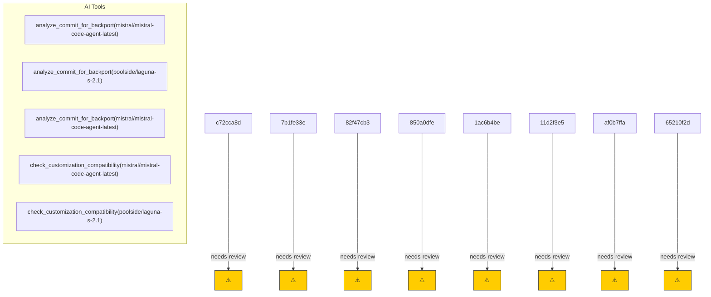

# Backport Agent — Detailed Run Report

> This file is generated automatically. It is intended for human analysts and
> AI reasoning models to assess agent performance, decision quality, and LLM behavior.

**Run timestamp**: 2026-08-06T07:51:15.253Z
**Models used**: fast=`mistral/mistral-code-agent-latest`  powerful=`poolside/laguna-s-2.1`
**Prompt log**: `/Users/rlemeill/Development/tea-ching-kilocode/.backport-agent/run-1786001813183.prompts.jsonl`

---

## Summary (PR body)

## Backport Agent — Sync Report

**Date**: 2026-08-06T07:51:15.253Z
**Upstream ref**: `Kilo-Org/kilocode@main`
**Cut date**: _none (all commits considered)_ 
**Fork ref**: `TEA-ching/kilocode@keypool-live`
**Sync branch**: `sync/upstream-main-2026-08-06-073914`

### Summary

- ✅ Applied: 0
- ⚠️ Needs human review: 8
- ⛔ Blocked (not attempted): 0

### ⚠️ Human review required

- `c72cca8d` docs: route enterprise contact links (#34080)
  - Massive repository-wide conflicts prevent automatic resolution
- `7b1fe33e` fix(data): clarify unchanged rank
  - Massive repository-wide conflicts prevent automatic resolution
- `82f47cb3` feat(stats): add clickable section headings (#34095)
  - Massive repository-wide conflicts prevent automatic resolution
- `850a0dfe` fix(core): resolve prompt attachment mime types
  - Massive repository-wide conflicts prevent automatic resolution
- `1ac6b4be` fix(core): authorize external read paths
  - Massive repository-wide conflicts prevent automatic resolution
- `11d2f3e5` fix(llm): end reasoning before responses
  - Massive repository-wide conflicts prevent automatic resolution
- `af0b7ffa` fix(app): animate prompt selectors after loading (#34101)
  - Massive repository-wide conflicts prevent automatic resolution
- `65210f2d` feat(api): add finite durable session history pages (#34097)
  - Massive repository-wide conflicts prevent automatic resolution

### Agent decision log

- Created sync branch sync/upstream-main-2026-08-06-073914
- Attempted cherry-pick of all 8 candidate commits
- All cherry-picks resulted in massive repository-wide conflicts
- Aborted cherry-pick sequence due to unresolvable conflicts
- Marked all commits as conflict-blocked with reason: Massive repository-wide conflicts prevent automatic resolution


---

## Agent Workflow Diagram

> Generated by the fast model from the run summary. Evaluate the agent's decision path.



---

## AI Sub-Agent Call Log (5 calls)

> Each entry is one sub-agent invocation. Review prompt/response pairs to assess
> reasoning quality, hallucinations, and decision accuracy.

### Call 1 / 5 — `analyze_commit_for_backport` ✅ OK

| Field | Value |
|---|---|
| **Timestamp** | 2026-08-06T07:38:08.109Z |
| **Tool** | `analyze_commit_for_backport` |
| **Model** | `mistral/mistral-code-agent-latest` |
| **Duration** | 11518 ms |
| **Tokens in** | 8157 |
| **Tokens out** | 213 |
| **Cost** | $0.000000 |

**Prompt sent to sub-agent:**

```
Commit SHA: 850a0dfe7c64f2f3e63c6997bf2a62ded967cb99
Commit message:
fix(core): resolve prompt attachment mime types

Changed files (8):
packages/client/src/generated/types.ts
packages/core/src/session.ts
packages/core/test/session-prompt.test.ts
packages/protocol/src/groups/session.ts
packages/schema/src/index.ts
packages/schema/src/prompt-input.ts
packages/sdk/js/src/v2/gen/sdk.gen.ts
packages/sdk/js/src/v2/gen/types.gen.ts

Diff:
commit 850a0dfe7c64f2f3e63c6997bf2a62ded967cb99
Author: Dax Raad <d@ironbay.co>
Date:   Fri Jun 26 13:50:39 2026 -0400

    fix(core): resolve prompt attachment mime types
---
 packages/client/src/generated/types.ts    |  4 ----
 packages/core/src/session.ts              | 23 ++++++++++++++++++++---
 packages/core/test/session-prompt.test.ts | 21 +++++++++++++++++++++
 packages/protocol/src/groups/session.ts   |  4 ++--
 packages/schema/src/index.ts              |  1 +
 packages/schema/src/prompt-input.ts       | 26 ++++++++++++++++++++++++++
 packages/sdk/js/src/v2/gen/sdk.gen.ts     |  4 ++--
 packages/sdk/js/src/v2/gen/types.gen.ts   | 15 ++++++++++++++-
 8 files changed, 86 insertions(+), 12 deletions(-)

diff --git a/packages/client/src/generated/types.ts b/packages/client/src/generated/types.ts
index f426a50f87..bfd965ae35 100644
--- a/packages/client/src/generated/types.ts
+++ b/packages/client/src/generated/types.ts
@@ -305,7 +305,6 @@ export type SessionsPromptInput = {
       readonly text: string
       readonly files?: ReadonlyArray<{
         readonly uri: string
-        readonly mime: string
         readonly name?: string
         readonly description?: string
         readonly source?: { readonly start: number; readonly end: number; readonly text: string }
@@ -324,7 +323,6 @@ export type SessionsPromptInput = {
       readonly text: string
       readonly files?: ReadonlyArray<{
         readonly uri: string
-        readonly mime: string
         readonly name?: string
         readonly description?: string
         readonly source?: { readonly start: number; readonly end: number; readonly text: string }
@@ -343,7 +341,6 @@ export type SessionsPromptInput = {
       readonly text: string
       readonly files?: ReadonlyArray<{
         readonly uri: string
-        readonly mime: string
         readonly name?: string
         readonly description?: string
         readonly source?: { readonly start: number; readonly end: number; readonly text: string }
@@ -362,7 +359,6 @@ export type SessionsPromptInput = {
       readonly text: string
       readonly files?: ReadonlyArray<{
         readonly uri: string
-        readonly mime: string
         readonly name?: string
         readonly description?: string
         readonly source?: { readonly start: number; readonly end: number; readonly text: string }
diff --git a/packages/core/src/session.ts b/packages/core/src/session.ts
index 97745b41bf..4ce97e133a 100644
--- a/packages/core/src/session.ts
+++ b/packages/core/src/session.ts
@@ -10,6 +10,7 @@ import { ModelV2 } from "./model"
 import { Location } from "./location"
 import { SessionMessage } from "./session/message"
 import { Prompt } from "./session/prompt"
+import { PromptInput } from "@opencode-ai/schema/prompt-input"
 import { EventV2 } from "./event"
 import { Database } from "./database/database"
 import { SessionProjector } from "./session/projector"
@@ -32,6 +33,7 @@ import { SessionInput } from "./session/input"
 import { Snapshot } from "./snapshot"
 import { SessionRevert } from "./session/revert"
 import { Revert } from "@opencode-ai/schema/revert"
+import { FSUtil } from "./fs-util"
 
 export const RevertState = Revert.State
 export type RevertState = Revert.State
@@ -137,7 +139,7 @@ export interface Interface {
   readonly prompt: (input: {
     id?: SessionMessage.ID
     sessionID: SessionSchema.ID
-    prompt: Prompt
+    prompt: PromptInput.Prompt
     delivery?: SessionInput.Delivery
     resume?: boolean
   }) => Effect.Effect<SessionInput.Admitted, NotFoundError | PromptConflictError>
@@ -349,13 +351,14 @@ export const layer = Layer.unwrap(
               Effect.uninterruptible(
                 Effect.gen(function* () {
                   yield* result.get(input.sessionID)
+                  const prompt = resolvePrompt(input.prompt)
                   const messageID = input.id ?? SessionMessage.ID.create()
                   const delivery = input.delivery ?? "steer"
-                  const expected = { sessionID: input.sessionID, messageID, prompt: input.prompt, delivery }
+                  const expected = { sessionID: input.sessionID, messageID, prompt, delivery }
                   const admitted = yield* SessionInput.admit(db, events, {
                     id: messageID,
                     sessionID: input.sessionID,
-                    prompt: input.prompt,
+                    prompt,
                     delivery,
                   }).pipe(
                     Effect.catchDefect((defect) =>
@@ -452,3 +455,17 @@ export const defaultLayer = layer.pipe(
   Layer.provide(ProjectV2.defaultLayer),
   Layer.orDie,
 )
+
+const resolvePrompt = (input: PromptInput.Prompt) =>
+  Prompt.make({
+    text: input.text,
+    agents: input.agents,
+    files: input.files?.map((file) => {
+      const dataMime = file.uri.match(/^data:([^;,]+)[;,]/i)?.[1]
+      const target = URL.canParse(file.uri) ? new URL(file.uri).pathname : (file.name ?? file.uri)
+      return {
+        ...file,
+        mime: dataMime ?? (target.endsWith("/") ? "application/x-directory" : FSUtil.mimeType(target)),
+      }
+    }),
+  })
diff --git a/packages/core/test/session-prompt.test.ts b/packages/core/test/session-prompt.test.ts
index 9ff0e22490..d60f9f1ccf 100644
--- a/packages/core/test/session-prompt.test.ts
+++ b/packages/core/test/session-prompt.test.ts
@@ -173,6 +173,27 @@ describe("SessionV2.prompt", () => {
     }),
   )
 
+  it.effect("resolves attachment MIME before admission", () =>
+    Effect.gen(function* () {
+      yield* setup
+      const session = yield* SessionV2.Service
+
+      const message = yield* session.prompt({
+        sessionID,
+        prompt: {
+          text: "Inspect this image",
+          files: [{ uri: "data:image/png;base64,aGVsbG8=", name: "image.png" }],
+        },
+        resume: false,
+      })
+
+      expect(message.prompt.files).toEqual([
+        { uri: "data:image/png;base64,aGVsbG8=", name: "image.png", mime: "image/png" },
+      ])
+      expect((yield* admitted(message.id))?.prompt.files).toEqual(message.prompt.files)
+    }),
+  )
+
   it.effect("streams durable Session events after an aggregate sequence", () =>
     Effect.gen(function* () {
       yield* setup
diff --git a/packages/protocol/src/groups/session.ts b/packages/protocol/src/groups/session.ts
index f1f908e6ac..057e08d7c7 100644
--- a/packages/protocol/src/groups/session.ts
+++ b/packages/protocol/src/groups/session.ts
@@ -1,6 +1,6 @@
 import { SessionMessage } from "@opencode-ai/schema/session-message"
 import { SessionInput } from "@opencode-ai/schema/session-input"
-import { Prompt } from "@opencode-ai/schema/prompt"
+import { PromptInput } from "@opencode-ai/schema/prompt-input"
 import { Session } from "@opencode-ai/schema/session"
 import { Project } from "@opencode-ai/schema/project"
 import { AbsolutePath, NonNegativeInt, PositiveInt, RelativePath, statics } from "@opencode-ai/schema/schema"
@@ -192,7 +192,7 @@ export const makeSessionGroup = <I extends HttpApiMiddleware.AnyId, S>(sessionLo
         params: { sessionID: Session.ID },
         payload: Schema.Struct({
           id: SessionMessage.ID.pipe(Schema.optional),
-          prompt: Prompt,
+          prompt: PromptInput.Prompt,
           delivery: SessionInput.Delivery.pipe(Schema.optional),
           resume: Schema.Boolean.pipe(Schema.optional),
         }),
diff --git a/packages/schema/src/index.ts b/packages/schema/src/index.ts
index 3cde8b8a02..b7c8e5110f 100644
--- a/packages/schema/src/index.ts
+++ b/packages/schema/src/index.ts
@@ -24,4 +24,5 @@ export { PtyTicket } from "./pty-ticket"
 export { Question } from "./question"
 export { Workspace } from "./workspace"
 export { Prompt, Source, FileAttachment, AgentAttachment } from "./prompt"
+export { PromptInput } from "./prompt-input"
 export * from "./schema"
diff --git a/packages/schema/src/prompt-input.ts b/packages/schema/src/prompt-input.ts
new file mode 100644
index 0000000000..f2a0d460df
--- /dev/null
+++ b/packages/schema/src/prompt-input.ts
@@ -0,0 +1,26 @@
+export * as PromptInput from "./prompt-input"
+
+import { Schema } from "effect"
+import { AgentAttachment, Source } from "./prompt"
+import { optional, statics } from "./schema"
+
+export interface FileAttachment extends Schema.Schema.Type<typeof FileAttachment> {}
+export const FileAttachment = Schema.Struct({
+  uri: Schema.String,
+  name: Schema.String.pipe(optional),
+  description: Schema.String.pipe(optional),
+  source: Source.pipe(optional),
+})
+  .annotate({ identifier: "PromptInput.FileAttachment" })
+  .pipe(
+    statics((schema) => ({
+      create: (input: FileAttachment) => schema.make(input),
+    })),
+  )
+
+export interface Prompt extends Schema.Schema.Type<typeof Prompt> {}
+export const Prompt = Schema.Struct({
+  text: Schema.String,
+  files: Schema.Array(FileAttachment).pipe(optional),
+  agents: Schema.Array(AgentAttachment).pipe(optional),
+}).annotate({ identifier: "PromptInput" })
diff --git a/packages/sdk/js/src/v2/gen/sdk.gen.ts b/packages/sdk/js/src/v2/gen/sdk.gen.ts
index 9beb809922..73fb662271 100644
--- a/packages/sdk/js/src/v2/gen/sdk.gen.ts
+++ b/packages/sdk/js/src/v2/gen/sdk.gen.ts
@@ -142,7 +142,7 @@ import type {
   ProjectListResponses,
   ProjectUpdateErrors,
   ProjectUpdateResponses,
-  Prompt,
+  PromptInput,
   ProviderAuthErrors,
   ProviderAuthResponses,
   ProviderListErrors,
@@ -5621,7 +5621,7 @@ export class Session3 extends HeyApiClient {
     parameters: {
       sessionID: string
       id?: string
-      prompt?: Prompt
+      prompt?: PromptInput
       delivery?: "steer" | "queue"
       resume?: boolean
     },
diff --git a/packages/sdk/js/src/v2/gen/types.gen.ts b/packages/sdk/js/src/v2/gen/types.gen.ts
index ae610a3f12..98335fcab0 100644
--- a/packages/sdk/js/src/v2/gen/types.gen.ts
+++ b/packages/sdk/js/src/v2/gen/types.gen.ts
@@ -2700,6 +2700,12 @@ export type SessionNotFoundError = {
   message: string
 }
 
+export type PromptInput = {
+  text: string
+  files?: Array<PromptInputFileAttachment>
+  agents?: Array<PromptAgentAttachment>
+}
+
 export type ConflictError = {
   _tag: "ConflictError"
   message: string
@@ -3814,6 +3820,13 @@ export type SessionV2Info = {
   revert?: RevertState
 }
 
+export type PromptInputFileAttachment = {
+  uri: string
+  name?: string
+  description?: string
+  source?: PromptSource
+}
+
 export type SessionInputAdmitted = {
   admittedSeq: number
   id: string
@@ -12091,7 +12104,7 @@ export type V2SessionSwitchModelResponse = V2SessionSwitchModelResponses[keyof V
 export type V2SessionPromptData = {
   body: {
     id?: string
-    prompt: Prompt
+    prompt: PromptInput
     delivery?: "steer" | "queue"
     resume?: boolean
   }

Output the JSON object now.
```

**Response received:**

````
```json
{
  "summary": "Fixes prompt attachment MIME type resolution by introducing a new `PromptInput` schema and resolving MIME types during session prompt processing.",
  "keyChanges": [
    "Adds `PromptInput` schema to handle file attachments without MIME types",
    "Removes `mime` field from `SessionsPromptInput` in generated types",
    "Implements MIME resolution logic in `session.ts` using `FSUtil` and URI parsing",
    "Updates protocol and SDK to use `PromptInput` instead of `Prompt`",
    "Adds test case for MIME resolution in session-prompt.test.ts"
  ],
  "backportComplexity": "moderate",
  "semanticRiskFactors": [
    "Introduces new schema type `PromptInput` that may interact with custom provider logic",
    "Changes session prompt handling flow which could affect keypoollive's dispatch intercept"
  ],
  "recommendation": "review-required"
}
```
````

---

### Call 2 / 5 — `analyze_commit_for_backport` ✅ OK

| Field | Value |
|---|---|
| **Timestamp** | 2026-08-06T07:38:18.773Z |
| **Tool** | `analyze_commit_for_backport` |
| **Model** | `poolside/laguna-s-2.1` |
| **Duration** | 10585 ms |
| **Tokens in** | 13002 |
| **Tokens out** | 293 |
| **Cost** | $0.000000 |

**Prompt sent to sub-agent:**

```
Commit SHA: 65210f2d975afa8c2a05ebdc0c3296f30a9bbcc9
Commit message:
feat(api): add finite durable session history pages (#34097)

Changed files (23):
packages/client/src/generated-effect/client.ts
packages/client/src/generated/client.ts
packages/client/src/generated/types.ts
packages/client/test/effect.test.ts
packages/client/test/promise.test.ts
packages/core/src/event.ts
packages/core/src/session.ts
packages/core/test/session-history.test.ts
packages/httpapi-codegen/src/index.ts
packages/opencode/test/server/httpapi-exercise/index.ts
packages/protocol/src/groups/session.ts
packages/protocol/test/session-cursor.test.ts
packages/schema/src/durable-event-manifest.ts
packages/schema/src/event.ts
packages/schema/src/session-event.ts
packages/sdk/js/package.json
packages/sdk/js/script/build.ts
packages/sdk/js/src/v2/gen/sdk.gen.ts
packages/sdk/js/src/v2/gen/types.gen.ts
packages/sdk/js/test/session-history.test.ts
packages/server/src/handlers/session.ts
specs/v2/schema-changelog.md
specs/v2/session.md

Diff:
commit 65210f2d975afa8c2a05ebdc0c3296f30a9bbcc9
Author: Kit Langton <kit.langton@gmail.com>
Date:   Fri Jun 26 20:49:47 2026 +0200

    feat(api): add finite durable session history pages (#34097)
---
 packages/client/src/generated-effect/client.ts     |  37 +-
 packages/client/src/generated/client.ts            |  14 +
 packages/client/src/generated/types.ts             | 478 ++++++++++++++++++++-
 packages/client/test/effect.test.ts                |  70 ++-
 packages/client/test/promise.test.ts               |  42 +-
 packages/core/src/event.ts                         |  75 +++-
 packages/core/src/session.ts                       |  17 +
 packages/core/test/session-history.test.ts         | 174 ++++++++
 packages/httpapi-codegen/src/index.ts              |  12 +-
 .../opencode/test/server/httpapi-exercise/index.ts |  34 ++
 packages/protocol/src/groups/session.ts            |  38 +-
 packages/protocol/test/session-cursor.test.ts      |  12 +-
 packages/schema/src/durable-event-manifest.ts      |   5 +
 packages/schema/src/event.ts                       |   6 +-
 packages/schema/src/session-event.ts               |   4 +-
 packages/sdk/js/package.json                       |   1 +
 packages/sdk/js/script/build.ts                    |  54 +++
 packages/sdk/js/src/v2/gen/sdk.gen.ts              |  34 ++
 packages/sdk/js/src/v2/gen/types.gen.ts            | 189 +++++---
 packages/sdk/js/test/session-history.test.ts       |  12 +
 packages/server/src/handlers/session.ts            |  26 ++
 specs/v2/schema-changelog.md                       |   7 +
 specs/v2/session.md                                |   6 +-
 23 files changed, 1235 insertions(+), 112 deletions(-)

diff --git a/packages/client/src/generated-effect/client.ts b/packages/client/src/generated-effect/client.ts
index 172eb4ca22..4856a3ccde 100644
--- a/packages/client/src/generated-effect/client.ts
+++ b/packages/client/src/generated-effect/client.ts
@@ -149,12 +149,24 @@ const Endpoint0_12 = (raw: RawClient["server.session"]) => (input: Endpoint0_12I
     Effect.map((value) => value.data),
   )
 
-type Endpoint0_13Request = Parameters<RawClient["server.session"]["session.events"]>[0]
+type Endpoint0_13Request = Parameters<RawClient["server.session"]["session.history"]>[0]
 type Endpoint0_13Input = {
   readonly sessionID: Endpoint0_13Request["params"]["sessionID"]
+  readonly limit?: Endpoint0_13Request["query"]["limit"]
   readonly after?: Endpoint0_13Request["query"]["after"]
 }
 const Endpoint0_13 = (raw: RawClient["server.session"]) => (input: Endpoint0_13Input) =>
+  raw["session.history"]({
+    params: { sessionID: input.sessionID },
+    query: { limit: input.limit, after: input.after },
+  }).pipe(Effect.mapError(mapClientError))
+
+type Endpoint0_14Request = Parameters<RawClient["server.session"]["session.events"]>[0]
+type Endpoint0_14Input = {
+  readonly sessionID: Endpoint0_14Request["params"]["sessionID"]
+  readonly after?: Endpoint0_14Request["query"]["after"]
+}
+const Endpoint0_14 = (raw: RawClient["server.session"]) => (input: Endpoint0_14Input) =>
   Stream.unwrap(
     raw["session.events"]({ params: { sessionID: input.sessionID }, query: { after: input.after } }).pipe(
       Effect.mapError(mapClientError),
@@ -162,17 +174,17 @@ const Endpoint0_13 = (raw: RawClient["server.session"]) => (input: Endpoint0_13I
     ),
   )
 
-type Endpoint0_14Request = Parameters<RawClient["server.session"]["session.interrupt"]>[0]
-type Endpoint0_14Input = { readonly sessionID: Endpoint0_14Request["params"]["sessionID"] }
-const Endpoint0_14 = (raw: RawClient["server.session"]) => (input: Endpoint0_14Input) =>
+type Endpoint0_15Request = Parameters<RawClient["server.session"]["session.interrupt"]>[0]
+type Endpoint0_15Input = { readonly sessionID: Endpoint0_15Request["params"]["sessionID"] }
+const Endpoint0_15 = (raw: RawClient["server.session"]) => (input: Endpoint0_15Input) =>
   raw["session.interrupt"]({ params: { sessionID: input.sessionID } }).pipe(Effect.mapError(mapClientError))
 
-type Endpoint0_15Request = Parameters<RawClient["server.session"]["session.message"]>[0]
-type Endpoint0_15Input = {
-  readonly sessionID: Endpoint0_15Request["params"]["sessionID"]
-  readonly messageID: Endpoint0_15Request["params"]["messageID"]
+type Endpoint0_16Request = Parameters<RawClient["server.session"]["session.message"]>[0]
+type Endpoint0_16Input = {
+  readonly sessionID: Endpoint0_16Request["params"]["sessionID"]
+  readonly messageID: Endpoint0_16Request["params"]["messageID"]
 }
-const Endpoint0_15 = (raw: RawClient["server.session"]) => (input: Endpoint0_15Input) =>
+const Endpoint0_16 = (raw: RawClient["server.session"]) => (input: Endpoint0_16Input) =>
   raw["session.message"]({ params: { sessionID: input.sessionID, messageID: input.messageID } }).pipe(
     Effect.mapError(mapClientError),
     Effect.map((value) => value.data),
@@ -192,9 +204,10 @@ const adaptGroup0 = (raw: RawClient["server.session"]) => ({
   clear: Endpoint0_10(raw),
   commit: Endpoint0_11(raw),
   context: Endpoint0_12(raw),
-  events: Endpoint0_13(raw),
-  interrupt: Endpoint0_14(raw),
-  message: Endpoint0_15(raw),
+  history: Endpoint0_13(raw),
+  events: Endpoint0_14(raw),
+  interrupt: Endpoint0_15(raw),
+  message: Endpoint0_16(raw),
 })
 
 const adaptClient = (raw: RawClient) => ({ sessions: adaptGroup0(raw["server.session"]) })
diff --git a/packages/client/src/generated/client.ts b/packages/client/src/generated/client.ts
index 2d3cd92ee0..6366fbb560 100644
--- a/packages/client/src/generated/client.ts
+++ b/packages/client/src/generated/client.ts
@@ -24,6 +24,8 @@ import type {
   SessionsCommitOutput,
   SessionsContextInput,
   SessionsContextOutput,
+  SessionsHistoryInput,
+  SessionsHistoryOutput,
   SessionsEventsInput,
   SessionsEventsOutput,
   SessionsInterruptInput,
@@ -324,6 +326,18 @@ export function make(options: ClientOptions) {
           },
           requestOptions,
         ).then((value) => value.data),
+      history: (input: SessionsHistoryInput, requestOptions?: RequestOptions) =>
+        request<SessionsHistoryOutput>(
+          {
+            method: "GET",
+            path: `/api/session/${encodeURIComponent(input.sessionID)}/history`,
+            query: { limit: input.limit, after: input.after },
+            successStatus: 200,
+            declaredStatuses: [404, 400, 401],
+            empty: false,
+          },
+          requestOptions,
+        ),
       events: (input: SessionsEventsInput, requestOptions?: RequestOptions): AsyncIterable<SessionsEventsOutput> =>
         sse<SessionsEventsOutput>(
           {
diff --git a/packages/client/src/generated/types.ts b/packages/client/src/generated/types.ts
index bfd965ae35..bfa543ea23 100644
--- a/packages/client/src/generated/types.ts
+++ b/packages/client/src/generated/types.ts
@@ -67,7 +67,7 @@ export const isUnknownError = (value: unknown): value is UnknownError =>
 export type SessionsListInput = {
   readonly workspace?: {
     readonly workspace?: string | undefined
-    readonly limit?: string | undefined
+    readonly limit?: number | undefined
     readonly order?: "asc" | "desc" | undefined
     readonly search?: string | undefined
     readonly directory?: string | undefined
@@ -77,7 +77,7 @@ export type SessionsListInput = {
   }["workspace"]
   readonly limit?: {
     readonly workspace?: string | undefined
-    readonly limit?: string | undefined
+    readonly limit?: number | undefined
     readonly order?: "asc" | "desc" | undefined
     readonly search?: string | undefined
     readonly directory?: string | undefined
@@ -87,7 +87,7 @@ export type SessionsListInput = {
   }["limit"]
   readonly order?: {
     readonly workspace?: string | undefined
-    readonly limit?: string | undefined
+    readonly limit?: number | undefined
     readonly order?: "asc" | "desc" | undefined
     readonly search?: string | undefined
     readonly directory?: string | undefined
@@ -97,7 +97,7 @@ export type SessionsListInput = {
   }["order"]
   readonly search?: {
     readonly workspace?: string | undefined
-    readonly limit?: string | undefined
+    readonly limit?: number | undefined
     readonly order?: "asc" | "desc" | undefined
     readonly search?: string | undefined
     readonly directory?: string | undefined
@@ -107,7 +107,7 @@ export type SessionsListInput = {
   }["search"]
   readonly directory?: {
     readonly workspace?: string | undefined
-    readonly limit?: string | undefined
+    readonly limit?: number | undefined
     readonly order?: "asc" | "desc" | undefined
     readonly search?: string | undefined
     readonly directory?: string | undefined
@@ -117,7 +117,7 @@ export type SessionsListInput = {
   }["directory"]
   readonly project?: {
     readonly workspace?: string | undefined
-    readonly limit?: string | undefined
+    readonly limit?: number | undefined
     readonly order?: "asc" | "desc" | undefined
     readonly search?: string | undefined
     readonly directory?: string | undefined
@@ -127,7 +127,7 @@ export type SessionsListInput = {
   }["project"]
   readonly subpath?: {
     readonly workspace?: string | undefined
-    readonly limit?: string | undefined
+    readonly limit?: number | undefined
     readonly order?: "asc" | "desc" | undefined
     readonly search?: string | undefined
     readonly directory?: string | undefined
@@ -137,7 +137,7 @@ export type SessionsListInput = {
   }["subpath"]
   readonly cursor?: {
     readonly workspace?: string | undefined
-    readonly limit?: string | undefined
+    readonly limit?: number | undefined
     readonly order?: "asc" | "desc" | undefined
     readonly search?: string | undefined
     readonly directory?: string | undefined
@@ -591,9 +591,469 @@ export type SessionsContextOutput = {
   >
 }["data"]
 
+export type SessionsHistoryInput = {
+  readonly sessionID: { readonly sessionID: string }["sessionID"]
+  readonly limit?: { readonly limit?: number | undefined; readonly after?: number | undefined }["limit"]
+  readonly after?: { readonly limit?: number | undefined; readonly after?: number | undefined }["after"]
+}
+
+export type SessionsHistoryOutput = {
+  readonly data: ReadonlyArray<
+    | {
+        readonly id: string
+        readonly metadata?: { readonly [x: string]: JsonValue }
+        readonly type: "session.next.agent.switched"
+        readonly durable?: { readonly aggregateID: string; readonly seq: number; readonly version: number }
+        readonly location?: { readonly directory: string; readonly workspaceID?: string }
+        readonly data: {
+          readonly timestamp: number
+          readonly sessionID: string
+          readonly messageID: string
+          readonly agent: string
+        }
+      }
+    | {
+        readonly id: string
+        readonly metadata?: { readonly [x: string]: JsonValue }
+        readonly type: "session.next.model.switched"
+        readonly durable?: { readonly aggregateID: string; readonly seq: number; readonly version: number }
+        readonly location?: { readonly directory: string; readonly workspaceID?: string }
+        readonly data: {
+          readonly timestamp: number
+          readonly sessionID: string
+          readonly messageID: string
+          readonly model: { readonly id: string; readonly providerID: string; readonly variant?: string }
+        }
+      }
+    | {
+        readonly id: string
+        readonly metadata?: { readonly [x: string]: JsonValue }
+        readonly type: "session.next.moved"
+        readonly durable?: { readonly aggregateID: string; readonly seq: number; readonly version: number }
+        readonly location?: { readonly directory: string; readonly workspaceID?: string }
+        readonly data: {
+          readonly timestamp: number
+          readonly sessionID: string
+          readonly location: { readonly directory: string; readonly workspaceID?: string }
+          readonly subdirectory?: string
+        }
+      }
+    | {
+        readonly id: string
+        readonly metadata?: { readonly [x: string]: JsonValue }
+        readonly type: "session.next.prompted"
+        readonly durable?: { readonly aggregateID: string; readonly seq: number; readonly version: number }
+        readonly location?: { readonly directory: string; readonly workspaceID?: string }
+        readonly data: {
+          readonly timestamp: number
+          readonly sessionID: string
+          readonly messageID: string
+          readonly prompt: {
+            readonly text: string
+            readonly files?: ReadonlyArray<{
+              readonly uri: string
+              readonly mime: string
+              readonly name?: string
+              readonly description?: string
+              readonly source?: { readonly start: number; readonly end: number; readonly text: string }
+            }>
+            readonly agents?: ReadonlyArray<{
+              readonly name: string
+              readonly source?: { readonly start: number; readonly end: number; readonly text: string }
+            }>
+          }
+          readonly delivery: "steer" | "queue"
+        }
+      }
+    | {
+        readonly id: string
+        readonly metadata?: { readonly [x: string]: JsonValue }
+        readonly type: "session.next.prompt.admitted"
+        readonly durable?: { readonly aggregateID: string; readonly seq: number; readonly version: number }
+        readonly location?: { readonly directory: string; readonly workspaceID?: string }
+        readonly data: {
+          readonly timestamp: number
+          readonly sessionID: string
+          readonly messageID: string
+          readonly prompt: {
+            readonly text: string
+            readonly files?: ReadonlyArray<{
+              readonly uri: string
+              readonly mime: string
+              readonly name?: string
+              readonly description?: string
+              readonly source?: { readonly start: number; readonly end: number; readonly text: string }
+            }>
+            readonly agents?: ReadonlyArray<{
+              readonly name: string
+              readonly source?: { readonly start: number; readonly end: number; readonly text: string }
+            }>
+          }
+          readonly delivery: "steer" | "queue"
+        }
+      }
+    | {
+        readonly id: string
+        readonly metadata?: { readonly [x: string]: JsonValue }
+        readonly type: "session.next.context.updated"
+        readonly durable?: { readonly aggregateID: string; readonly seq: number; readonly version: number }
+        readonly location?: { readonly directory: string; readonly workspaceID?: string }
+        readonly data: {
+          readonly timestamp: number
+          readonly sessionID: string
+          readonly messageID: string
+          readonly text: string
+        }
+      }
+    | {
+        readonly id: string
+        readonly metadata?: { readonly [x: string]: JsonValue }
+        readonly type: "session.next.synthetic"
+        readonly durable?: { readonly aggregateID: string; readonly seq: number; readonly version: number }
+        readonly location?: { readonly directory: string; readonly workspaceID?: string }
+        readonly data: {
+          readonly timestamp: number
+          readonly sessionID: string
+          readonly messageID: string
+          readonly text: string
+        }
+      }
+    | {
+        readonly id: string
+        readonly metadata?: { readonly [x: string]: JsonValue }
+        readonly type: "session.next.shell.started"
+        readonly durable?: { readonly aggregateID: string; readonly seq: number; readonly version: number }
+        readonly location?: { readonly directory: string; readonly workspaceID?: string }
+        readonly data: {
+          readonly timestamp: number
+          readonly sessionID: string
+          readonly messageID: string
+          readonly callID: string
+          readonly command: string
+        }
+      }
+    | {
+        readonly id: string
+        readonly metadata?: { readonly [x: string]: JsonValue }
+        readonly type: "session.next.shell.ended"
+        readonly durable?: { readonly aggregateID: string; readonly seq: number; readonly version: number }
+        readonly location?: { readonly directory: string; readonly workspaceID?: string }
+        readonly data: {
+          readonly timestamp: number
+          readonly sessionID: string
+          readonly callID: string
+          readonly output: string
+        }
+      }
+    | {
+        readonly id: string
+        readonly metadata?: { readonly [x: string]: JsonValue }
+        readonly type: "session.next.step.started"
+        readonly durable?: { readonly aggregateID: string; readonly seq: number; readonly version: number }
+        readonly location?: { readonly directory: string; readonly workspaceID?: string }
+        readonly data: {
+          readonly timestamp: number
+          readonly sessionID: string
+          readonly assistantMessageID: string
+          readonly agent: string
+          readonly model: { readonly id: string; readonly providerID: string; readonly variant?: string }
+          readonly snapshot?: string
+        }
+      }
+    | {
+        readonly id: string
+        readonly metadata?: { readonly [x: string]: JsonValue }
+        readonly type: "session.next.step.ended"
+        readonly durable?: { readonly aggregateID: string; readonly seq: number; readonly version: number }
+        readonly location?: { readonly directory: string; readonly workspaceID?: string }
+        readonly data: {
+          readonly timestamp: number
+          readonly sessionID: string
+          readonly assistantMessageID: string
+          readonly finish: string
+          readonly cost: number
+          readonly tokens: {
+            readonly input: number
+            readonly output: number
+            readonly reasoning: number
+            readonly cache: { readonly read: number; readonly write: number }
+          }
+          readonly snapshot?: string
+          readonly files?: ReadonlyArray<string>
+        }
+      }
+    | {
+        readonly id: string
+        readonly metadata?: { readonly [x: string]: JsonValue }
+        readonly type: "session.next.step.failed"
+        readonly durable?: { readonly aggregateID: string; readonly seq: number; readonly version: number }
+        readonly location?: { readonly directory: string; readonly workspaceID?: string }
+        readonly data: {
+          readonly timestamp: number
+          readonly sessionID: string
+          readonly assistantMessageID: string
+          readonly error: { readonly type: "unknown"; readonly message: string }
+        }
+      }
+    | {
+        readonly id: string
+        readonly metadata?: { readonly [x: string]: JsonValue }
+        readonly type: "session.next.text.started"
+        readonly durable?: { readonly aggregateID: string; readonly seq: number; readonly version: number }
+        readonly location?: { readonly directory: string; readonly workspaceID?: string }
+        readonly data: {
+          readonly timestamp: number
+          readonly sessionID: string
+          readonly assistantMessageID: string
+          readonly textID: string
+        }
+      }
+    | {
+        readonly id: string
+        readonly metadata?: { readonly [x: string]: JsonValue }
+        readonly type: "session.next.text.ended"
+        readonly durable?: { readonly aggregateID: string; readonly seq: number; readonly version: number }
+        readonly location?: { readonly directory: string; readonly workspaceID?: string }
+        readonly data: {
+          readonly timestamp: number
+          readonly sessionID: string
+          readonly assistantMessageID: string
+          readonly textID: string
+          readonly text: string
+        }
+      }
+    | {
+        readonly id: string
+        readonly metadata?: { readonly [x: string]: JsonValue }
+        readonly type: "session.next.tool.input.started"
+        readonly durable?: { readonly aggregateID: string; readonly seq: number; readonly version: number }
+        readonly location?: { readonly directory: string; readonly workspaceID?: string }
+        readonly data: {
+          readonly timestamp: number
+          readonly sessionID: string
+          readonly assistantMessageID: string
+          readonly callID: string
+          readonly name: string
+        }
+      }
+    | {
+        readonly id: string
+        readonly metadata?: { readonly [x: string]: JsonValue }
+        readonly type: "session.next.tool.input.ended"
+        readonly durable?: { readonly aggregateID: string; readonly seq: number; readonly version: number }
+        readonly location?: { readonly directory: string; readonly workspaceID?: string }
+        readonly data: {
+          readonly timestamp: number
+          readonly sessionID: string
+          readonly assistantMessageID: string
+          readonly callID: string
+          readonly text: string
+        }
+      }
+    | {
+        readonly id: string
+        readonly metadata?: { readonly [x: string]: JsonValue }
+        readonly type: "session.next.tool.called"
+        readonly durable?: { readonly aggregateID: string; readonly seq: number; readonly version: number }
+        readonly location?: { readonly directory: string; readonly workspaceID?: string }
+        readonly data: {
+          readonly timestamp: number
+          readonly sessionID: string
+          readonly assistantMessageID: string
+          readonly callID: string
+          readonly tool: string
+          readonly input: { readonly [x: string]: JsonValue }
+          readonly provider: {
+            readonly executed: boolean
+            readonly metadata?: { readonly [x: string]: { readonly [x: string]: JsonValue } }
+          }
+        }
+      }
+    | {
+        readonly id: string
+        readonly metadata?: { readonly [x: string]: JsonValue }
+        readonly type: "session.next.tool.progress"
+        readonly durable?: { readonly aggregateID: string; readonly seq: number; readonly version: number }
+        readonly location?: { readonly directory: string; readonly workspaceID?: string }
+        readonly data: {
+          readonly timestamp: number
+          readonly sessionID: string
+          readonly assistantMessageID: string
+          readonly callID: string
+          readonly structured: { readonly [x: string]: JsonValue }
+          readonly content: ReadonlyArray<
+            | { readonly type: "text"; readonly text: string }
+            | { readonly type: "file"; readonly uri: string; readonly mime: string; readonly name?: string }
+          >
+        }
+      }
+    | {
+        readonly id: string
+        readonly metadata?: { readonly [x: string]: JsonValue }
+        readonly type: "session.next.tool.success"
+        readonly durable?: { readonly aggregateID: string; readonly seq: number; readonly version: number }
+        readonly location?: { readonly directory: string; readonly workspaceID?: string }
+        readonly data: {
+          readonly timestamp: number
+          readonly sessionID: string
+          readonly assistantMessageID: string
+          readonly callID: string
+          readonly structured: { readonly [x: string]: JsonValue }
+          readonly content: ReadonlyArray<
+            | { readonly type: "text"; readonly text: string }
+            | { readonly type: "file"; readonly uri: string; readonly mime: string; readonly name?: string }
+          >
+          readonly outputPaths?: ReadonlyArray<string>
+          readonly result?: JsonValue
+          readonly provider: {
+            readonly executed: boolean
+            readonly metadata?: { readonly [x: string]: { readonly [x: string]: JsonValue } }
+          }
+        }
+      }
+    | {
+        readonly id: string
+        readonly metadata?: { readonly [x: string]: JsonValue }
+        readonly type: "session.next.tool.failed"
+        readonly durable?: { readonly aggregateID: string; readonly seq: number; readonly version: number }
+        readonly location?: { readonly directory: string; readonly workspaceID?: string }
+        readonly data: {
+          readonly timestamp: number
+          readonly sessionID: string
+          readonly assistantMessageID: string
+          readonly callID: string
+          readonly error: { readonly type: "unknown"; readonly message: string }
+          readonly result?: JsonValue
+          readonly provider: {
+            readonly executed: boolean
+            readonly metadata?: { readonly [x: string]: { readonly [x: string]: JsonValue } }
+          }
+        }
+      }
+    | {
+        readonly id: string
+        readonly metadata?: { readonly [x: string]: JsonValue }
+        readonly type: "session.next.reasoning.started"
+        readonly durable?: { readonly aggregateID: string; readonly seq: number; readonly version: number }
+        readonly location?: { readonly directory: string; readonly workspaceID?: string }
+        readonly data: {
+          readonly timestamp: number
+          readonly sessionID: string
+          readonly assistantMessageID: string
+          readonly reasoningID: string
+          readonly providerMetadata?: { readonly [x: string]: { readonly [x: string]: JsonValue } }
+        }
+      }
+    | {
+        readonly id: string
+        readonly metadata?: { readonly [x: string]: JsonValue }
+        readonly type: "session.next.reasoning.ended"
+        readonly durable?: { readonly aggregateID: string; readonly seq: number; readonly version: number }
+        readonly location?: { readonly directory: string; readonly workspaceID?: string }
+        readonly data: {
+          readonly timestamp: number
+          readonly sessionID: string
+          readonly assistantMessageID: string
+          readonly reasoningID: string
+          readonly text: string
+          readonly providerMetadata?: { readonly [x: string]: { readonly [x: string]: JsonValue } }
+        }
+      }
+    | {
+        readonly id: string
+        readonly metadata?: { readonly [x: string]: JsonValue }
+        readonly type: "session.next.retried"
+        readonly durable?: { readonly aggregateID: string; readonly seq: number; readonly version: number }
+        readonly location?: { readonly directory: string; readonly workspaceID?: string }
+        readonly data: {
+          readonly timestamp: number
+          readonly sessionID: string
+          readonly attempt: number
+          readonly error: {
+            readonly message: string
+            readonly statusCode?: number
+            readonly isRetryable: boolean
+            readonly responseHeaders?: { readonly [x: string]: string }
+            readonly responseBody?: string
+            readonly metadata?: { readonly [x: string]: string }
+          }
+        }
+      }
+    | {
+        readonly id: string
+        readonly metadata?: { readonly [x: string]: JsonValue }
+        readonly type: "session.next.compaction.started"
+        readonly durable?: { readonly aggregateID: string; readonly seq: number; readonly version: number }
+        readonly location?: { readonly directory: string; readonly workspaceID?: string }
+        readonly data: {
+          readonly timestamp: number
+          readonly sessionID: string
+          readonly messageID: string
+          readonly reason: "auto" | "manual"
+        }
+      }
+    | {
+        readonly id: string
+        readonly metadata?: { readonly [x: string]: JsonValue }
+        readonly type: "session.next.compaction.ended"
+        readonly durable?: { readonly aggregateID: string; readonly seq: number; readonly version: number }
+        readonly location?: { readonly directory: string; readonly workspaceID?: string }
+        readonly data: {
+          readonly timestamp: number
+          readonly sessionID: string
+          readonly messageID: string
+          readonly reason: "auto" | "manual"
+          readonly text: string
+          readonly recent: string
+        }
+      }
+    | {
+        readonly id: string
+        readonly metadata?: { readonly [x: string]: JsonValue }
+        readonly type: "session.next.revert.staged"
+        readonly durable?: { readonly aggregateID: string; readonly seq: number; readonly version: number }
+        readonly location?: { readonly directory: string; readonly workspaceID?: string }
+        readonly data: {
+          readonly timestamp: number
+          readonly sessionID: string
+          readonly revert: {
+            readonly messageID: string
+            readonly partID?: string
+            readonly snapshot?: string
+            readonly diff?: string
+            readonly files?: ReadonlyArray<{
+              readonly path: string
+              readonly status: "added" | "modified" | "deleted"
+              readonly additions: number
+              readonly deletions: number
+              readonly patch: string
+            }>
+          }
+        }
+      }
+    | {
+        readonly id: string
+        readonly metadata?: { readonly [x: string]: JsonValue }
+        readonly type: "session.next.revert.cleared"
+        readonly durable?: { readonly aggregateID: string; readonly seq: number; readonly version: number }
+        readonly location?: { readonly directory: string; readonly workspaceID?: string }
+        readonly data: { readonly timestamp: number; readonly sessionID: string }
+      }
+    | {
+        readonly id: string
+        readonly metadata?: { readonly [x: string]: JsonValue }
+        readonly type: "session.next.revert.committed"
+        readonly durable?: { readonly aggregateID: string; readonly seq: number; readonly version: number }
+        readonly location?: { readonly directory: string; readonly workspaceID?: string }
+        readonly data: { readonly timestamp: number; readonly sessionID: string; readonly messageID: string }
+      }
+  >
+  readonly hasMore: boolean
+}
+
 export type SessionsEventsInput = {
   readonly sessionID: { readonly sessionID: string }["sessionID"]
-  readonly after?: { readonly after?: string | undefined }["after"]
+  readonly after?: { readonly after?: number | undefined }["after"]
 }
 
 export type SessionsEventsOutput =
diff --git a/packages/client/test/effect.test.ts b/packages/client/test/effect.test.ts
index 6ca73c22f4..865da23b93 100644
--- a/packages/client/test/effect.test.ts
+++ b/packages/client/test/effect.test.ts
@@ -1,7 +1,16 @@
 import { expect, test } from "bun:test"
 import { DateTime, Effect, Stream } from "effect"
 import { HttpClient, HttpClientResponse } from "effect/unstable/http"
-import { AbsolutePath, Agent, Location, Model, OpenCode, Prompt, Session, SessionMessage } from "../src/effect"
+import {
+  AbsolutePath,
+  Agent,
+  Location,
+  Model,
+  OpenCode,
+  Prompt,
+  Session,
+  SessionMessage,
+} from "../src/effect"
 
 test("sessions.get returns the decoded Effect projection", async () => {
   const httpClient = HttpClient.make((request) =>
@@ -16,6 +25,8 @@ test("sessions.get returns the decoded Effect projection", async () => {
 })
 
 test("session methods retain decoded Effect inputs and outputs", async () => {
+  const historyQueries: Array<Record<string, string>> = []
+  let historyPage = 0
   const httpClient = HttpClient.make((request) => {
     const url = request.url
     if (url.includes("/event")) {
@@ -28,6 +39,20 @@ test("session methods retain decoded Effect inputs and outputs", async () => {
         ),
       )
     }
+    if (url.includes("/history")) {
+      historyPage++
+      historyQueries.push(Object.fromEntries(request.urlParams.params))
+      return Effect.succeed(
+        HttpClientResponse.fromWeb(
+          request,
+          Response.json(
+            historyPage === 1
+   
... [truncated]

Output the JSON object now.
```

**Response received:**

````
```json
{
  "summary": "This commit adds a new `session.history` API endpoint with pagination support (`limit` and `after` parameters) for fetching finite durable event history pages. The change spans code generation, protocol definitions, schema modifications, and tests across multiple packages. None of the modified files fall into keypoollive customization zones; changes are in standard kilocode protocol, client, SDK, and server packages.",
  "keyChanges": [
    "New `GET /api/session/{sessionID}/history` endpoint with `limit` and `after` query params",
    "Code-generated client updates (types, effect client, promise client) to support history endpoint",
    "Protocol schema additions for history input/output types and durable session event structures",
    "Event and session schema modifications to support new event types and pagination cursors",
    "Comprehensive tests for session history pagination in core, client, and SDK packages"
  ],
  "backportComplexity": "moderate",
  "semanticRiskFactors": [
    "Modifies generated client files which may conflict with fork's own codegen customizations",
    "Changes `after` param type from string to number in session events, potential breaking change",
    "Adds extensive new event types to session protocol that fork may rely on"
  ],
  "recommendation": "apply-with-care"
}
```
````

---

### Call 3 / 5 — `analyze_commit_for_backport` ✅ OK

| Field | Value |
|---|---|
| **Timestamp** | 2026-08-06T07:38:22.303Z |
| **Tool** | `analyze_commit_for_backport` |
| **Model** | `mistral/mistral-code-agent-latest` |
| **Duration** | 3458 ms |
| **Tokens in** | 7736 |
| **Tokens out** | 108 |
| **Cost** | $0.000000 |

**Prompt sent to sub-agent:**

```
Commit SHA: af0b7ffae78ebcaeacff50050b8f29eb3fa5b5f8
Commit message:
fix(app): animate prompt selectors after loading (#34101)

Changed files (5):
bun.lock
packages/app/package.json
packages/app/src/components/prompt-input.tsx
packages/app/src/index.css
packages/ui/package.json

Diff:
commit af0b7ffae78ebcaeacff50050b8f29eb3fa5b5f8
Author: Brendan Allan <14191578+Brendonovich@users.noreply.github.com>
Date:   Sat Jun 27 02:36:01 2026 +0800

    fix(app): animate prompt selectors after loading (#34101)
---
 bun.lock                                     |  4 ++++
 packages/app/package.json                    |  1 +
 packages/app/src/components/prompt-input.tsx | 17 +++++++++++------
 packages/app/src/index.css                   | 10 +---------
 packages/ui/package.json                     |  3 ++-
 5 files changed, 19 insertions(+), 16 deletions(-)

diff --git a/bun.lock b/bun.lock
index c7ac6ab61c..84c4f9e500 100644
--- a/bun.lock
+++ b/bun.lock
@@ -83,6 +83,7 @@
         "@types/luxon": "catalog:",
         "@types/node": "catalog:",
         "@typescript/native-preview": "catalog:",
+        "tw-animate-css": "1.4.0",
         "typescript": "catalog:",
         "vite": "catalog:",
         "vite-plugin-icons-spritesheet": "3.0.1",
@@ -990,6 +991,7 @@
         "@typescript/native-preview": "catalog:",
         "solid-js": "catalog:",
         "tailwindcss": "catalog:",
+        "tw-animate-css": "1.4.0",
         "typescript": "catalog:",
         "vite": "catalog:",
         "vite-plugin-icons-spritesheet": "3.0.1",
@@ -5315,6 +5317,8 @@
 
     "turndown": ["turndown@7.2.0", "", { "dependencies": { "@mixmark-io/domino": "^2.2.0" } }, "sha512-eCZGBN4nNNqM9Owkv9HAtWRYfLA4h909E/WGAWWBpmB275ehNhZyk87/Tpvjbp0jjNl9XwCsbe6bm6CqFsgD+A=="],
 
+    "tw-animate-css": ["tw-animate-css@1.4.0", "", {}, "sha512-7bziOlRqH0hJx80h/3mbicLW7o8qLsH5+RaLR2t+OHM3D0JlWGODQKQ4cxbK7WlvmUxpcj6Kgu6EKqjrGFe3QQ=="],
+
     "tw-to-css": ["tw-to-css@0.0.12", "", { "dependencies": { "postcss": "8.4.31", "postcss-css-variables": "0.18.0", "tailwindcss": "3.3.2" } }, "sha512-rQAsQvOtV1lBkyCw+iypMygNHrShYAItES5r8fMsrhhaj5qrV2LkZyXc8ccEH+u5bFjHjQ9iuxe90I7Kykf6pw=="],
 
     "type-fest": ["type-fest@4.41.0", "", {}, "sha512-TeTSQ6H5YHvpqVwBRcnLDCBnDOHWYu7IvGbHT6N8AOymcr9PJGjc1GTtiWZTYg0NCgYwvnYWEkVChQAr9bjfwA=="],
diff --git a/packages/app/package.json b/packages/app/package.json
index b8f52ebfc7..52420afedc 100644
--- a/packages/app/package.json
+++ b/packages/app/package.json
@@ -38,6 +38,7 @@
     "@types/luxon": "catalog:",
     "@types/node": "catalog:",
     "@typescript/native-preview": "catalog:",
+    "tw-animate-css": "1.4.0",
     "typescript": "catalog:",
     "vite": "catalog:",
     "vite-plugin-icons-spritesheet": "3.0.1",
diff --git a/packages/app/src/components/prompt-input.tsx b/packages/app/src/components/prompt-input.tsx
index f9a99aebb6..56f5296a89 100644
--- a/packages/app/src/components/prompt-input.tsx
+++ b/packages/app/src/components/prompt-input.tsx
@@ -1343,9 +1343,9 @@ export const PromptInput: Component<PromptInputProps> = (props) => {
   }
 
   const agentsLoading = () => props.controls.agents.loading
-  const agentsShouldFadeIn = createMemo((prev) => prev ?? agentsLoading())
+  const agentsShouldFadeIn = createMemo<boolean>((prev) => prev ?? agentsLoading())
   const providersLoading = () => props.controls.model.loading
-  const providersShouldFadeIn = createMemo((prev) => prev ?? providersLoading())
+  const providersShouldFadeIn = createMemo<boolean>((prev) => prev ?? providersLoading())
 
   const [promptReady] = createResource(
     () => prompt.ready.promise,
@@ -1359,6 +1359,7 @@ export const PromptInput: Component<PromptInputProps> = (props) => {
 
   const modelControlState = createMemo<ComposerModelControlState>(() => ({
     loading: providersLoading(),
+    shouldAnimate: providersShouldFadeIn(),
     paid: props.controls.model.paid,
     title: language.t("command.model.choose"),
     keybind: command.keybind("model.choose"),
@@ -1519,10 +1520,11 @@ export const PromptInput: Component<PromptInputProps> = (props) => {
                   </Show>
                   {props.toolbar}
                   <ComposerModelControl state={modelControlState()} />
-                  <Show when={store.mode !== "shell" && showVariantControl()}>
+                  <Show when={!providersLoading() && store.mode !== "shell" && showVariantControl()}>
                     <div
                       data-component="prompt-variant-control"
                       classList={{
+                        "animate-in fade-in": providersShouldFadeIn(),
                         "hidden group-hover/prompt-input:block group-focus-within/prompt-input:block":
                           !props.controls.model.selection.variant.current() && !store.variantOpen,
                       }}
@@ -1765,7 +1767,7 @@ export const PromptInput: Component<PromptInputProps> = (props) => {
                     <Show when={!agentsLoading()}>
                       <div
                         data-component="prompt-agent-control"
-                        style={agentsShouldFadeIn() ? { animation: "fade-in 0.3s" } : undefined}
+                        classList={{ "animate-in fade-in duration-300": agentsShouldFadeIn() }}
                       >
                         <TooltipKeybind
                           placement="top"
@@ -1794,7 +1796,7 @@ export const PromptInput: Component<PromptInputProps> = (props) => {
                       <Show when={store.mode !== "shell"}>
                         <div
                           data-component="prompt-model-control"
-                          style={providersShouldFadeIn() ? { animation: "fade-in 0.3s" } : undefined}
+                          classList={{ "animate-in fade-in duration-300": providersShouldFadeIn() }}
                         >
                           <Show
                             when={props.controls.model.paid}
@@ -1873,7 +1875,7 @@ export const PromptInput: Component<PromptInputProps> = (props) => {
                         <Show when={showVariantControl()}>
                           <div
                             data-component="prompt-variant-control"
-                            style={providersShouldFadeIn() ? { animation: "fade-in 0.3s" } : undefined}
+                            classList={{ "animate-in fade-in duration-300": providersShouldFadeIn() }}
                           >
                             <TooltipKeybind
                               placement="top"
@@ -1923,6 +1925,7 @@ type ComposerAgentControlState = {
 
 type ComposerModelControlState = {
   loading: boolean
+  shouldAnimate: boolean
   paid: boolean
   title: string
   keybind: string
@@ -1970,6 +1973,7 @@ function ComposerModelControl(props: { state: ComposerModelControlState }) {
               variant="ghost"
               size="normal"
               class="min-w-0 max-w-[220px] justify-start text-[13px] font-[440] leading-5 text-v2-text-text-faint group"
+              classList={{ "animate-in fade-in": props.state.shouldAnimate }}
               style={props.state.style}
               onClick={props.state.onUnpaidClick}
             >
@@ -2000,6 +2004,7 @@ function ComposerModelControl(props: { state: ComposerModelControlState }) {
               style: props.state.style,
               class:
                 "min-w-0 max-w-[220px] justify-start text-[13px] font-[440] leading-5 text-v2-text-text-faint group",
+              classList: { "animate-in fade-in": props.state.shouldAnimate },
               "data-action": "prompt-model",
             }}
             onClose={props.state.onClose}
diff --git a/packages/app/src/index.css b/packages/app/src/index.css
index 77982626a7..a99034f5da 100644
--- a/packages/app/src/index.css
+++ b/packages/app/src/index.css
@@ -1,6 +1,7 @@
 @import "@opencode-ai/ui/styles/tailwind";
 @import "@opencode-ai/session-ui/styles";
 @import "@opencode-ai/ui/v2/styles/tailwind.css";
+@import "tw-animate-css";
 
 @font-face {
   font-family: "JetBrainsMono Nerd Font Mono";
@@ -131,13 +132,4 @@
       transform: rotate(360deg);
     }
   }
-
-  @keyframes fade-in {
-    from {
-      opacity: 0;
-    }
-    to {
-      opacity: 1;
-    }
-  }
 }
diff --git a/packages/ui/package.json b/packages/ui/package.json
index 991ec8232e..6312702331 100644
--- a/packages/ui/package.json
+++ b/packages/ui/package.json
@@ -64,15 +64,16 @@
     "generate:v2-oc2": "bun run script/build-oc2-v2-overrides.ts"
   },
   "devDependencies": {
+    "@solidjs/meta": "catalog:",
     "@tailwindcss/vite": "catalog:",
     "@tsconfig/node22": "catalog:",
     "@types/bun": "catalog:",
     "@types/katex": "0.16.7",
     "@types/luxon": "catalog:",
     "@typescript/native-preview": "catalog:",
-    "@solidjs/meta": "catalog:",
     "solid-js": "catalog:",
     "tailwindcss": "catalog:",
+    "tw-animate-css": "1.4.0",
     "typescript": "catalog:",
     "vite": "catalog:",
     "vite-plugin-icons-spritesheet": "3.0.1",

Output the JSON object now.
```

**Response received:**

````
```json
{
  "summary": "Adds fade-in animations to prompt selectors using tw-animate-css, replacing custom CSS animations.",
  "keyChanges": [
    "Adds tw-animate-css dependency",
    "Replaces inline fade-in animations with Tailwind classes",
    "Updates ComposerModelControlState to include shouldAnimate flag"
  ],
  "backportComplexity": "trivial",
  "semanticRiskFactors": [],
  "recommendation": "apply"
}
```
````

---

### Call 4 / 5 — `check_customization_compatibility` ✅ OK

| Field | Value |
|---|---|
| **Timestamp** | 2026-08-06T07:38:28.138Z |
| **Tool** | `check_customization_compatibility` |
| **Model** | `mistral/mistral-code-agent-latest` |
| **Duration** | 2001 ms |
| **Tokens in** | 3871 |
| **Tokens out** | 61 |
| **Cost** | $0.000000 |

**Prompt sent to sub-agent:**

```
Declared fork customisations:
  1. Pattern: packages/opencode/src/kilocode/server/httpapi/groups/keypoollive.ts,packages/opencode/src/kilocode/server/httpapi/handlers/keypoollive.ts,packages/opencode/src/server/routes/instance/httpapi/api.ts,packages/opencode/src/kilocode/server/httpapi/server.ts,packages/sdk/js/src/v2/gen/sdk.gen.ts,packages/sdk/js/src/v2/gen/types.gen.ts,script/generate.ts
     Description: Exposes `POST /keypoollive/rotate` ({vaultProviderName} -> {rotated}), `GET /keypoollive/usage` ({period?} -> {storageMode, stats}), `GET /keypoollive/errors` (-> {storageMode, stats}), and `POST /keypoollive/purge` (-> {freedBytes}). Follows the existing Kilo-owned HttpApi group pattern under packages/opencode/src/kilocode/server/httpapi/{groups,handlers}/ (an exempt path — no kilocode_change markers needed inside it), registered into the shared packages/opencode/src/server/routes/instance/httpapi/api.ts (InstanceHttpApi) and packages/opencode/src/kilocode/server/httpapi/server.ts (exempt) — mirrors instance-reload.ts/branch-name.ts almost exactly, see those for the template.
Deliberately does NOT expose a "list vault models" route: vault models already appear through the generic `GET /provider` endpoint (packages/opencode/src/server/routes/instance/httpapi/groups/provider.ts) once keypoollive-provider's config() hook registers them — no bespoke listing needed.
`vaultProviderName` is the vault's own provider name (e.g. "openai"), not the kilocode combined model id — there is no per-session key assignment (packages/opencode/src/session/llm.ts calls `provider.getLanguage(model)` with no sessionID reaching key selection, and provider.ts's SDK cache is keyed by {providerID, npm, options} with no session dimension either), so rotation advances the shared round-robin position for that vault provider globally, not "this session's key" — same accepted approximation as the usage-tracking key attribution in keypoollive-usage-tracking below.


Upstream diff to evaluate:
commit 850a0dfe7c64f2f3e63c6997bf2a62ded967cb99
Author: Dax Raad <d@ironbay.co>
Date:   Fri Jun 26 13:50:39 2026 -0400

    fix(core): resolve prompt attachment mime types
---
 packages/client/src/generated/types.ts    |  4 ----
 packages/core/src/session.ts              | 23 ++++++++++++++++++++---
 packages/core/test/session-prompt.test.ts | 21 +++++++++++++++++++++
 packages/protocol/src/groups/session.ts   |  4 ++--
 packages/schema/src/index.ts              |  1 +
 packages/schema/src/prompt-input.ts       | 26 ++++++++++++++++++++++++++
 packages/sdk/js/src/v2/gen/sdk.gen.ts     |  4 ++--
 packages/sdk/js/src/v2/gen/types.gen.ts   | 15 ++++++++++++++-
 8 files changed, 86 insertions(+), 12 deletions(-)

diff --git a/packages/client/src/generated/types.ts b/packages/client/src/generated/types.ts
index f426a50f87..bfd965ae35 100644
--- a/packages/client/src/generated/types.ts
+++ b/packages/client/src/generated/types.ts
@@ -305,7 +305,6 @@ export type SessionsPromptInput = {
       readonly text: string
       readonly files?: ReadonlyArray<{
         readonly uri: string
-        readonly mime: string
         readonly name?: string
         readonly description?: string
         readonly source?: { readonly start: number; readonly end: number; readonly text: string }
@@ -324,7 +323,6 @@ export type SessionsPromptInput = {
       readonly text: string
       readonly files?: ReadonlyArray<{
         readonly uri: string
-        readonly mime: string
         readonly name?: string
         readonly description?: string
         readonly source?: { readonly start: number; readonly end: number; readonly text: string }
@@ -343,7 +341,6 @@ export type SessionsPromptInput = {
       readonly text: string
       readonly files?: ReadonlyArray<{
         readonly uri: string
-        readonly mime: string
         readonly name?: string
         readonly description?: string
         readonly source?: { readonly start: number; readonly end: number; readonly text: string }
@@ -362,7 +359,6 @@ export type SessionsPromptInput = {
       readonly text: string
       readonly files?: ReadonlyArray<{
         readonly uri: string
-        readonly mime: string
         readonly name?: string
         readonly description?: string
         readonly source?: { readonly start: number; readonly end: number; readonly text: string }
diff --git a/packages/core/src/session.ts b/packages/core/src/session.ts
index 97745b41bf..4ce97e133a 100644
--- a/packages/core/src/session.ts
+++ b/packages/core/src/session.ts
@@ -10,6 +10,7 @@ import { ModelV2 } from "./model"
 import { Location } from "./location"
 import { SessionMessage } from "./session/message"
 import { Prompt } from "./session/prompt"
+import { PromptInput } from "@opencode-ai/schema/prompt-input"
 import { EventV2 } from "./event"
 import { Database } from "./database/database"
 import { SessionProjector } from "./session/projector"
@@ -32,6 +33,7 @@ import { SessionInput } from "./session/input"
 import { Snapshot } from "./snapshot"
 import { SessionRevert } from "./session/revert"
 import { Revert } from "@opencode-ai/schema/revert"
+import { FSUtil } from "./fs-util"
 
 export const RevertState = Revert.State
 export type RevertState = Revert.State
@@ -137,7 +139,7 @@ export interface Interface {
   readonly prompt: (input: {
     id?: SessionMessage.ID
     sessionID: SessionSchema.ID
-    prompt: Prompt
+    prompt: PromptInput.Prompt
     delivery?: SessionInput.Delivery
     resume?: boolean
   }) => Effect.Effect<SessionInput.Admitted, NotFoundError | PromptConflictError>
@@ -349,13 +351,14 @@ export const layer = Layer.unwrap(
               Effect.uninterruptible(
                 Effect.gen(function* () {
                   yield* result.get(input.sessionID)
+                  const prompt = resolvePrompt(input.prompt)
                   const messageID = input.id ?? SessionMessage.ID.create()
                   const delivery = input.delivery ?? "steer"
-                  const expected = { sessionID: input.sessionID, messageID, prompt: input.prompt, delivery }
+                  const expected = { sessionID: input.sessionID, messageID, prompt, delivery }
                   const admitted = yield* SessionInput.admit(db, events, {
                     id: messageID,
                     sessionID: input.sessionID,
-                    prompt: input.prompt,
+                    prompt,
                     delivery,
                   }).pipe(
                     Effect.catchDefect((defect) =>
@@ -452,3 +455,17 @@ export const defaultLayer = layer.pipe(
   Layer.provide(ProjectV2.defaultLayer),
   Layer.orDie,
 )
+
+const resolvePrompt = (input: PromptInput.Prompt) =>
+  Prompt.make({
+    text: input.text,
+    agents: input.agents,
+    files: input.files?.map((file) => {
+      const dataMime = file.uri.match(/^data:([^;,]+)[;,]/i)?.[1]
+      const target = URL.canParse(file.uri) ? new URL(file.uri).pathname : (file.name ?? file.uri)
+      return {
+        ...file,
+        mime: dataMime ?? (target.endsWith("/") ? "application/x-directory" : FSUtil.mimeType(target)),
+      }
+    }),
+  })
diff --git a/packages/core/test/session-prompt.test.ts b/packages/core/test/session-prompt.test.ts
index 9ff0e22490..d60f9f1ccf 100644
--- a/packages/core/test/session-prompt.test.ts
+++ b/packages/core/test/session-prompt.test.ts
@@ -173,6 +173,27 @@ describe("SessionV2.prompt", () => {
     }),
   )
 
+  it.effect("resolves attachment MIME before admission", () =>
+    Effect.gen(function* () {
+      yield* setup
+      const session = yield* SessionV2.Service
+
+      const message = yield* session.prompt({
+        sessionID,
+        prompt: {
+          text: "Inspect this image",
+          files: [{ uri: "data:image/png;base64,aGVsbG8=", name: "image.png" }],
+        },
+        resume: false,
+      })
+
+      expect(message.prompt.files).toEqual([
+        { uri: "data:image/png;base64,aGVsbG8=", name: "image.png", mime: "image/png" },
+      ])
+      expect((yield* admitted(message.id))?.prompt.files).toEqual(message.prompt.files)
+    }),
+  )
+
   it.effect("streams durable Session events after an aggregate sequence", () =>
     Effect.gen(function* () {
       yield* setup
diff --git a/packages/protocol/src/groups/session.ts b/packages/protocol/src/groups/session.ts
index f1f908e6ac..057e08d7c7 100644
--- a/packages/protocol/src/groups/session.ts
+++ b/packages/protocol/src/groups/session.ts
@@ -1,6 +1,6 @@
 import { SessionMessage } from "@opencode-ai/schema/session-message"
 import { SessionInput } from "@opencode-ai/schema/session-input"
-import { Prompt } from "@opencode-ai/schema/prompt"
+import { PromptInput } from "@opencode-ai/schema/prompt-input"
 import { Session } from "@opencode-ai/schema/session"
 import { Project } from "@opencode-ai/schema/project"
 import { AbsolutePath, NonNegativeInt, PositiveInt, RelativePath, statics } from "@opencode-ai/schema/schema"
@@ -192,7 +192,7 @@ export const makeSessionGroup = <I extends HttpApiMiddleware.AnyId, S>(sessionLo
         params: { sessionID: Session.ID },
         payload: Schema.Struct({
           id: SessionMessage.ID.pipe(Schema.optional),
-          prompt: Prompt,
+          prompt: PromptInput.Prompt,
           delivery: SessionInput.Delivery.pipe(Schema.optional),
           resume: Schema.Boolean.pipe(Schema.optional),
         }),
diff --git a/packages/schema/src/index.ts b/packages/schema/src/index.ts
index 3cde8b8a02..b7c8e5110f 100644
--- a/packages/schema/src/index.ts
+++ b/packages/schema/src/index.ts
@@ -24,4 +24,5 @@ export { PtyTicket } from "./pty-ticket"
 export { Question } from "./question"
 export { Workspace } from "./workspace"
 export { Prompt, Source, FileAttachment, AgentAttachment } from "./prompt"
+export { PromptInput } from "./prompt-input"
 export * from "./schema"
diff --git a/packages/schema/src/prompt-input.ts b/packages/schema/src/prompt-input.ts
new file mode 100644
index 0000000000..f2a0d460df
--- /dev/null
+++ b/packages/schema/src/prompt-input.ts
@@ -0,0 +1,26 @@
+export * as PromptInput from "./prompt-input"
+
+import { Schema } from "effect"
+import { AgentAttachment, Source } from "./prompt"
+import { optional, statics } from "./schema"
+
+export interface FileAttachment extends Schema.Schema.Type<typeof FileAttachment> {}
+export const FileAttachment = Schema.Struct({
+  uri: Schema.String,
+  name: Schema.String.pipe(optional),
+  description: Schema.String.pipe(optional),
+  source: Source.pipe(optional),
+})
+  .annotate({ identifier: "PromptInput.FileAttachment" })
+  .pipe(
+    statics((schema) => ({
+      create: (input: FileAttachment) => schema.make(input),
+    })),
+  )
+
+export interface Prompt extends Schema.Schema.Type<typeof Prompt> {}
+export const Prompt = Schema.Struct({
+  text: Schema.String,
+  files: Schema.Array(FileAttachment).pipe(optional),
+  agents: Schema.Array(AgentAttachment).pipe(optional),
+}).annotate({ identifier: "PromptInput" })
diff --git a/packages/sdk/js/src/v2/gen/sdk.gen.ts b/packages/sdk/js/src/v2/gen/sdk.gen.ts
index 9beb809922..73fb662271 100644
--- a/packages/sdk/js/src/v2/gen/sdk.gen.ts
+++ b/packages/sdk/js/src/v2/gen/sdk.gen.ts
@@ -142,7 +142,7 @@ import type {
   ProjectListResponses,
   ProjectUpdateErrors,
   ProjectUpdateResponses,
-  Prompt,
+  PromptInput,
   ProviderAuthErrors,
   ProviderAuthResponses,
   ProviderListErrors,
@@ -5621,7 +5621,7 @@ export class Session3 extends HeyApiClient {
     parameters: {
       sessionID: string
       id?: string
-      prompt?: Prompt
+      prompt?: PromptInput
       delivery?: "steer" | "queue"
       resume?: boolean
     },
diff --git a/packages/sdk/js/src/v2/gen/types.gen.ts b/packages/sdk/js/src/v2/gen/types.gen.ts
index ae610a3f12..98335fcab0 100644
--- a/packages/sdk/js/src/v2/gen/types.gen.ts
+++ b/packages/sdk/js/src/v2/gen/types.gen.ts
@@ -2700,6 +2700,12 @@ export type SessionNotFoundError = {
   message: string
 }
 
+export type PromptInput = {
+  text: string
+  files?: Array<PromptInputFileAttachment>
+  agents?: Array<PromptAgentAttachment>
+}
+
 export type ConflictError = {
   _tag: "ConflictError"
   message: string
@@ -3814,6 +3820,13 @@ export type SessionV2Info = {
   revert?: RevertState
 }
 
+export type PromptInputFileAttachment = {
+  uri: string
+  name?: string
+  description?: string
+  source?: PromptSource
+}
+
 export type SessionInputAdmitted = {
   admittedSeq: number
   id: string
@@ -12091,7 +12104,7 @@ export type V2SessionSwitchModelResponse = V2SessionSwitchModelResponses[keyof V
 export type V2SessionPromptData = {
   body: {
     id?: string
-    prompt: Prompt
+    prompt: PromptInput
     delivery?: "steer" | "queue"
     resume?: boolean
   }

Output the JSON object now.
```

**Response received:**

````
```json
{
  "compatible": true,
  "affectedCustomizations": [],
  "semanticConflicts": [],
  "warnings": [],
  "recommendation": "The upstream change is unrelated to the fork's customisations and can be safely merged."
}
```
````

---

### Call 5 / 5 — `check_customization_compatibility` ✅ OK

| Field | Value |
|---|---|
| **Timestamp** | 2026-08-06T07:38:32.395Z |
| **Tool** | `check_customization_compatibility` |
| **Model** | `poolside/laguna-s-2.1` |
| **Duration** | 4012 ms |
| **Tokens in** | 8851 |
| **Tokens out** | 126 |
| **Cost** | $0.000000 |

**Prompt sent to sub-agent:**

```
Declared fork customisations:
  1. Pattern: packages/opencode/src/kilocode/server/httpapi/groups/keypoollive.ts,packages/opencode/src/kilocode/server/httpapi/handlers/keypoollive.ts,packages/opencode/src/server/routes/instance/httpapi/api.ts,packages/opencode/src/kilocode/server/httpapi/server.ts,packages/sdk/js/src/v2/gen/sdk.gen.ts,packages/sdk/js/src/v2/gen/types.gen.ts,script/generate.ts
     Description: Exposes `POST /keypoollive/rotate` ({vaultProviderName} -> {rotated}), `GET /keypoollive/usage` ({period?} -> {storageMode, stats}), `GET /keypoollive/errors` (-> {storageMode, stats}), and `POST /keypoollive/purge` (-> {freedBytes}). Follows the existing Kilo-owned HttpApi group pattern under packages/opencode/src/kilocode/server/httpapi/{groups,handlers}/ (an exempt path — no kilocode_change markers needed inside it), registered into the shared packages/opencode/src/server/routes/instance/httpapi/api.ts (InstanceHttpApi) and packages/opencode/src/kilocode/server/httpapi/server.ts (exempt) — mirrors instance-reload.ts/branch-name.ts almost exactly, see those for the template.
Deliberately does NOT expose a "list vault models" route: vault models already appear through the generic `GET /provider` endpoint (packages/opencode/src/server/routes/instance/httpapi/groups/provider.ts) once keypoollive-provider's config() hook registers them — no bespoke listing needed.
`vaultProviderName` is the vault's own provider name (e.g. "openai"), not the kilocode combined model id — there is no per-session key assignment (packages/opencode/src/session/llm.ts calls `provider.getLanguage(model)` with no sessionID reaching key selection, and provider.ts's SDK cache is keyed by {providerID, npm, options} with no session dimension either), so rotation advances the shared round-robin position for that vault provider globally, not "this session's key" — same accepted approximation as the usage-tracking key attribution in keypoollive-usage-tracking below.


Upstream diff to evaluate:
commit 65210f2d975afa8c2a05ebdc0c3296f30a9bbcc9
Author: Kit Langton <kit.langton@gmail.com>
Date:   Fri Jun 26 20:49:47 2026 +0200

    feat(api): add finite durable session history pages (#34097)
---
 packages/client/src/generated-effect/client.ts     |  37 +-
 packages/client/src/generated/client.ts            |  14 +
 packages/client/src/generated/types.ts             | 478 ++++++++++++++++++++-
 packages/client/test/effect.test.ts                |  70 ++-
 packages/client/test/promise.test.ts               |  42 +-
 packages/core/src/event.ts                         |  75 +++-
 packages/core/src/session.ts                       |  17 +
 packages/core/test/session-history.test.ts         | 174 ++++++++
 packages/httpapi-codegen/src/index.ts              |  12 +-
 .../opencode/test/server/httpapi-exercise/index.ts |  34 ++
 packages/protocol/src/groups/session.ts            |  38 +-
 packages/protocol/test/session-cursor.test.ts      |  12 +-
 packages/schema/src/durable-event-manifest.ts      |   5 +
 packages/schema/src/event.ts                       |   6 +-
 packages/schema/src/session-event.ts               |   4 +-
 packages/sdk/js/package.json                       |   1 +
 packages/sdk/js/script/build.ts                    |  54 +++
 packages/sdk/js/src/v2/gen/sdk.gen.ts              |  34 ++
 packages/sdk/js/src/v2/gen/types.gen.ts            | 189 +++++---
 packages/sdk/js/test/session-history.test.ts       |  12 +
 packages/server/src/handlers/session.ts            |  26 ++
 specs/v2/schema-changelog.md                       |   7 +
 specs/v2/session.md                                |   6 +-
 23 files changed, 1235 insertions(+), 112 deletions(-)

diff --git a/packages/client/src/generated-effect/client.ts b/packages/client/src/generated-effect/client.ts
index 172eb4ca22..4856a3ccde 100644
--- a/packages/client/src/generated-effect/client.ts
+++ b/packages/client/src/generated-effect/client.ts
@@ -149,12 +149,24 @@ const Endpoint0_12 = (raw: RawClient["server.session"]) => (input: Endpoint0_12I
     Effect.map((value) => value.data),
   )
 
-type Endpoint0_13Request = Parameters<RawClient["server.session"]["session.events"]>[0]
+type Endpoint0_13Request = Parameters<RawClient["server.session"]["session.history"]>[0]
 type Endpoint0_13Input = {
   readonly sessionID: Endpoint0_13Request["params"]["sessionID"]
+  readonly limit?: Endpoint0_13Request["query"]["limit"]
   readonly after?: Endpoint0_13Request["query"]["after"]
 }
 const Endpoint0_13 = (raw: RawClient["server.session"]) => (input: Endpoint0_13Input) =>
+  raw["session.history"]({
+    params: { sessionID: input.sessionID },
+    query: { limit: input.limit, after: input.after },
+  }).pipe(Effect.mapError(mapClientError))
+
+type Endpoint0_14Request = Parameters<RawClient["server.session"]["session.events"]>[0]
+type Endpoint0_14Input = {
+  readonly sessionID: Endpoint0_14Request["params"]["sessionID"]
+  readonly after?: Endpoint0_14Request["query"]["after"]
+}
+const Endpoint0_14 = (raw: RawClient["server.session"]) => (input: Endpoint0_14Input) =>
   Stream.unwrap(
     raw["session.events"]({ params: { sessionID: input.sessionID }, query: { after: input.after } }).pipe(
       Effect.mapError(mapClientError),
@@ -162,17 +174,17 @@ const Endpoint0_13 = (raw: RawClient["server.session"]) => (input: Endpoint0_13I
     ),
   )
 
-type Endpoint0_14Request = Parameters<RawClient["server.session"]["session.interrupt"]>[0]
-type Endpoint0_14Input = { readonly sessionID: Endpoint0_14Request["params"]["sessionID"] }
-const Endpoint0_14 = (raw: RawClient["server.session"]) => (input: Endpoint0_14Input) =>
+type Endpoint0_15Request = Parameters<RawClient["server.session"]["session.interrupt"]>[0]
+type Endpoint0_15Input = { readonly sessionID: Endpoint0_15Request["params"]["sessionID"] }
+const Endpoint0_15 = (raw: RawClient["server.session"]) => (input: Endpoint0_15Input) =>
   raw["session.interrupt"]({ params: { sessionID: input.sessionID } }).pipe(Effect.mapError(mapClientError))
 
-type Endpoint0_15Request = Parameters<RawClient["server.session"]["session.message"]>[0]
-type Endpoint0_15Input = {
-  readonly sessionID: Endpoint0_15Request["params"]["sessionID"]
-  readonly messageID: Endpoint0_15Request["params"]["messageID"]
+type Endpoint0_16Request = Parameters<RawClient["server.session"]["session.message"]>[0]
+type Endpoint0_16Input = {
+  readonly sessionID: Endpoint0_16Request["params"]["sessionID"]
+  readonly messageID: Endpoint0_16Request["params"]["messageID"]
 }
-const Endpoint0_15 = (raw: RawClient["server.session"]) => (input: Endpoint0_15Input) =>
+const Endpoint0_16 = (raw: RawClient["server.session"]) => (input: Endpoint0_16Input) =>
   raw["session.message"]({ params: { sessionID: input.sessionID, messageID: input.messageID } }).pipe(
     Effect.mapError(mapClientError),
     Effect.map((value) => value.data),
@@ -192,9 +204,10 @@ const adaptGroup0 = (raw: RawClient["server.session"]) => ({
   clear: Endpoint0_10(raw),
   commit: Endpoint0_11(raw),
   context: Endpoint0_12(raw),
-  events: Endpoint0_13(raw),
-  interrupt: Endpoint0_14(raw),
-  message: Endpoint0_15(raw),
+  history: Endpoint0_13(raw),
+  events: Endpoint0_14(raw),
+  interrupt: Endpoint0_15(raw),
+  message: Endpoint0_16(raw),
 })
 
 const adaptClient = (raw: RawClient) => ({ sessions: adaptGroup0(raw["server.session"]) })
diff --git a/packages/client/src/generated/client.ts b/packages/client/src/generated/client.ts
index 2d3cd92ee0..6366fbb560 100644
--- a/packages/client/src/generated/client.ts
+++ b/packages/client/src/generated/client.ts
@@ -24,6 +24,8 @@ import type {
   SessionsCommitOutput,
   SessionsContextInput,
   SessionsContextOutput,
+  SessionsHistoryInput,
+  SessionsHistoryOutput,
   SessionsEventsInput,
   SessionsEventsOutput,
   SessionsInterruptInput,
@@ -324,6 +326,18 @@ export function make(options: ClientOptions) {
           },
           requestOptions,
         ).then((value) => value.data),
+      history: (input: SessionsHistoryInput, requestOptions?: RequestOptions) =>
+        request<SessionsHistoryOutput>(
+          {
+            method: "GET",
+            path: `/api/session/${encodeURIComponent(input.sessionID)}/history`,
+            query: { limit: input.limit, after: input.after },
+            successStatus: 200,
+            declaredStatuses: [404, 400, 401],
+            empty: false,
+          },
+          requestOptions,
+        ),
       events: (input: SessionsEventsInput, requestOptions?: RequestOptions): AsyncIterable<SessionsEventsOutput> =>
         sse<SessionsEventsOutput>(
           {
diff --git a/packages/client/src/generated/types.ts b/packages/client/src/generated/types.ts
index bfd965ae35..bfa543ea23 100644
--- a/packages/client/src/generated/types.ts
+++ b/packages/client/src/generated/types.ts
@@ -67,7 +67,7 @@ export const isUnknownError = (value: unknown): value is UnknownError =>
 export type SessionsListInput = {
   readonly workspace?: {
     readonly workspace?: string | undefined
-    readonly limit?: string | undefined
+    readonly limit?: number | undefined
     readonly order?: "asc" | "desc" | undefined
     readonly search?: string | undefined
     readonly directory?: string | undefined
@@ -77,7 +77,7 @@ export type SessionsListInput = {
   }["workspace"]
   readonly limit?: {
     readonly workspace?: string | undefined
-    readonly limit?: string | undefined
+    readonly limit?: number | undefined
     readonly order?: "asc" | "desc" | undefined
     readonly search?: string | undefined
     readonly directory?: string | undefined
@@ -87,7 +87,7 @@ export type SessionsListInput = {
   }["limit"]
   readonly order?: {
     readonly workspace?: string | undefined
-    readonly limit?: string | undefined
+    readonly limit?: number | undefined
     readonly order?: "asc" | "desc" | undefined
     readonly search?: string | undefined
     readonly directory?: string | undefined
@@ -97,7 +97,7 @@ export type SessionsListInput = {
   }["order"]
   readonly search?: {
     readonly workspace?: string | undefined
-    readonly limit?: string | undefined
+    readonly limit?: number | undefined
     readonly order?: "asc" | "desc" | undefined
     readonly search?: string | undefined
     readonly directory?: string | undefined
@@ -107,7 +107,7 @@ export type SessionsListInput = {
   }["search"]
   readonly directory?: {
     readonly workspace?: string | undefined
-    readonly limit?: string | undefined
+    readonly limit?: number | undefined
     readonly order?: "asc" | "desc" | undefined
     readonly search?: string | undefined
     readonly directory?: string | undefined
@@ -117,7 +117,7 @@ export type SessionsListInput = {
   }["directory"]
   readonly project?: {
     readonly workspace?: string | undefined
-    readonly limit?: string | undefined
+    readonly limit?: number | undefined
     readonly order?: "asc" | "desc" | undefined
     readonly search?: string | undefined
     readonly directory?: string | undefined
@@ -127,7 +127,7 @@ export type SessionsListInput = {
   }["project"]
   readonly subpath?: {
     readonly workspace?: string | undefined
-    readonly limit?: string | undefined
+    readonly limit?: number | undefined
     readonly order?: "asc" | "desc" | undefined
     readonly search?: string | undefined
     readonly directory?: string | undefined
@@ -137,7 +137,7 @@ export type SessionsListInput = {
   }["subpath"]
   readonly cursor?: {
     readonly workspace?: string | undefined
-    readonly limit?: string | undefined
+    readonly limit?: number | undefined
     readonly order?: "asc" | "desc" | undefined
     readonly search?: string | undefined
     readonly directory?: string | undefined
@@ -591,9 +591,469 @@ export type SessionsContextOutput = {
   >
 }["data"]
 
+export type SessionsHistoryInput = {
+  readonly sessionID: { readonly sessionID: string }["sessionID"]
+  readonly limit?: { readonly limit?: number | undefined; readonly after?: number | undefined }["limit"]
+  readonly after?: { readonly limit?: number | undefined; readonly after?: number | undefined }["after"]
+}
+
+export type SessionsHistoryOutput = {
+  readonly data: ReadonlyArray<
+    | {
+        readonly id: string
+        readonly metadata?: { readonly [x: string]: JsonValue }
+        readonly type: "session.next.agent.switched"
+        readonly durable?: { readonly aggregateID: string; readonly seq: number; readonly version: number }
+        readonly location?: { readonly directory: string; readonly workspaceID?: string }
+        readonly data: {
+          readonly timestamp: number
+          readonly sessionID: string
+          readonly messageID: string
+          readonly agent: string
+        }
+      }
+    | {
+        readonly id: string
+        readonly metadata?: { readonly [x: string]: JsonValue }
+        readonly type: "session.next.model.switched"
+        readonly durable?: { readonly aggregateID: string; readonly seq: number; readonly version: number }
+        readonly location?: { readonly directory: string; readonly workspaceID?: string }
+        readonly data: {
+          readonly timestamp: number
+          readonly sessionID: string
+          readonly messageID: string
+          readonly model: { readonly id: string; readonly providerID: string; readonly variant?: string }
+        }
+      }
+    | {
+        readonly id: string
+        readonly metadata?: { readonly [x: string]: JsonValue }
+        readonly type: "session.next.moved"
+        readonly durable?: { readonly aggregateID: string; readonly seq: number; readonly version: number }
+        readonly location?: { readonly directory: string; readonly workspaceID?: string }
+        readonly data: {
+          readonly timestamp: number
+          readonly sessionID: string
+          readonly location: { readonly directory: string; readonly workspaceID?: string }
+          readonly subdirectory?: string
+        }
+      }
+    | {
+        readonly id: string
+        readonly metadata?: { readonly [x: string]: JsonValue }
+        readonly type: "session.next.prompted"
+        readonly durable?: { readonly aggregateID: string; readonly seq: number; readonly version: number }
+        readonly location?: { readonly directory: string; readonly workspaceID?: string }
+        readonly data: {
+          readonly timestamp: number
+          readonly sessionID: string
+          readonly messageID: string
+          readonly prompt: {
+            readonly text: string
+            readonly files?: ReadonlyArray<{
+              readonly uri: string
+              readonly mime: string
+              readonly name?: string
+              readonly description?: string
+              readonly source?: { readonly start: number; readonly end: number; readonly text: string }
+            }>
+            readonly agents?: ReadonlyArray<{
+              readonly name: string
+              readonly source?: { readonly start: number; readonly end: number; readonly text: string }
+            }>
+          }
+          readonly delivery: "steer" | "queue"
+        }
+      }
+    | {
+        readonly id: string
+        readonly metadata?: { readonly [x: string]: JsonValue }
+        readonly type: "session.next.prompt.admitted"
+        readonly durable?: { readonly aggregateID: string; readonly seq: number; readonly version: number }
+        readonly location?: { readonly directory: string; readonly workspaceID?: string }
+        readonly data: {
+          readonly timestamp: number
+          readonly sessionID: string
+          readonly messageID: string
+          readonly prompt: {
+            readonly text: string
+            readonly files?: ReadonlyArray<{
+              readonly uri: string
+              readonly mime: string
+              readonly name?: string
+              readonly description?: string
+              readonly source?: { readonly start: number; readonly end: number; readonly text: string }
+            }>
+            readonly agents?: ReadonlyArray<{
+              readonly name: string
+              readonly source?: { readonly start: number; readonly end: number; readonly text: string }
+            }>
+          }
+          readonly delivery: "steer" | "queue"
+        }
+      }
+    | {
+        readonly id: string
+        readonly metadata?: { readonly [x: string]: JsonValue }
+        readonly type: "session.next.context.updated"
+        readonly durable?: { readonly aggregateID: string; readonly seq: number; readonly version: number }
+        readonly location?: { readonly directory: string; readonly workspaceID?: string }
+        readonly data: {
+          readonly timestamp: number
+          readonly sessionID: string
+          readonly messageID: string
+          readonly text: string
+        }
+      }
+    | {
+        readonly id: string
+        readonly metadata?: { readonly [x: string]: JsonValue }
+        readonly type: "session.next.synthetic"
+        readonly durable?: { readonly aggregateID: string; readonly seq: number; readonly version: number }
+        readonly location?: { readonly directory: string; readonly workspaceID?: string }
+        readonly data: {
+          readonly timestamp: number
+          readonly sessionID: string
+          readonly messageID: string
+          readonly text: string
+        }
+      }
+    | {
+        readonly id: string
+        readonly metadata?: { readonly [x: string]: JsonValue }
+        readonly type: "session.next.shell.started"
+        readonly durable?: { readonly aggregateID: string; readonly seq: number; readonly version: number }
+        readonly location?: { readonly directory: string; readonly workspaceID?: string }
+        readonly data: {
+          readonly timestamp: number
+          readonly sessionID: string
+          readonly messageID: string
+          readonly callID: string
+          readonly command: string
+        }
+      }
+    | {
+        readonly id: string
+        readonly metadata?: { readonly [x: string]: JsonValue }
+        readonly type: "session.next.shell.ended"
+        readonly durable?: { readonly aggregateID: string; readonly seq: number; readonly version: number }
+        readonly location?: { readonly directory: string; readonly workspaceID?: string }
+        readonly data: {
+          readonly timestamp: number
+          readonly sessionID: string
+          readonly callID: string
+          readonly output: string
+        }
+      }
+    | {
+        readonly id: string
+        readonly metadata?: { readonly [x: string]: JsonValue }
+        readonly type: "session.next.step.started"
+        readonly durable?: { readonly aggregateID: string; readonly seq: number; readonly version: number }
+        readonly location?: { readonly directory: string; readonly workspaceID?: string }
+        readonly data: {
+          readonly timestamp: number
+          readonly sessionID: string
+          readonly assistantMessageID: string
+          readonly agent: string
+          readonly model: { readonly id: string; readonly providerID: string; readonly variant?: string }
+          readonly snapshot?: string
+        }
+      }
+    | {
+        readonly id: string
+        readonly metadata?: { readonly [x: string]: JsonValue }
+        readonly type: "session.next.step.ended"
+        readonly durable?: { readonly aggregateID: string; readonly seq: number; readonly version: number }
+        readonly location?: { readonly directory: string; readonly workspaceID?: string }
+        readonly data: {
+          readonly timestamp: number
+          readonly sessionID: string
+          readonly assistantMessageID: string
+          readonly finish: string
+          readonly cost: number
+          readonly tokens: {
+            readonly input: number
+            readonly output: number
+            readonly reasoning: number
+            readonly cache: { readonly read: number; readonly write: number }
+          }
+          readonly snapshot?: string
+          readonly files?: ReadonlyArray<string>
+        }
+      }
+    | {
+        readonly id: string
+        readonly metadata?: { readonly [x: string]: JsonValue }
+        readonly type: "session.next.step.failed"
+        readonly durable?: { readonly aggregateID: string; readonly seq: number; readonly version: number }
+        readonly location?: { readonly directory: string; readonly workspaceID?: string }
+        readonly data: {
+          readonly timestamp: number
+          readonly sessionID: string
+          readonly assistantMessageID: string
+          readonly error: { readonly type: "unknown"; readonly message: string }
+        }
+      }
+    | {
+        readonly id: string
+        readonly metadata?: { readonly [x: string]: JsonValue }
+        readonly type: "session.next.text.started"
+        readonly durable?: { readonly aggregateID: string; readonly seq: number; readonly version: number }
+        readonly location?: { readonly directory: string; readonly workspaceID?: string }
+        readonly data: {
+          readonly timestamp: number
+          readonly sessionID: string
+          readonly assistantMessageID: string
+          readonly textID: string
+        }
+      }
+    | {
+        readonly id: string
+        readonly metadata?: { readonly [x: string]: JsonValue }
+        readonly type: "session.next.text.ended"
+        readonly durable?: { readonly aggregateID: string; readonly seq: number; readonly version: number }
+        readonly location?: { readonly directory: string; readonly workspaceID?: string }
+        readonly data: {
+          readonly timestamp: number
+          readonly sessionID: string
+          readonly assistantMessageID: string
+          readonly textID: string
+          readonly text: string
+        }
+      }
+    | {
+        readonly id: string
+        readonly metadata?: { readonly [x: string]: JsonValue }
+        readonly type: "session.next.tool.input.started"
+        readonly durable?: { readonly aggregateID: string; readonly seq: number; readonly version: number }
+        readonly location?: { readonly directory: string; readonly workspaceID?: string }
+        readonly data: {
+          readonly timestamp: number
+          readonly sessionID: string
+          readonly assistantMessageID: string
+          readonly callID: string
+          readonly name: string
+        }
+      }
+    | {
+        readonly id: string
+        readonly metadata?: { readonly [x: string]: JsonValue }
+        readonly type: "session.next.tool.input.ended"
+        readonly durable?: { readonly aggregateID: string; readonly seq: number; readonly version: number }
+        readonly location?: { readonly directory: string; readonly workspaceID?: string }
+        readonly data: {
+          readonly timestamp: number
+          readonly sessionID: string
+          readonly assistantMessageID: string
+          readonly callID: string
+          readonly text: string
+        }
+      }
+    | {
+        readonly id: string
+        readonly metadata?: { readonly [x: string]: JsonValue }
+        readonly type: "session.next.tool.called"
+        readonly durable?: { readonly aggregateID: string; readonly seq: number; readonly version: number }
+        readonly location?: { readonly directory: string; readonly workspaceID?: string }
+        readonly data: {
+          readonly timestamp: number
+          readonly sessionID: string
+          readonly assistantMessageID: string
+          readonly callID: string
+          readonly tool: string
+          readonly input: { readonly [x: string]: JsonValue }
+          readonly provider: {
+            readonly executed: boolean
+            readonly metadata?: { readonly [x: string]: { readonly [x: string]: JsonValue } }
+          }
+        }
+      }
+    | {
+        readonly id: string
+        readonly metadata?: { readonly [x: string]: JsonValue }
+        readonly type: "session.next.tool.progress"
+        readonly durable?: { readonly aggregateID: string; readonly seq: number; readonly version: number }
+        readonly location?: { readonly directory: string; readonly workspaceID?: string }
+        readonly data: {
+          readonly timestamp: number
+          readonly sessionID: string
+          readonly assistantMessageID: string
+          readonly callID: string
+          readonly structured: { readonly [x: string]: JsonValue }
+          readonly content: ReadonlyArray<
+            | { readonly type: "text"; readonly text: string }
+            | { readonly type: "file"; readonly uri: string; readonly mime: string; readonly name?: string }
+          >
+        }
+      }
+    | {
+        readonly id: string
+        readonly metadata?: { readonly [x: string]: JsonValue }
+        readonly type: "session.next.tool.success"
+        readonly durable?: { readonly aggregateID: string; readonly seq: number; readonly version: number }
+        readonly location?: { readonly directory: string; readonly workspaceID?: string }
+        readonly data: {
+          readonly timestamp: number
+          readonly sessionID: string
+          readonly assistantMessageID: string
+          readonly callID: string
+          readonly structured: { readonly [x: string]: JsonValue }
+          readonly content: ReadonlyArray<
+            | { readonly type: "text"; readonly text: string }
+            | { readonly type: "file"; readonly uri: string; readonly mime: string; readonly name?: string }
+          >
+          readonly outputPaths?: ReadonlyArray<string>
+          readonly result?: JsonValue
+          readonly provider: {
+            readonly executed: boolean
+            readonly metadata?: { readonly [x: string]: { readonly [x: string]: JsonValue } }
+          }
+        }
+      }
+    | {
+        readonly id: string
+        readonly metadata?: { readonly [x: string]: JsonValue }
+        readonly type: "session.next.tool.failed"
+        readonly durable?: { readonly aggregateID: string; readonly seq: number; readonly version: number }
+        readonly location?: { readonly directory: string; readonly workspaceID?: string }
+        readonly data: {
+          readonly timestamp: number
+          readonly sessionID: string
+          readonly assistantMessageID: string
+          readonly callID: string
+          readonly error: { readonly type: "unknown"; readonly message: string }
+          readonly result?: JsonValue
+          readonly provider: {
+            readonly executed: boolean
+            readonly metadata?: { readonly [x: string]: { readonly [x: string]: JsonValue } }
+          }
+        }
+      }
+    | {
+        readonly id: string
+        readonly metadata?: { readonly [x: string]: JsonValue }
+        readonly type: "session.next.reasoning.started"
+        readonly durable?: { readonly aggregateID: string; readonly seq: number; readonly version: number }
+        readonly location?: { readonly directory: string; readonly workspaceID?: string }
+        readonly data: {
+          readonly timestamp: number
+          readonly sessionID: string
+          readonly assistantMessageID: string
+          readonly reasoningID: string
+          readonly providerMetadata?: { readonly [x: string]: { readonly [x: string]: JsonValue } }
+        }
+      }
+    | {
+        readonly id: string
+        readonly metadata?: { readonly [x: string]: JsonValue }
+        readonly type: "session.next.reasoning.ended"
+        readonly durable?: { readonly aggregateID: string; readonly seq: number; readonly version: number }
+        readonly location?: { readonly directory: string; readonly workspaceID?: string }
+        readonly data: {
+          readonly timestamp: number
+          readonly sessionID: string
+          readonly assistantMessageID: string
+          readonly reasoningID: string
+          readonly text: string
+          readonly providerMetadata?: { readonly [x: string]: { readonly [x: string]: JsonValue } }
+        }
+      }
+    | {
+        readonly id: string
+        readonly metadata?: { readonly [x: string]: JsonValue }
+        readonly type: "session.next.retried"
+        readonly durable?: { readonly aggregateID: string; readonly seq: number; readonly version: number }
+        readonly location?: { readonly directory: string; readonly workspaceID?: string }
+        readonly data: {
+          readonly timestamp: number
+          readonly sessionID: string
+          readonly attempt: number
+          readonly error: {
+            readonly message: string
+            readonly statusCode?: number
+            readonly isRetryable: boolean
+            readonly responseHeaders?: { readonly [x: string]: string }
+            readonly responseBody?: string
+            readonly metadata?: { readonly [x: string]: string }
+          }
+        }
+      }
+    | {
+        readonly id: string
+        readonly metadata?: { readonly [x: string]: JsonValue }
+        readonly type: "session.next.compaction.started"
+        readonly durable?: { readonly aggregateID: string; readonly seq: number; readonly version: number }
+        readonly location?: { readonly directory: string; readonly workspaceID?: string }
+        readonly data: {
+          readonly timestamp: number
+          readonly sessionID: string
+          readonly messageID: string
+          readonly reason: "auto" | "manual"
+        }
+      }
+    | {
+        readonly id: string
+        readonly metadata?: { readonly [x: string]: JsonValue }
+        readonly type: "session.next.compaction.ended"
+        readonly durable?: { readonly aggregateID: string; readonly seq: number; readonly version: number }
+        readonly location?: { readonly directory: string; readonly workspaceID?: string }
+        readonly data: {
+          readonly timestamp: number
+          readonly sessionID: string
+          readonly messageID: string
+          readonly reason: "auto" | "manual"
+          readonly text: string
+          readonly recent: string
+        }
+      }
+    | {
+        readonly id: string
+        readonly metadata?: { readonly [x: string]: JsonValue }
+        readonly type: "session.next.revert.staged"
+        readonly durable?: { readonly aggregateID: string; readonly seq: number; readonly version: number }
+        readonly location?: { readonly directory: string; readonly workspaceID?: string }
+        readonly data: {
+          readonly timestamp: number
+          readonly sessionID: string
+          readonly revert: {
+            readonly messageID: string
+            readonly partID?: string
+            readonly snapshot?: string
+            readonly diff?: string
+            readonly files?: ReadonlyArray<{
+              readonly path: string
+              readonly status: "added" | "modified" | "deleted"
+              readonly additions: number
+              readonly deletions: number
+              readonly patch: string
+            }>
+          }
+        }
+      }
+    | {
+        readonly id: string
+        readonly metadata?: { readonly [x: string]: JsonValue }
+        readonly type: "session.next.revert.cleared"
+        readonly durable?: { readonly aggregateID: string; readonly seq: number; readonly version: number }
+        readonly location?: { readonly directory: string; readonly workspaceID?: string }
+        readonly data: { readonly timestamp: number; readonly sessionID: string }
+      }
+    | {
+        readonly id: string
+        readonly metadata?: { readonly [x: string]: JsonValue }
+        readonly type: "session.next.revert.committed"
+        readonly durable?: { readonly aggregateID: string; readonly seq: number; readonly version: number }
+        readonly location?: { readonly directory: string; readonly workspaceID?: string }
+        readonly data: { readonly timestamp: number; readonly sessionID: string; readonly messageID: string }
+      }
+  >
+  readonly hasMore: boolean
+}
+
 export type SessionsEventsInput = {
   readonly sessionID: { readonly sessionID: string }["sessionID"]
-  readonly after?: { readonly after?: string | undefined }["after"]
+  readonly after?: { readonly after?: number | undefined }["after"]
 }
 
 export type SessionsEventsOutput =
diff --git a/packages/client/test/effect.test.ts b/packages/client/test/effect.test.ts
index 6ca73c22f4..865da23b93 100644
--- a/packages/client/test/effect.test.ts
+++ b/packages/client/test/effect.test.ts
@@ -1,7 +1,16 @@
 import { expect, test } from "bun:test"
 import { DateTime, Effect, Stream } from "effect"
 import { HttpClient, HttpClientResponse } from "effect/unstable/http"
-import { AbsolutePath, Agent, Location, Model, OpenCode, Prompt, Session, SessionMessage } from "../src/effect"
+import {
+  AbsolutePath,
+  Agent,
+  Location,
+  Model,
+  OpenCode,
+  Prompt,
+  Session,
+  SessionMessage,
+} from "../src/effect"
 
 test("sessions.get returns the decoded Effect projection", async () => {
   const httpClient = HttpClient.make((request) =>
@@ -16,6 +25,8 @@ test("sessions.get returns the decoded Effect projection", async () => {
 })
 
 test("session methods retain decoded Effect inputs and outputs", async () => {
+  const historyQueries: Array<Record<string, string>> = []
+  let historyPage = 0
   const httpClient = HttpClient.make((request) => {
     const url = request.url
     if (url.includes("/event")) {
@@ -28,6 +39,20 @@ test("session methods retain decoded Effect inputs and outputs", async () => {
         ),
       )
     }
+    if (url.includes("/history")) {
+      historyPage++
+      historyQueries.push(Object.fromEntries(request.urlParams.params))
+      return Effect.succeed(
+        HttpClientResponse.fromWeb(
+          request,
+          Response.json(
+            historyPage === 1
+   
... [truncated]

Output the JSON object now.
```

**Response received:**

````
```json
{
  "compatible": true,
  "affectedCustomizations": [],
  "semanticConflicts": [],
  "warnings": [
    "Upstream modifies generated SDK files (sdk.gen.ts, types.gen.ts) which the fork also customizes; verify generator output alignment.",
    "Upstream changes session history/pagination APIs; ensure the fork regenerates its types if it relies on SDK codegen."
  ],
  "recommendation": "No semantic conflicts affect the keypoollive customizations, but regenerate the SDK types to align with the new session history APIs."
}
```
````

---

## Performance Summary

**Total AI time**: 31574 ms across 5 call(s)
**Total input tokens**: 41617
**Total output tokens**: 801

| Tool | Calls | Total ms | Avg ms | Input tok | Output tok |
|---|---|---|---|---|---|
| `analyze_commit_for_backport` | 3 | 25561 | 8520 | 28895 | 614 |
| `check_customization_compatibility` | 2 | 6013 | 3007 | 12722 | 187 |

## Decision Quality Metrics

> Automated quality signals derived from tool output guards, schema validation,
> hallucination detection, and consensus checks.  Review flagged items manually.

### Commit Analysis Quality

| Metric | Value |
|---|---|
| Total analyze calls | 3 |
| Commits with semantic risk factors | 2 |
| Possible hallucinated references (total) | 0 |

### Compatibility Check Quality

| Metric | Value |
|---|---|
| Total compatibility checks | 2 |
| Checks with file content enrichment | 2 |
| Incompatible results | 0 |

### Audit Event Timeline

| Timestamp | Tool | Event | Details |
|---|---|---|---|
| 07:36:53 | `loadCustomizations` | `manifest_loaded` | sourceKind="file", path=".backport-agent/customizations.yaml", sha256_16="a732ec71251a0c02" |
| 07:37:44 | `classify_commit_risk` | `risk_classified` | sha="c72cca8defac0806344131b410498608bd443da, level="low", changedFileCount=0 |
| 07:37:45 | `classify_commit_risk` | `risk_classified` | sha="7b1fe33ed36f3a44e9ac0949100d0b0d789ca00, level="low", changedFileCount=19 |
| 07:37:45 | `classify_commit_risk` | `risk_classified` | sha="82f47cb312fb9505cdc2eba5edbbfc0d8b7b06b, level="low", changedFileCount=5 |
| 07:37:45 | `classify_commit_risk` | `risk_classified` | sha="850a0dfe7c64f2f3e63c6997bf2a62ded967cb9, level="medium", changedFileCount=8 |
| 07:37:45 | `classify_commit_risk` | `risk_classified` | sha="1ac6b4bec46f876eca69310d9371488e497ae5c, level="low", changedFileCount=2 |
| 07:37:45 | `classify_commit_risk` | `risk_classified` | sha="11d2f3e5f8751cbdca35139cd7310ce0cdb7bad, level="low", changedFileCount=4 |
| 07:37:45 | `classify_commit_risk` | `risk_classified` | sha="af0b7ffae78ebcaeacff50050b8f29eb3fa5b5f, level="high", changedFileCount=5 |
| 07:37:45 | `classify_commit_risk` | `risk_classified` | sha="65210f2d975afa8c2a05ebdc0c3296f30a9bbcc, level="medium", changedFileCount=23 |
| 07:38:08 | `analyze_commit_for_backport` | `analysis_complete` | sha="850a0dfe7c64f2f3e63c6997bf2a62ded967cb9, recommendation="review-required", complexity="moderate" |
| 07:38:18 | `analyze_commit_for_backport` | `analysis_complete` | sha="65210f2d975afa8c2a05ebdc0c3296f30a9bbcc, recommendation="apply-with-care", complexity="moderate" |
| 07:38:22 | `analyze_commit_for_backport` | `analysis_complete` | sha="af0b7ffae78ebcaeacff50050b8f29eb3fa5b5f, recommendation="apply", complexity="trivial" |
| 07:38:26 | `check_customization_compatibility` | `deterministic_customization_match` | sha="850a0dfe7c64f2f3e63c6997bf2a62ded967cb9, matchedIds=["keypoollive-server-routes"], explicitCount=0 |
| 07:38:28 | `check_customization_compatibility` | `compatibility_check_complete` | compatible=true, affectedCustomizations=[], semanticConflictsCount=0 |
| 07:38:28 | `check_customization_compatibility` | `deterministic_customization_match` | sha="65210f2d975afa8c2a05ebdc0c3296f30a9bbcc, matchedIds=["keypoollive-server-routes"], explicitCount=0 |
| 07:38:32 | `check_customization_compatibility` | `compatibility_check_complete` | compatible=true, affectedCustomizations=[], semanticConflictsCount=0 |
| 07:39:11 | `reconcile_ai_assessments` | `no_contradiction` | sha="850a0dfe7c64f2f3e63c6997bf2a62ded967cb9, analyzeRecommendation="review-required", compatibilityCompatible=true |
| 07:39:11 | `reconcile_ai_assessments` | `no_contradiction` | sha="65210f2d975afa8c2a05ebdc0c3296f30a9bbcc, analyzeRecommendation="apply-with-care", compatibilityCompatible=true |
| 07:39:11 | `reconcile_ai_assessments` | `no_contradiction` | sha="af0b7ffae78ebcaeacff50050b8f29eb3fa5b5f, analyzeRecommendation="apply", compatibilityCompatible=true |
