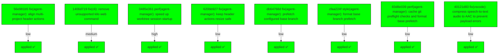

# Backport Agent — Detailed Run Report

> This file is generated automatically. It is intended for human analysts and
> AI reasoning models to assess agent performance, decision quality, and LLM behavior.

**Run timestamp**: 2026-08-07T10:39:53.164Z
**Models used**: fast=`mistral/mistral-code-agent-latest`  powerful=`poolside/laguna-s-2.1`
**Prompt log**: `/Users/rlemeill/Development/tea-ching-kilocode/.backport-agent/run-1786098603618.prompts.jsonl`

---

## Summary (PR body)

## Backport Agent — Sync Report

**Date**: 2026-08-07T10:39:53.164Z
**Upstream ref**: `main`
**Cut date**: `2026-08-06T10:02:00+02:00` 
**Fork ref**: `keypool-live`
**Sync branch**: `sync/upstream-main-2026-08-07-103127`

### Summary

- ✅ Applied: 8
- ⚠️ Needs human review: 0
- ⛔ Blocked (not attempted): 0
- 🔴 Validation suite FAILED during this run (host-verified)
- 🔴🔴 **THIS RUN REQUIRES HUMAN REVIEW despite the counters above reading clean — see 🛑 Host-side gate report below.**

### 🛑 Host-side gate report

- Validation suite(s) FAILED: high, final — this run requires human review regardless of per-commit statuses above.

### Applied commits

- `56e981b5` [low] fix(agent-manager): align multi-project header actions
- `1406d719` [medium] fix(cli): remove unsupported kilo web command
- `0485e361` [high] perf(agent-manager): speed up worktree session startup
- `620bb927` [low] fix(agent-manager): keep header actions resize safe
- `db64768d` [low] fix(agent-manager): prefetch configured base branch
- `cfaa224f` [low] style(agent-manager): format base branch prefetch
- `83d8e039` [low] perf(agent-manager): cache git preflight checks and format base prefetch
- `40121d83` [low] fix(vscode): compress speech-to-text audio to AAC to prevent payload errors

### Agent decision log

- Applied 8 commits: 7 low risk, 1 medium risk, 1 high risk (with AI conflict resolution).
- Validation failed due to missing Java 21 toolchain in the JetBrains package — environment issue, not a semantic conflict.


---

## Agent Workflow Diagram

> Generated by the fast model from the run summary. Evaluate the agent's decision path.



---

## AI Sub-Agent Call Log (7 calls)

> Each entry is one sub-agent invocation. Review prompt/response pairs to assess
> reasoning quality, hallucinations, and decision accuracy.

### Call 1 / 7 — `analyze_commit_for_backport` ✅ OK

| Field | Value |
|---|---|
| **Timestamp** | 2026-08-07T10:31:09.944Z |
| **Tool** | `analyze_commit_for_backport` |
| **Model** | `mistral/mistral-code-agent-latest` |
| **Duration** | 3669 ms |
| **Tokens in** | 10145 |
| **Tokens out** | 174 |
| **Cost** | $0.000000 |

**Prompt sent to sub-agent:**

```
Commit SHA: 0485e361c6fcde687923daf2d42a1761bd315366
Commit message:
perf(agent-manager): speed up worktree session startup

Changed files (8):
.changeset/faster-agent-manager-worktrees.md
packages/kilo-vscode/package.json
packages/kilo-vscode/src/agent-manager/WorktreeManager.ts
packages/kilo-vscode/src/agent-manager/provider-multi-version.ts
packages/kilo-vscode/src/agent-manager/worktree-importer.ts
packages/kilo-vscode/tests/unit/agent-manager-arch.test.ts
packages/kilo-vscode/tests/unit/provider-multi-version.test.ts
packages/kilo-vscode/tests/unit/sandbox-bootstrap.test.ts

Diff:
commit 0485e361c6fcde687923daf2d42a1761bd315366
Author: marius-kilocode <marius@kilocode.ai>
Date:   Fri Aug 7 10:27:53 2026 +0200

    perf(agent-manager): speed up worktree session startup
---
 .changeset/faster-agent-manager-worktrees.md       |   5 +
 packages/kilo-vscode/package.json                  |   6 +
 .../src/agent-manager/WorktreeManager.ts           |  34 ++++--
 .../src/agent-manager/provider-multi-version.ts    | 130 ++++++++++++---------
 .../src/agent-manager/worktree-importer.ts         |   3 +
 .../tests/unit/agent-manager-arch.test.ts          |   2 +-
 .../tests/unit/provider-multi-version.test.ts      |  67 +++++++++++
 .../tests/unit/sandbox-bootstrap.test.ts           |   8 +-
 8 files changed, 189 insertions(+), 66 deletions(-)

diff --git a/.changeset/faster-agent-manager-worktrees.md b/.changeset/faster-agent-manager-worktrees.md
new file mode 100644
index 0000000000..259a5413f7
--- /dev/null
+++ b/.changeset/faster-agent-manager-worktrees.md
@@ -0,0 +1,5 @@
+---
+"kilo-code": patch
+---
+
+Start Agent Manager worktree sessions faster by prefetching base branches, reducing workspace file-watcher load, and overlapping independent multi-session setup.
diff --git a/packages/kilo-vscode/package.json b/packages/kilo-vscode/package.json
index 1ce8210b66..acca2e4b35 100644
--- a/packages/kilo-vscode/package.json
+++ b/packages/kilo-vscode/package.json
@@ -59,6 +59,12 @@
   ],
   "main": "./dist/extension.js",
   "contributes": {
+    "configurationDefaults": {
+      "files.watcherExclude": {
+        "**/.kilo/worktrees/**": true,
+        "**/.kilocode/worktrees/**": true
+      }
+    },
     "taskDefinitions": [
       {
         "type": "kilo-worktree-setup",
diff --git a/packages/kilo-vscode/src/agent-manager/WorktreeManager.ts b/packages/kilo-vscode/src/agent-manager/WorktreeManager.ts
index 4879b32af3..763484584e 100644
--- a/packages/kilo-vscode/src/agent-manager/WorktreeManager.ts
+++ b/packages/kilo-vscode/src/agent-manager/WorktreeManager.ts
@@ -150,6 +150,13 @@ export class WorktreeManager {
     return this.withGitLock(() => this.createWorktreeImpl(params))
   }
 
+  /** Start the remote base refresh before creation reaches the git mutex. */
+  async prefetchBase(branch?: string): Promise<void> {
+    await this.ensureMigrated()
+    const base = branch || (await this.defaultBranch())
+    await this.withGitLock(() => this.refreshBase(base))
+  }
+
   async renameBranch(worktreePath: string, current: string, requested: string): Promise<string> {
     await this.ensureMigrated()
     return this.withGitLock(() => this.renameBranchImpl(worktreePath, current, requested))
@@ -762,20 +769,14 @@ export class WorktreeManager {
             source: "remote",
           }
         }
+        WorktreeManager.fetchCache.delete(cacheKey)
       }
 
       // Either not cached or cache is stale - do the fetch.
       // Use non-interactive env to prevent SSH passphrase popups.
       onProgress?.("fetching", `Fetching ${remote}/${branch}...`)
       try {
-        // Only opt into simple-git's allowUnsafeSshCommand when the SSH command
-        // is the fixed value Kilo injects — never for an inherited one, which
-        // could be attacker-controlled.
-        const env = nonInteractiveEnv()
-        await simpleGit(this.root, { unsafe: { allowUnsafeSshCommand: isKiloOwnedSshCommand(env) } })
-          .env(env)
-          .fetch(remote, branch, { "--quiet": null, "--no-tags": null })
-        WorktreeManager.fetchCache.set(cacheKey, Date.now())
+        await this.refreshBase(branch, remote)
         if (await this.refExistsLocally(`${remote}/${branch}`)) {
           return {
             ref: `${remote}/${branch}`,
@@ -830,6 +831,23 @@ export class WorktreeManager {
     throw new Error(`Could not resolve start point for branch "${branch}"`)
   }
 
+  private async refreshBase(branch: string, requested?: string): Promise<void> {
+    const remote = requested ?? (await this.resolveRemote())
+    if (!remote) return
+    const key = `${this.root}:${remote}:${branch}`
+    const cached = WorktreeManager.fetchCache.get(key)
+    if (cached && Date.now() - cached < WorktreeManager.FETCH_CACHE_TTL) return
+
+    // Only opt into simple-git's allowUnsafeSshCommand when the SSH command
+    // is the fixed value Kilo injects — never for an inherited one, which
+    // could be attacker-controlled.
+    const env = nonInteractiveEnv()
+    await simpleGit(this.root, { unsafe: { allowUnsafeSshCommand: isKiloOwnedSshCommand(env) } })
+      .env(env)
+      .fetch(remote, branch, { "--quiet": null, "--no-tags": null })
+    WorktreeManager.fetchCache.set(key, Date.now())
+  }
+
   /**
    * Resolve the primary remote name for this repo.
    * Uses `GitOps.resolveRemote` when available, otherwise checks for "origin".
diff --git a/packages/kilo-vscode/src/agent-manager/provider-multi-version.ts b/packages/kilo-vscode/src/agent-manager/provider-multi-version.ts
index 41cc02049e..59b6aba1af 100644
--- a/packages/kilo-vscode/src/agent-manager/provider-multi-version.ts
+++ b/packages/kilo-vscode/src/agent-manager/provider-multi-version.ts
@@ -6,6 +6,9 @@ import { versionedName } from "./branch-name"
 import { resolveVersionModels, buildInitialMessages, type CreatedVersion } from "./multi-version"
 import { ensureSandbox } from "./sandbox-bootstrap"
 import type { LifecycleHost } from "./provider-lifecycle"
+import { Semaphore } from "./semaphore"
+
+const PROVISION_CONCURRENCY = 2
 
 /**
  * Multi-version creation needs the lifecycle capabilities plus three provider
@@ -19,8 +22,8 @@ export interface MultiVersionHost extends LifecycleHost {
 }
 
 /**
- * Create N worktrees with one session each (optionally one model per version),
- * then fan the initial prompt out to every created session. State is reached
+ * Create N worktrees, provision their sessions with bounded concurrency, then
+ * send each initial prompt as soon as that session is ready. State is reached
  * through the project context; everything else goes through the host.
  */
 export async function createMultiVersion(
@@ -57,26 +60,49 @@ export async function createMultiVersion(
     groupId,
   })
 
-  // Phase 1: Create all worktrees + sessions first
+  // Phase 1: finish every shared-repository Git mutation before setup scripts
+  // or agents can run their own Git commands in the new worktrees.
   const created: CreatedVersion[] = []
 
-  for (let i = 0; i < versions; i++) {
-    const version = await createVersion(ctx, host, {
-      index: i,
-      versions,
-      groupId,
-      baseBranch,
-      branchName,
-      worktreeName,
+  const specs = Array.from({ length: versions }, (_, index) => ({
+    index,
+    versions,
+    groupId,
+    baseBranch,
+    branchName,
+    worktreeName,
+    models,
+    providerID,
+    modelID,
+    sandbox: msg.sandbox,
+  }))
+  const prepared: PreparedVersion[] = []
+  for (const spec of specs) {
+    const version = await prepareVersion(host, spec)
+    if (version) prepared.push(version)
+  }
+
+  // Phase 2: Git creation is complete, so independent setup/session pipelines
+  // can overlap without racing the shared worktree metadata mutation.
+  const provision = async (version: PreparedVersion) => {
+    const ready = await provisionVersion(ctx, host, version)
+    if (!ready) return
+    created.push(ready)
+
+    sendInitialPrompt(
+      host,
+      ctx.id,
+      ready,
       models,
-      providerID,
-      modelID,
-      sandbox: msg.sandbox,
-    })
-    if (!version) continue
-    created.push(version)
+      { providerID, modelID },
+      {
+        text,
+        agent,
+        variant: msg.variant,
+        files,
+      },
+    )
 
-    // Update progress
     host.post({
       type: "agentManager.multiVersionProgress",
       projectId: ctx.id,
@@ -87,15 +113,8 @@ export async function createMultiVersion(
     })
   }
 
-  // Phase 2: Send the initial prompt to all sessions, or clear busy state if no text.
-  await sendInitialPrompts(
-    host,
-    ctx.id,
-    created,
-    models,
-    { providerID, modelID },
-    { text, agent, variant: msg.variant, files },
-  )
+  const gate = new Semaphore(PROVISION_CONCURRENCY)
+  await Promise.all(prepared.map((version) => gate.run(() => provision(version))))
 
   // Notify completion
   host.post({
@@ -128,12 +147,13 @@ interface VersionSpec {
   sandbox: boolean | undefined
 }
 
-/** Create one version's worktree + session and wire it into state and the webview. */
-async function createVersion(
-  ctx: ProjectContext,
-  host: MultiVersionHost,
-  spec: VersionSpec,
-): Promise<CreatedVersion | null> {
+interface PreparedVersion {
+  spec: VersionSpec
+  wt: NonNullable<Awaited<ReturnType<MultiVersionHost["createOnDisk"]>>>
+}
+
+/** Create one version's worktree while the shared-repository Git barrier is active. */
+async function prepareVersion(host: MultiVersionHost, spec: VersionSpec): Promise<PreparedVersion | null> {
   host.log(`Creating worktree ${spec.index + 1}/${spec.versions}`)
 
   const version = versionedName(spec.branchName || spec.worktreeName, spec.index, spec.versions)
@@ -148,6 +168,16 @@ async function createVersion(
     host.log(`Failed to create worktree for version ${spec.index + 1}`)
     return null
   }
+  return { spec, wt }
+}
+
+/** Set up one prepared worktree, create its session, and expose it to the UI. */
+async function provisionVersion(
+  ctx: ProjectContext,
+  host: MultiVersionHost,
+  prepared: PreparedVersion,
+): Promise<CreatedVersion | null> {
+  const { spec, wt } = prepared
 
   await host.runSetup(wt.result.path, wt.result.branch, wt.worktree.id)
 
@@ -240,11 +270,11 @@ async function reconcileSandbox(
   }
 }
 
-/** Fan the initial prompt out to every created session, throttled between sends. */
-async function sendInitialPrompts(
+/** Send one version's initial prompt as soon as its session is ready. */
+function sendInitialPrompt(
   host: MultiVersionHost,
   projectId: string,
-  created: CreatedVersion[],
+  created: CreatedVersion,
   models: VersionSpec["models"],
   resolved: { providerID: string | undefined; modelID: string | undefined },
   input: {
@@ -253,22 +283,16 @@ async function sendInitialPrompts(
     variant: string | undefined
     files: Extract<AgentManagerInMessage, { type: "agentManager.createMultiVersion" }>["files"]
   },
-): Promise<void> {
-  const messages = buildInitialMessages(created, models, resolved, input.text, input.agent, input.variant, input.files)
-  for (let i = 0; i < messages.length; i++) {
-    const msg = messages[i]!
-    if (input.text) {
-      host.log(`Sending initial message to version ${i + 1} (session=${msg.sessionId})`)
-      host.promptName({
-        sessionID: msg.sessionId,
-        text: input.text,
-        providerID: msg.providerID,
-        modelID: msg.modelID,
-      })
-    }
-    host.post({ type: "agentManager.sendInitialMessage", projectId, ...msg })
-    if (input.text && i < messages.length - 1) {
-      await new Promise((resolve) => setTimeout(resolve, 300))
-    }
+): void {
+  const msg = buildInitialMessages([created], models, resolved, input.text, input.agent, input.variant, input.files)[0]!
+  if (input.text) {
+    host.log(`Sending initial message to version ${created.versionIndex + 1} (session=${msg.sessionId})`)
+    host.promptName({
+      sessionID: msg.sessionId,
+      text: input.text,
+      providerID: msg.providerID,
+      modelID: msg.modelID,
+    })
   }
+  host.post({ type: "agentManager.sendInitialMessage", projectId, ...msg })
 }
diff --git a/packages/kilo-vscode/src/agent-manager/worktree-importer.ts b/packages/kilo-vscode/src/agent-manager/worktree-importer.ts
index c44d7d9cf9..c1a55a8ba8 100644
--- a/packages/kilo-vscode/src/agent-manager/worktree-importer.ts
+++ b/packages/kilo-vscode/src/agent-manager/worktree-importer.ts
@@ -30,6 +30,9 @@ export class WorktreeImporter {
 
     try {
       const result = await manager.listBranches()
+      void manager
+        .prefetchBase(result.defaultBranch)
+        .catch((err) => this.host.log("Failed to prefetch base branch:", err))
       const checked = await manager.checkedOutBranches()
       const branches = result.branches.map((branch) => ({
         ...branch,
diff --git a/packages/kilo-vscode/tests/unit/agent-manager-arch.test.ts b/packages/kilo-vscode/tests/unit/agent-manager-arch.test.ts
index a9c2f4b355..7d0b8b1c13 100644
--- a/packages/kilo-vscode/tests/unit/agent-manager-arch.test.ts
+++ b/packages/kilo-vscode/tests/unit/agent-manager-arch.test.ts
@@ -461,7 +461,7 @@ describe("Agent Manager Provider — onMessage routing", () => {
     const lifecycle = source.getProject().addSourceFileAtPath(path.join(ROOT, "src/agent-manager", module))
     const fn = lifecycle.getFunction(delegated[1]!)
     expect(fn, `delegated function ${delegated[1]} not found in ${module}`).toBeTruthy()
-    // The multi-version flow spans phase helpers (createVersion, sendInitialPrompts),
+    // The multi-version flow spans prepare, provision, and initial-prompt helpers,
     // so ordering assertions need the whole module, not just the orchestrator.
     if (delegated[1] === "createMultiVersion") return lifecycle.getText()
     return fn!.getText()
diff --git a/packages/kilo-vscode/tests/unit/provider-multi-version.test.ts b/packages/kilo-vscode/tests/unit/provider-multi-version.test.ts
new file mode 100644
index 0000000000..df0ec2d53b
--- /dev/null
+++ b/packages/kilo-vscode/tests/unit/provider-multi-version.test.ts
@@ -0,0 +1,67 @@
+import { describe, expect, it, mock } from "bun:test"
+import type { Session } from "@kilocode/sdk/v2/client"
+import { createMultiVersion, type MultiVersionHost } from "../../src/agent-manager/provider-multi-version"
+import type { ProjectContext } from "../../src/agent-manager/project/context"
+import type { CreateWorktreeOnDiskResult } from "../../src/agent-manager/worktree-create"
+
+describe("multi-version provisioning", () => {
+  it("finishes git creation before provisioning at bounded concurrency", async () => {
+    const flow: string[] = []
+    const gates = [Promise.withResolvers<void>(), Promise.withResolvers<void>()]
+    const entered = [Promise.withResolvers<void>(), Promise.withResolvers<void>()]
+    const state = { addSession: mock(() => {}), armAutoName: mock(() => {}) }
+    const ctx = {
+      id: "project-1",
+      stateManager: () => state,
+      peekState: () => state,
+      worktreeManager: () => ({ removeWorktree: mock(async () => {}) }),
+    } as unknown as ProjectContext
+    const host = {
+      log: mock(() => {}),
+      post: mock((msg: { type: string; sessionId?: string }) => {
+        if (msg.type === "agentManager.sendInitialMessage") flow.push(`prompt:${msg.sessionId}`)
+      }),
+      createOnDisk: mock(async (opts: { branchName?: string }) => {
+        const index = opts.branchName?.endsWith("_v2") ? 1 : opts.branchName?.endsWith("_v3") ? 2 : 0
+        flow.push(`git:${index}`)
+        return {
+          worktree: { id: `wt-${index}` },
+          result: { path: `/repo/wt-${index}`, branch: `branch-${index}`, parentBranch: "main" },
+        } as CreateWorktreeOnDiskResult
+      }),
+      runSetup: mock(async (dir: string) => {
+        const index = Number(dir.at(-1)!)
+        flow.push(`setup:${index}`)
+        if (index < 2) {
+          entered[index]?.resolve()
+          await gates[index]?.promise
+        }
+      }),
+      createSession: mock(async (dir: string) => ({ id: `session-${dir.at(-1)!}` }) as Session),
+      autoName: () => ({ enabled: false }),
+      register: mock(() => {}),
+      notifyReady: mock(() => {}),
+      sessions: { register: mock(() => {}) },
+      promptName: mock(() => {}),
+      capture: mock(() => {}),
+      error: mock(() => {}),
+    } as unknown as MultiVersionHost
+
+    const pending = createMultiVersion(ctx, host, {
+      type: "agentManager.createMultiVersion",
+      text: "Fix it",
+      branchName: "fix-it",
+      versions: 3,
+    })
+    await Promise.all(entered.map((entry) => entry.promise))
+
+    expect(flow.slice(0, 5)).toEqual(["git:0", "git:1", "git:2", "setup:0", "setup:1"])
+    expect(flow).not.toContain("setup:2")
+
+    gates.forEach((gate) => gate.resolve())
+    await pending
+
+    expect(flow).toContain("setup:2")
+    expect(flow.filter((event) => event.startsWith("prompt:"))).toHaveLength(3)
+  })
+})
diff --git a/packages/kilo-vscode/tests/unit/sandbox-bootstrap.test.ts b/packages/kilo-vscode/tests/unit/sandbox-bootstrap.test.ts
index 445192eeff..7d7a02172d 100644
--- a/packages/kilo-vscode/tests/unit/sandbox-bootstrap.test.ts
+++ b/packages/kilo-vscode/tests/unit/sandbox-bootstrap.test.ts
@@ -98,8 +98,8 @@ describe("Agent Manager sandbox startup", () => {
   )
 
   test("reconciles before exposing or prompting the session", () => {
-    // In createVersion the sandbox gate runs before the session is exposed.
-    const start = flow.indexOf("async function createVersion")
+    // In provisionVersion the sandbox gate runs before the session is exposed.
+    const start = flow.indexOf("async function provisionVersion")
     const version = flow.slice(start, flow.indexOf("\n/**", start + 1))
     const gate = version.indexOf("await reconcileSandbox")
     const register = version.indexOf("host.register", gate)
@@ -122,8 +122,8 @@ describe("Agent Manager sandbox startup", () => {
     expect(abort).toBeGreaterThan(discard)
 
     // The created sessions feed the initial prompt phase.
-    const prompts = flow.slice(flow.indexOf("async function sendInitialPrompts"))
-    expect(prompts).toContain("buildInitialMessages(created")
+    const prompts = flow.slice(flow.indexOf("function sendInitialPrompt"))
+    expect(prompts).toContain("buildInitialMessages([created]")
     expect(prompts).toContain('type: "agentManager.sendInitialMessage"')
   })

Output the JSON object now.
```

**Response received:**

````
```json
{
  "summary": "Optimizes Agent Manager worktree startup by prefetching base branches, reducing file-watcher load, and parallelizing session provisioning.",
  "keyChanges": [
    "Adds `prefetchBase` to WorktreeManager for early base branch fetching",
    "Refactors multi-version creation into prepare/provision phases with bounded concurrency",
    "Excludes worktree directories from VS Code file watcher via `files.watcherExclude`",
    "Adds new unit tests for multi-version provisioning flow"
  ],
  "backportComplexity": "moderate",
  "semanticRiskFactors": [
    "Changes worktree/session creation orchestration logic",
    "Adds new VS Code configuration defaults"
  ],
  "recommendation": "apply-with-care"
}
```
````

---

### Call 2 / 7 — `check_customization_compatibility` ✅ OK

| Field | Value |
|---|---|
| **Timestamp** | 2026-08-07T10:31:17.462Z |
| **Tool** | `check_customization_compatibility` |
| **Model** | `mistral/mistral-code-agent-latest` |
| **Duration** | 7391 ms |
| **Tokens in** | 6331 |
| **Tokens out** | 82 |
| **Cost** | $0.000000 |

**Prompt sent to sub-agent:**

```
Declared fork customisations:
  1. Pattern: .github/workflows/keypool-live-preview.yml,script/check-workflows.ts,packages/opencode/package.json,packages/opencode/bin/kilo,packages/opencode/script/build.ts,packages/opencode/script/publish.ts,packages/kilo-vscode/package.json,packages/kilo-vscode/script/build.ts,packages/script/src/index.ts
     Description: .github/workflows/keypool-live-preview.yml builds a VSIX and CLI binaries/npm package on every push to keypool-live, renamed away from the real kilocode identity so both can be installed side by side without ID collisions:
  - VS Code extension: kilocode.kilo-code -> sctg.keypool-code (packages/kilo-vscode/package.json
    patched at CI time — name/publisher/displayName/repository/homepage/author — never committed).
  - CLI npm package: @kilocode/cli -> @sctg/keypool-code-cli (packages/opencode/package.json's
    `name` patched at CI time; packages/opencode/script/build.ts derives every per-arch dist
    folder name from that field dynamically, so this one patch is enough to rename the whole
    build — no other part of build.ts hardcodes the old name).

GOTCHA found while designing this workflow: packages/opencode/bin/kilo (the npm-published CLI wrapper script) hardcodes the platform sub-package name it resolves at runtime (`"@kilocode/cli-" + platform + "-" + arch`) as a literal string — completely independent of package.json. Renaming only package.json without also sed-patching this exact string produces a package that installs fine but crashes on first run trying to require() a platform package that was never renamed to match. The workflow patches both together, always in the same step.
packages/kilo-vscode/script/build.ts also hardcodes the per-target CLI dist directory names it expects ("@kilocode/cli-<target>") — rather than patching that shared, committed script too, the workflow builds the CLI ONCE under the renamed identity, then aliases the renamed dist dirs back to the original expected names via symlinks before invoking the unmodified build script.
SECOND GOTCHA (hit in production, first preview publish run): packages/opencode/script/build.ts (per-platform dist package.json) and packages/opencode/script/publish.ts (the aggregate `@sctg/keypool-code-cli` package.json) both write a `repository.url` field into the package.json they generate for npm. Until this was fixed, that field was a hardcoded literal ("https://github.com/Kilo-Org/kilocode"), so every published tarball's repository.url stayed pinned to the real kilocode repo no matter what the CI rename step patched. npm's provenance verification (this workflow publishes with `--provenance`) cross-checks the tarball's `repository.url` against the GitHub OIDC attestation's actual repo (TEA-ching/kilocode) and rejects the publish with `E422 ... expected to match "https://github.com/TEA-ching/kilocode" from provenance` when they don't match — every per-platform package failed this way in the first real run. Fix: both scripts now read `pkg.repository?.url` (falling back to the literal for the real kilocode build, where no CI rename step runs) instead of hardcoding the string, and packages/opencode/package.json gained a real `repository` field so `pkg.repository` exists for TypeScript to type-check — the CI rename step's existing `.repository.url = ...` jq patch (which already ran before this fix, just uselessly) now actually reaches npm.
Deliberately reuses the real packages/opencode/script/{build,publish}.ts and packages/kilo-vscode/script/build.ts unmodified (never forked/duplicated) — they're complex (bwrap sandbox staging, tree-sitter wasm bundling, kilo-console build, multi-target native compiles) and safe to reuse as-is because every rename flows through package.json fields they already read dynamically. packages/opencode/script/publish.ts's `!Script.preview` guard (which this workflow relies on to skip Docker/AUR/Homebrew publishing) is upstream's own, not fork-added — do not assume it will always exist; re-verify after any upstream sync that touches that file. The npm publish job does NOT use `packages/kilo-vscode/script/publish.ts` (that one calls `vsce publish`/`ovsx publish` to the real public VS Code Marketplace/Open VSX — this fork only packages VSIX files as downloadable GitHub pre-release assets, same as the cline fork's equivalent workflow, never touching the real marketplace).


Upstream diff to evaluate:
commit 0485e361c6fcde687923daf2d42a1761bd315366
Author: marius-kilocode <marius@kilocode.ai>
Date:   Fri Aug 7 10:27:53 2026 +0200

    perf(agent-manager): speed up worktree session startup
---
 .changeset/faster-agent-manager-worktrees.md       |   5 +
 packages/kilo-vscode/package.json                  |   6 +
 .../src/agent-manager/WorktreeManager.ts           |  34 ++++--
 .../src/agent-manager/provider-multi-version.ts    | 130 ++++++++++++---------
 .../src/agent-manager/worktree-importer.ts         |   3 +
 .../tests/unit/agent-manager-arch.test.ts          |   2 +-
 .../tests/unit/provider-multi-version.test.ts      |  67 +++++++++++
 .../tests/unit/sandbox-bootstrap.test.ts           |   8 +-
 8 files changed, 189 insertions(+), 66 deletions(-)

diff --git a/.changeset/faster-agent-manager-worktrees.md b/.changeset/faster-agent-manager-worktrees.md
new file mode 100644
index 0000000000..259a5413f7
--- /dev/null
+++ b/.changeset/faster-agent-manager-worktrees.md
@@ -0,0 +1,5 @@
+---
+"kilo-code": patch
+---
+
+Start Agent Manager worktree sessions faster by prefetching base branches, reducing workspace file-watcher load, and overlapping independent multi-session setup.
diff --git a/packages/kilo-vscode/package.json b/packages/kilo-vscode/package.json
index 1ce8210b66..acca2e4b35 100644
--- a/packages/kilo-vscode/package.json
+++ b/packages/kilo-vscode/package.json
@@ -59,6 +59,12 @@
   ],
   "main": "./dist/extension.js",
   "contributes": {
+    "configurationDefaults": {
+      "files.watcherExclude": {
+        "**/.kilo/worktrees/**": true,
+        "**/.kilocode/worktrees/**": true
+      }
+    },
     "taskDefinitions": [
       {
         "type": "kilo-worktree-setup",
diff --git a/packages/kilo-vscode/src/agent-manager/WorktreeManager.ts b/packages/kilo-vscode/src/agent-manager/WorktreeManager.ts
index 4879b32af3..763484584e 100644
--- a/packages/kilo-vscode/src/agent-manager/WorktreeManager.ts
+++ b/packages/kilo-vscode/src/agent-manager/WorktreeManager.ts
@@ -150,6 +150,13 @@ export class WorktreeManager {
     return this.withGitLock(() => this.createWorktreeImpl(params))
   }
 
+  /** Start the remote base refresh before creation reaches the git mutex. */
+  async prefetchBase(branch?: string): Promise<void> {
+    await this.ensureMigrated()
+    const base = branch || (await this.defaultBranch())
+    await this.withGitLock(() => this.refreshBase(base))
+  }
+
   async renameBranch(worktreePath: string, current: string, requested: string): Promise<string> {
     await this.ensureMigrated()
     return this.withGitLock(() => this.renameBranchImpl(worktreePath, current, requested))
@@ -762,20 +769,14 @@ export class WorktreeManager {
             source: "remote",
           }
         }
+        WorktreeManager.fetchCache.delete(cacheKey)
       }
 
       // Either not cached or cache is stale - do the fetch.
       // Use non-interactive env to prevent SSH passphrase popups.
       onProgress?.("fetching", `Fetching ${remote}/${branch}...`)
       try {
-        // Only opt into simple-git's allowUnsafeSshCommand when the SSH command
-        // is the fixed value Kilo injects — never for an inherited one, which
-        // could be attacker-controlled.
-        const env = nonInteractiveEnv()
-        await simpleGit(this.root, { unsafe: { allowUnsafeSshCommand: isKiloOwnedSshCommand(env) } })
-          .env(env)
-          .fetch(remote, branch, { "--quiet": null, "--no-tags": null })
-        WorktreeManager.fetchCache.set(cacheKey, Date.now())
+        await this.refreshBase(branch, remote)
         if (await this.refExistsLocally(`${remote}/${branch}`)) {
           return {
             ref: `${remote}/${branch}`,
@@ -830,6 +831,23 @@ export class WorktreeManager {
     throw new Error(`Could not resolve start point for branch "${branch}"`)
   }
 
+  private async refreshBase(branch: string, requested?: string): Promise<void> {
+    const remote = requested ?? (await this.resolveRemote())
+    if (!remote) return
+    const key = `${this.root}:${remote}:${branch}`
+    const cached = WorktreeManager.fetchCache.get(key)
+    if (cached && Date.now() - cached < WorktreeManager.FETCH_CACHE_TTL) return
+
+    // Only opt into simple-git's allowUnsafeSshCommand when the SSH command
+    // is the fixed value Kilo injects — never for an inherited one, which
+    // could be attacker-controlled.
+    const env = nonInteractiveEnv()
+    await simpleGit(this.root, { unsafe: { allowUnsafeSshCommand: isKiloOwnedSshCommand(env) } })
+      .env(env)
+      .fetch(remote, branch, { "--quiet": null, "--no-tags": null })
+    WorktreeManager.fetchCache.set(key, Date.now())
+  }
+
   /**
    * Resolve the primary remote name for this repo.
    * Uses `GitOps.resolveRemote` when available, otherwise checks for "origin".
diff --git a/packages/kilo-vscode/src/agent-manager/provider-multi-version.ts b/packages/kilo-vscode/src/agent-manager/provider-multi-version.ts
index 41cc02049e..59b6aba1af 100644
--- a/packages/kilo-vscode/src/agent-manager/provider-multi-version.ts
+++ b/packages/kilo-vscode/src/agent-manager/provider-multi-version.ts
@@ -6,6 +6,9 @@ import { versionedName } from "./branch-name"
 import { resolveVersionModels, buildInitialMessages, type CreatedVersion } from "./multi-version"
 import { ensureSandbox } from "./sandbox-bootstrap"
 import type { LifecycleHost } from "./provider-lifecycle"
+import { Semaphore } from "./semaphore"
+
+const PROVISION_CONCURRENCY = 2
 
 /**
  * Multi-version creation needs the lifecycle capabilities plus three provider
@@ -19,8 +22,8 @@ export interface MultiVersionHost extends LifecycleHost {
 }
 
 /**
- * Create N worktrees with one session each (optionally one model per version),
- * then fan the initial prompt out to every created session. State is reached
+ * Create N worktrees, provision their sessions with bounded concurrency, then
+ * send each initial prompt as soon as that session is ready. State is reached
  * through the project context; everything else goes through the host.
  */
 export async function createMultiVersion(
@@ -57,26 +60,49 @@ export async function createMultiVersion(
     groupId,
   })
 
-  // Phase 1: Create all worktrees + sessions first
+  // Phase 1: finish every shared-repository Git mutation before setup scripts
+  // or agents can run their own Git commands in the new worktrees.
   const created: CreatedVersion[] = []
 
-  for (let i = 0; i < versions; i++) {
-    const version = await createVersion(ctx, host, {
-      index: i,
-      versions,
-      groupId,
-      baseBranch,
-      branchName,
-      worktreeName,
+  const specs = Array.from({ length: versions }, (_, index) => ({
+    index,
+    versions,
+    groupId,
+    baseBranch,
+    branchName,
+    worktreeName,
+    models,
+    providerID,
+    modelID,
+    sandbox: msg.sandbox,
+  }))
+  const prepared: PreparedVersion[] = []
+  for (const spec of specs) {
+    const version = await prepareVersion(host, spec)
+    if (version) prepared.push(version)
+  }
+
+  // Phase 2: Git creation is complete, so independent setup/session pipelines
+  // can overlap without racing the shared worktree metadata mutation.
+  const provision = async (version: PreparedVersion) => {
+    const ready = await provisionVersion(ctx, host, version)
+    if (!ready) return
+    created.push(ready)
+
+    sendInitialPrompt(
+      host,
+      ctx.id,
+      ready,
       models,
-      providerID,
-      modelID,
-      sandbox: msg.sandbox,
-    })
-    if (!version) continue
-    created.push(version)
+      { providerID, modelID },
+      {
+        text,
+        agent,
+        variant: msg.variant,
+        files,
+      },
+    )
 
-    // Update progress
     host.post({
       type: "agentManager.multiVersionProgress",
       projectId: ctx.id,
@@ -87,15 +113,8 @@ export async function createMultiVersion(
     })
   }
 
-  // Phase 2: Send the initial prompt to all sessions, or clear busy state if no text.
-  await sendInitialPrompts(
-    host,
-    ctx.id,
-    created,
-    models,
-    { providerID, modelID },
-    { text, agent, variant: msg.variant, files },
-  )
+  const gate = new Semaphore(PROVISION_CONCURRENCY)
+  await Promise.all(prepared.map((version) => gate.run(() => provision(version))))
 
   // Notify completion
   host.post({
@@ -128,12 +147,13 @@ interface VersionSpec {
   sandbox: boolean | undefined
 }
 
-/** Create one version's worktree + session and wire it into state and the webview. */
-async function createVersion(
-  ctx: ProjectContext,
-  host: MultiVersionHost,
-  spec: VersionSpec,
-): Promise<CreatedVersion | null> {
+interface PreparedVersion {
+  spec: VersionSpec
+  wt: NonNullable<Awaited<ReturnType<MultiVersionHost["createOnDisk"]>>>
+}
+
+/** Create one version's worktree while the shared-repository Git barrier is active. */
+async function prepareVersion(host: MultiVersionHost, spec: VersionSpec): Promise<PreparedVersion | null> {
   host.log(`Creating worktree ${spec.index + 1}/${spec.versions}`)
 
   const version = versionedName(spec.branchName || spec.worktreeName, spec.index, spec.versions)
@@ -148,6 +168,16 @@ async function createVersion(
     host.log(`Failed to create worktree for version ${spec.index + 1}`)
     return null
   }
+  return { spec, wt }
+}
+
+/** Set up one prepared worktree, create its session, and expose it to the UI. */
+async function provisionVersion(
+  ctx: ProjectContext,
+  host: MultiVersionHost,
+  prepared: PreparedVersion,
+): Promise<CreatedVersion | null> {
+  const { spec, wt } = prepared
 
   await host.runSetup(wt.result.path, wt.result.branch, wt.worktree.id)
 
@@ -240,11 +270,11 @@ async function reconcileSandbox(
   }
 }
 
-/** Fan the initial prompt out to every created session, throttled between sends. */
-async function sendInitialPrompts(
+/** Send one version's initial prompt as soon as its session is ready. */
+function sendInitialPrompt(
   host: MultiVersionHost,
   projectId: string,
-  created: CreatedVersion[],
+  created: CreatedVersion,
   models: VersionSpec["models"],
   resolved: { providerID: string | undefined; modelID: string | undefined },
   input: {
@@ -253,22 +283,16 @@ async function sendInitialPrompts(
     variant: string | undefined
     files: Extract<AgentManagerInMessage, { type: "agentManager.createMultiVersion" }>["files"]
   },
-): Promise<void> {
-  const messages = buildInitialMessages(created, models, resolved, input.text, input.agent, input.variant, input.files)
-  for (let i = 0; i < messages.length; i++) {
-    const msg = messages[i]!
-    if (input.text) {
-      host.log(`Sending initial message to version ${i + 1} (session=${msg.sessionId})`)
-      host.promptName({
-        sessionID: msg.sessionId,
-        text: input.text,
-        providerID: msg.providerID,
-        modelID: msg.modelID,
-      })
-    }
-    host.post({ type: "agentManager.sendInitialMessage", projectId, ...msg })
-    if (input.text && i < messages.length - 1) {
-      await new Promise((resolve) => setTimeout(resolve, 300))
-    }
+): void {
+  const msg = buildInitialMessages([created], models, resolved, input.text, input.agent, input.variant, input.files)[0]!
+  if (input.text) {
+    host.log(`Sending initial message to version ${created.versionIndex + 1} (session=${msg.sessionId})`)
+    host.promptName({
+      sessionID: msg.sessionId,
+      text: input.text,
+      providerID: msg.providerID,
+      modelID: msg.modelID,
+    })
   }
+  host.post({ type: "agentManager.sendInitialMessage", projectId, ...msg })
 }
diff --git a/packages/kilo-vscode/src/agent-manager/worktree-importer.ts b/packages/kilo-vscode/src/agent-manager/worktree-importer.ts
index c44d7d9cf9..c1a55a8ba8 100644
--- a/packages/kilo-vscode/src/agent-manager/worktree-importer.ts
+++ b/packages/kilo-vscode/src/agent-manager/worktree-importer.ts
@@ -30,6 +30,9 @@ export class WorktreeImporter {
 
     try {
       const result = await manager.listBranches()
+      void manager
+        .prefetchBase(result.defaultBranch)
+        .catch((err) => this.host.log("Failed to prefetch base branch:", err))
       const checked = await manager.checkedOutBranches()
       const branches = result.branches.map((branch) => ({
         ...branch,
diff --git a/packages/kilo-vscode/tests/unit/agent-manager-arch.test.ts b/packages/kilo-vscode/tests/unit/agent-manager-arch.test.ts
index a9c2f4b355..7d0b8b1c13 100644
--- a/packages/kilo-vscode/tests/unit/agent-manager-arch.test.ts
+++ b/packages/kilo-vscode/tests/unit/agent-manager-arch.test.ts
@@ -461,7 +461,7 @@ describe("Agent Manager Provider — onMessage routing", () => {
     const lifecycle = source.getProject().addSourceFileAtPath(path.join(ROOT, "src/agent-manager", module))
     const fn = lifecycle.getFunction(delegated[1]!)
     expect(fn, `delegated function ${delegated[1]} not found in ${module}`).toBeTruthy()
-    // The multi-version flow spans phase helpers (createVersion, sendInitialPrompts),
+    // The multi-version flow spans prepare, provision, and initial-prompt helpers,
     // so ordering assertions need the whole module, not just the orchestrator.
     if (delegated[1] === "createMultiVersion") return lifecycle.getText()
     return fn!.getText()
diff --git a/packages/kilo-vscode/tests/unit/provider-multi-version.test.ts b/packages/kilo-vscode/tests/unit/provider-multi-version.test.ts
new file mode 100644
index 0000000000..df0ec2d53b
--- /dev/null
+++ b/packages/kilo-vscode/tests/unit/provider-multi-version.test.ts
@@ -0,0 +1,67 @@
+import { describe, expect, it, mock } from "bun:test"
+import type { Session } from "@kilocode/sdk/v2/client"
+import { createMultiVersion, type MultiVersionHost } from "../../src/agent-manager/provider-multi-version"
+import type { ProjectContext } from "../../src/agent-manager/project/context"
+import type { CreateWorktreeOnDiskResult } from "../../src/agent-manager/worktree-create"
+
+describe("multi-version provisioning", () => {
+  it("finishes git creation before provisioning at bounded concurrency", async () => {
+    const flow: string[] = []
+    const gates = [Promise.withResolvers<void>(), Promise.withResolvers<void>()]
+    const entered = [Promise.withResolvers<void>(), Promise.withResolvers<void>()]
+    const state = { addSession: mock(() => {}), armAutoName: mock(() => {}) }
+    const ctx = {
+      id: "project-1",
+      stateManager: () => state,
+      peekState: () => state,
+      worktreeManager: () => ({ removeWorktree: mock(async () => {}) }),
+    } as unknown as ProjectContext
+    const host = {
+      log: mock(() => {}),
+      post: mock((msg: { type: string; sessionId?: string }) => {
+        if (msg.type === "agentManager.sendInitialMessage") flow.push(`prompt:${msg.sessionId}`)
+      }),
+      createOnDisk: mock(async (opts: { branchName?: string }) => {
+        const index = opts.branchName?.endsWith("_v2") ? 1 : opts.branchName?.endsWith("_v3") ? 2 : 0
+        flow.push(`git:${index}`)
+        return {
+          worktree: { id: `wt-${index}` },
+          result: { path: `/repo/wt-${index}`, branch: `branch-${index}`, parentBranch: "main" },
+        } as CreateWorktreeOnDiskResult
+      }),
+      runSetup: mock(async (dir: string) => {
+        const index = Number(dir.at(-1)!)
+        flow.push(`setup:${index}`)
+        if (index < 2) {
+          entered[index]?.resolve()
+          await gates[index]?.promise
+        }
+      }),
+      createSession: mock(async (dir: string) => ({ id: `session-${dir.at(-1)!}` }) as Session),
+      autoName: () => ({ enabled: false }),
+      register: mock(() => {}),
+      notifyReady: mock(() => {}),
+      sessions: { register: mock(() => {}) },
+      promptName: mock(() => {}),
+      capture: mock(() => {}),
+      error: mock(() => {}),
+    } as unknown as MultiVersionHost
+
+    const pending = createMultiVersion(ctx, host, {
+      type: "agentManager.createMultiVersion",
+      text: "Fix it",
+      branchName: "fix-it",
+      versions: 3,
+    })
+    await Promise.all(entered.map((entry) => entry.promise))
+
+    expect(flow.slice(0, 5)).toEqual(["git:0", "git:1", "git:2", "setup:0", "setup:1"])
+    expect(flow).not.toContain("setup:2")
+
+    gates.forEach((gate) => gate.resolve())
+    await pending
+
+    expect(flow).toContain("setup:2")
+    expect(flow.filter((event) => event.startsWith("prompt:"))).toHaveLength(3)
+  })
+})
diff --git a/packages/kilo-vscode/tests/unit/sandbox-bootstrap.test.ts b/packages/kilo-vscode/tests/unit/sandbox-bootstrap.test.ts
index 445192eeff..7d7a02172d 100644
--- a/packages/kilo-vscode/tests/unit/sandbox-bootstrap.test.ts
+++ b/packages/kilo-vscode/tests/unit/sandbox-bootstrap.test.ts
@@ -98,8 +98,8 @@ describe("Agent Manager sandbox startup", () => {
   )
 
   test("reconciles before exposing or prompting the session", () => {
-    // In createVersion the sandbox gate runs before the session is exposed.
-    const start = flow.indexOf("async function createVersion")
+    // In provisionVersion the sandbox gate runs before the session is exposed.
+    const start = flow.indexOf("async function provisionVersion")
     const version = flow.slice(start, flow.indexOf("\n/**", start + 1))
     const gate = version.indexOf("await reconcileSandbox")
     const register = version.indexOf("host.register", gate)
@@ -122,8 +122,8 @@ describe("Agent Manager sandbox startup", () => {
     expect(abort).toBeGreaterThan(discard)
 
     // The created sessions feed the initial prompt phase.
-    const prompts = flow.slice(flow.indexOf("async function sendInitialPrompts"))
-    expect(prompts).toContain("buildInitialMessages(created")
+    const prompts = flow.slice(flow.indexOf("function sendInitialPrompt"))
+    expect(prompts).toContain("buildInitialMessages([created]")
     expect(prompts).toContain('type: "agentManager.sendInitialMessage"')
   })

Output the JSON object now.
```

**Response received:**

````
```json
{
  "compatible": true,
  "affectedCustomizations": [],
  "semanticConflicts": [],
  "warnings": [],
  "recommendation": "The upstream changes are focused on agent-manager performance improvements and do not interact with the fork's customizations (CI-time renaming, repository URL handling, or build scripts). Safe to merge."
}
```
````

---

### Call 3 / 7 — `analyze_commit_for_backport` ✅ OK

| Field | Value |
|---|---|
| **Timestamp** | 2026-08-07T10:31:25.230Z |
| **Tool** | `analyze_commit_for_backport` |
| **Model** | `mistral/mistral-code-agent-latest` |
| **Duration** | 3542 ms |
| **Tokens in** | 8188 |
| **Tokens out** | 119 |
| **Cost** | $0.000000 |

**Prompt sent to sub-agent:**

````
Commit SHA: 1406d719e36afd6d98d60b9fe54fa79b51e6b294
Commit message:
fix(cli): remove unsupported kilo web command

Changed files (9):
.changeset/remove-web-command.md
packages/kilo-docs/markdoc/partials/cli-commands-table.md
packages/kilo-docs/pages/code-with-ai/platforms/cli-reference.md
DELETE:packages/opencode/src/cli/cmd/web.ts
packages/opencode/src/index.ts
packages/opencode/src/kilocode/commands.ts
packages/opencode/test/cli/help/__snapshots__/help-snapshots.test.ts.snap
packages/opencode/test/cli/help/help-snapshots.test.ts
packages/opencode/test/kilocode/help.test.ts

Diff:
commit 1406d719e36afd6d98d60b9fe54fa79b51e6b294
Author: Christiaan Arnoldus <christiaan.arnoldus@outlook.com>
Date:   Fri Aug 7 10:24:46 2026 +0200

    fix(cli): remove unsupported kilo web command
---
 .changeset/remove-web-command.md                   |  5 ++
 .../markdoc/partials/cli-commands-table.md         |  1 -
 .../pages/code-with-ai/platforms/cli-reference.md  | 15 ------
 packages/opencode/src/cli/cmd/web.ts               | 61 ----------------------
 packages/opencode/src/index.ts                     |  4 +-
 packages/opencode/src/kilocode/commands.ts         |  2 -
 .../help/__snapshots__/help-snapshots.test.ts.snap | 21 --------
 .../opencode/test/cli/help/help-snapshots.test.ts  |  1 -
 packages/opencode/test/kilocode/help.test.ts       |  2 -
 9 files changed, 7 insertions(+), 105 deletions(-)

diff --git a/.changeset/remove-web-command.md b/.changeset/remove-web-command.md
new file mode 100644
index 0000000000..8dd97b02fe
--- /dev/null
+++ b/.changeset/remove-web-command.md
@@ -0,0 +1,5 @@
+---
+"@kilocode/cli": patch
+---
+
+Remove unsupported `kilo web` CLI command.
diff --git a/packages/kilo-docs/markdoc/partials/cli-commands-table.md b/packages/kilo-docs/markdoc/partials/cli-commands-table.md
index 0ac95fd554..d8653a898a 100644
--- a/packages/kilo-docs/markdoc/partials/cli-commands-table.md
+++ b/packages/kilo-docs/markdoc/partials/cli-commands-table.md
@@ -13,7 +13,6 @@
 | `kilo upgrade [target]` | upgrade kilo to the latest or a specific version |
 | `kilo uninstall` | uninstall kilo and remove all related files |
 | `kilo serve` | starts a headless kilo server |
-| `kilo web` | start kilo server and open web interface |
 | `kilo models [provider]` | list all available models |
 | `kilo roll-call <filter>` | batch-test text models matching a filter for connectivity and latency |
 | `kilo profile` | show Kilo account profile |
diff --git a/packages/kilo-docs/pages/code-with-ai/platforms/cli-reference.md b/packages/kilo-docs/pages/code-with-ai/platforms/cli-reference.md
index 0047db658f..9a4ec19735 100644
--- a/packages/kilo-docs/pages/code-with-ai/platforms/cli-reference.md
+++ b/packages/kilo-docs/pages/code-with-ai/platforms/cli-reference.md
@@ -659,21 +659,6 @@ Options:
   --cors         additional domains to allow for CORS  [array] [default: []]
 ```
 
-## kilo web
-
-```
-start kilo server and open web interface
-
-Options:
-  --help         Show help  [boolean]
-  --version      Show version number  [boolean]
-  --port         port to listen on  [number] [default: 0]
-  --hostname     hostname to listen on  [string] [default: "127.0.0.1"]
-  --mdns         enable mDNS service discovery (defaults hostname to 0.0.0.0)  [boolean] [default: false]
-  --mdns-domain  custom domain name for mDNS service (default: kilo.local)  [string] [default: "kilo.local"]
-  --cors         additional domains to allow for CORS  [array] [default: []]
-```
-
 ## kilo models
 
 ```
diff --git a/packages/opencode/src/cli/cmd/web.ts b/packages/opencode/src/cli/cmd/web.ts
deleted file mode 100644
index 36df40c8c9..0000000000
--- a/packages/opencode/src/cli/cmd/web.ts
+++ /dev/null
@@ -1,61 +0,0 @@
-import { Effect } from "effect"
-import { UI } from "../ui"
-import { effectCmd } from "../effect-cmd"
-import { withNetworkOptions, resolveNetworkOptions } from "../network"
-import { Flag } from "@opencode-ai/core/flag/flag"
-import open from "open"
-
-export const WebCommand = effectCmd({
-  command: "web",
-  builder: (yargs) => withNetworkOptions(yargs),
-  describe: "start kilo server and open web interface",
-  // Server loads instances per-request via x-kilo-directory header — no
-  // ambient project InstanceContext needed at startup.
-  instance: false, // kilocode_change
-  handler: Effect.fn("Cli.web")(function* (args) {
-    const { Server } = yield* Effect.promise(() => import("../../server/server"))
-    if (!Flag.KILO_SERVER_PASSWORD) {
-      UI.println(UI.Style.TEXT_WARNING_BOLD + "!  KILO_SERVER_PASSWORD is not set; server is unsecured.")
-    }
-    const opts = yield* resolveNetworkOptions(args)
-    const server = yield* Effect.promise(() => Server.listen(opts))
-    UI.empty()
-    UI.println(UI.logo("  "))
-    UI.empty()
-
-    // kilocode_change start
-    const urls = server.urls
-
-    UI.println(UI.Style.TEXT_INFO_BOLD + "  Local:   ", UI.Style.TEXT_NORMAL, urls.local)
-    if (urls.network) {
-      UI.println(UI.Style.TEXT_INFO_BOLD + "  Network: ", UI.Style.TEXT_NORMAL, urls.network)
-    }
-
-    if (opts.mdns) {
-      UI.println(UI.Style.TEXT_INFO_BOLD + "  mDNS:    ", UI.Style.TEXT_NORMAL, `${opts.mdnsDomain}:${server.port}`)
-    }
-
-    open(urls.local).catch(() => {})
-    // kilocode_change end
-
-    // kilocode_change start - graceful signal shutdown
-    const { InstanceRuntime } = yield* Effect.promise(() => import("../../project/instance-runtime"))
-    yield* Effect.promise(
-      () =>
-        new Promise<void>((resolve) => {
-          const shutdown = async () => {
-            try {
-              await InstanceRuntime.disposeAllInstances()
-              await server.stop(true)
-            } finally {
-              resolve()
-            }
-          }
-          process.once("SIGTERM", shutdown)
-          process.once("SIGINT", shutdown)
-          process.once("SIGHUP", shutdown)
-        }),
-    )
-    // kilocode_change end
-  }),
-})
diff --git a/packages/opencode/src/index.ts b/packages/opencode/src/index.ts
index 779f51423a..f23744f03f 100644
--- a/packages/opencode/src/index.ts
+++ b/packages/opencode/src/index.ts
@@ -22,7 +22,7 @@ import { AttachCommand } from "./cli/cmd/attach"
 import { TuiThreadCommand } from "./cli/cmd/tui"
 import { AcpCommand } from "./cli/cmd/acp"
 import { EOL } from "os"
-import { WebCommand } from "./cli/cmd/web"
+// kilocode_change - upstream web command intentionally omitted; Kilo does not ship an embedded web UI
 import { PrCommand } from "./cli/cmd/pr"
 import { SessionCommand } from "./cli/cmd/session"
 import { DbCommand } from "./cli/cmd/db"
@@ -106,7 +106,7 @@ let cli = yargs(args) // kilocode_change
   .command(UpgradeCommand)
   .command(UninstallCommand)
   .command(ServeCommand)
-  .command(WebCommand)
+  // kilocode_change - upstream web command intentionally omitted
   .command(ModelsCommand)
   .command(StatsCommand)
   .command(ExportCommand)
diff --git a/packages/opencode/src/kilocode/commands.ts b/packages/opencode/src/kilocode/commands.ts
index 27f6316c5e..fff41dc464 100644
--- a/packages/opencode/src/kilocode/commands.ts
+++ b/packages/opencode/src/kilocode/commands.ts
@@ -13,7 +13,6 @@ import { AgentCommand } from "../cli/cmd/agent"
 import { UpgradeCommand } from "../cli/cmd/upgrade"
 import { UninstallCommand } from "../cli/cmd/uninstall"
 import { ServeCommand } from "../cli/cmd/serve"
-import { WebCommand } from "../cli/cmd/web"
 import { ModelsCommand } from "../cli/cmd/models"
 import { StatsCommand } from "../cli/cmd/stats"
 import { ExportCommand } from "../cli/cmd/export"
@@ -61,7 +60,6 @@ export const commands = [
   UpgradeCommand,
   UninstallCommand,
   ServeCommand,
-  WebCommand,
   ModelsCommand,
   RollCallCommand,
   ProfileCommand,
diff --git a/packages/opencode/test/cli/help/__snapshots__/help-snapshots.test.ts.snap b/packages/opencode/test/cli/help/__snapshots__/help-snapshots.test.ts.snap
index 7a5c5b19cd..241f8bd376 100644
--- a/packages/opencode/test/cli/help/__snapshots__/help-snapshots.test.ts.snap
+++ b/packages/opencode/test/cli/help/__snapshots__/help-snapshots.test.ts.snap
@@ -235,27 +235,6 @@ Options:
 "
 `;
 
-exports[`Kilo CLI help-text snapshots every documented command emits stable help text: kilo web --help 1`] = `
-"kilo web
-
-start kilo server and open web interface
-
-Options:
-  -h, --help         show help                                                             [boolean]
-  -v, --version      show version number                                                   [boolean]
-      --print-logs   print logs to stderr                                                  [boolean]
-      --log-level    log level                  [string] [choices: "DEBUG", "INFO", "WARN", "ERROR"]
-      --pure         run without external plugins                                          [boolean]
-      --port         port to listen on                                         [number] [default: 0]
-      --hostname     hostname to listen on                           [string] [default: "127.0.0.1"]
-      --mdns         enable mDNS service discovery (defaults hostname to 0.0.0.0)
-                                                                          [boolean] [default: false]
-      --mdns-domain  custom domain name for mDNS service (default: kilo.local)
-                                                                [string] [default: "kilo.local"]
-      --cors         additional domains to allow for CORS                      [array] [default: []]
-"
-`;
-
 exports[`Kilo CLI help-text snapshots every documented command emits stable help text: kilo models --help 1`] = `
 "kilo models [provider]
 
diff --git a/packages/opencode/test/cli/help/help-snapshots.test.ts b/packages/opencode/test/cli/help/help-snapshots.test.ts
index 2f28861d4e..f870c1abea 100644
--- a/packages/opencode/test/cli/help/help-snapshots.test.ts
+++ b/packages/opencode/test/cli/help/help-snapshots.test.ts
@@ -66,7 +66,6 @@ const TOP_LEVEL = [
   "upgrade",
   "uninstall",
   "serve",
-  "web",
   "models",
   "stats",
   "export",
diff --git a/packages/opencode/test/kilocode/help.test.ts b/packages/opencode/test/kilocode/help.test.ts
index bb1179b38a..264fbb8984 100644
--- a/packages/opencode/test/kilocode/help.test.ts
+++ b/packages/opencode/test/kilocode/help.test.ts
@@ -12,7 +12,6 @@ import { AgentCommand } from "../../src/cli/cmd/agent"
 import { UpgradeCommand } from "../../src/cli/cmd/upgrade"
 import { UninstallCommand } from "../../src/cli/cmd/uninstall"
 import { ServeCommand } from "../../src/cli/cmd/serve"
-import { WebCommand } from "../../src/cli/cmd/web"
 import { ModelsCommand } from "../../src/cli/cmd/models"
 import { StatsCommand } from "../../src/cli/cmd/stats"
 import { ExportCommand } from "../../src/cli/cmd/export"
@@ -64,7 +63,6 @@ const commands = [
   UpgradeCommand,
   UninstallCommand,
   ServeCommand,
-  WebCommand,
   ModelsCommand,
   StatsCommand,
   ExportCommand,

Output the JSON object now.
````

**Response received:**

````
```json
{
  "summary": "Removes the unsupported `kilo web` CLI command, including its implementation, documentation, and tests.",
  "keyChanges": [
    "Deletes `packages/opencode/src/cli/cmd/web.ts`",
    "Removes `web` command from CLI registration in `index.ts` and `commands.ts`",
    "Updates documentation and help snapshots"
  ],
  "backportComplexity": "trivial",
  "semanticRiskFactors": [],
  "recommendation": "apply"
}
```
````

---

### Call 4 / 7 — `resolve_conflict_with_ai:consensus` ✅ OK

| Field | Value |
|---|---|
| **Timestamp** | 2026-08-07T10:34:56.579Z |
| **Tool** | `resolve_conflict_with_ai:consensus` |
| **Model** | `poolside/laguna-s-2.1` |
| **Duration** | 52757 ms |
| **Tokens in** | 4600 |
| **Tokens out** | 2553 |
| **Cost** | $0.000000 |

**Prompt sent to sub-agent:**

```
Resolve the merge conflict in file: packages/kilo-vscode/src/agent-manager/worktree-importer.ts
Upstream commit message: perf(agent-manager): speed up worktree session startup

Fork customisation context:
This file is part of the agent-manager customization zone. The fork adds CI-time renaming and repository URL handling, but the upstream change is focused on prefetching base branches and should not conflict semantically.

--- BASE (common ancestor) ---
import type { Session } from "@kilocode/sdk/v2/client"
import type { AgentManagerOutMessage } from "./types"
import type { WorktreeManager, CreateWorktreeResult } from "./WorktreeManager"
import type { WorktreeStateManager } from "./WorktreeStateManager"
import { classifyWorktreeError } from "./git-import"

export interface WorktreeImporterHost {
  manager(): WorktreeManager | undefined
  state(): WorktreeStateManager | undefined
  post(msg: AgentManagerOutMessage): void
  push(): void
  setup(path: string, branch?: string, worktreeId?: string): Promise<void>
  session(path: string, branch: string, worktreeId?: string): Promise<Session | null>
  register(sessionId: string, directory: string): void
  ready(sessionId: string, result: CreateWorktreeResult, worktreeId?: string): void
  log(...args: unknown[]): void
}

export class WorktreeImporter {
  private importing = false

  constructor(private readonly host: WorktreeImporterHost) {}

  async branches(projectId?: string): Promise<void> {
    const manager = this.host.manager()
    if (!manager) {
      this.host.post({ type: "agentManager.branches", projectId, branches: [], defaultBranch: "main" })
      return
    }

    try {
      const result = await manager.listBranches()
      const checked = await manager.checkedOutBranches()
      const branches = result.branches.map((branch) => ({
        ...branch,
        isCheckedOut: checked.has(branch.name),
      }))

      const state = this.host.state()
      const configured = state?.getDefaultBaseBranch()
      if (state && configured && !branches.some((branch) => branch.name === configured)) {
        this.host.log(`Default base branch "${configured}" no longer exists, clearing`)
        state.setDefaultBaseBranch(undefined)
        this.host.push()
      }

      this.host.post({
        type: "agentManager.branches",
        projectId,
        branches,
        defaultBranch: result.defaultBranch,
      })
    } catch (error) {
      this.host.log(`Failed to list branches: ${error}`)
      this.host.post({ type: "agentManager.branches", projectId, branches: [], defaultBranch: "main" })
    }
  }

  async branch(branch: string, projectId?: string): Promise<void> {
    await this.run({ branch }, projectId)
  }

  async pr(url: string, projectId?: string): Promise<void> {
    await this.run({ url }, projectId)
  }

  private async run(target: { branch: string } | { url: string }, projectId?: string): Promise<void> {
    const manager = this.host.manager()
    const state = this.host.state()
    if (!manager || !state) {
      this.host.post({ type: "agentManager.importResult", projectId, success: false, message: "Not a git repository" })
      return
    }
    if (this.busy(projectId)) return
    this.importing = true
    const branch = "branch" in target
    const creating = branch ? "Creating worktree from branch..." : "Resolving PR..."
    const setup = branch ? "Running setup script..." : "Setting up worktree..."
    const duplicate = branch
      ? `Branch "${target.branch}" is already checked out in another worktree`
      : "This PR's branch is already checked out in another worktree"
    try {
      const progress = { type: "agentManager.worktreeSetup", projectId, status: "creating" } as const
      this.host.post({ ...progress, message: creating })
      const result = branch
        ? await manager.createWorktree({ existingBranch: target.branch })
        : await manager.createFromPR(target.url)
      const success = branch ? `Opened branch ${target.branch}` : `Opened PR branch ${result.branch}`
      const log = branch ? `Imported branch ${target.branch}` : `Imported PR ${target.url}`
      const worktree = state.addWorktree({
        branch: result.branch,
        path: result.path,
        parentBranch: result.parentBranch,
        remote: result.remote,
        branchOwned: false,
      })
      this.host.push()
      try {
        this.host.post({ ...progress, message: setup, branch: result.branch, worktreeId: worktree.id })
        await this.host.setup(result.path, result.branch, worktree.id)
        const session = await this.host.session(result.path, result.branch, worktree.id)
        if (!session) throw new Error("Failed to create session")
        state.addSession(session.id, worktree.id)
        this.host.register(session.id, result.path)
        this.host.ready(session.id, result, worktree.id)
        this.host.post({ type: "agentManager.importResult", projectId, success: true, message: success })
        this.host.log(`${log} as worktree ${worktree.id}`)
      } catch (error) {
        state.removeWorktree(worktree.id)
        await manager.removeWorktree(result.path)
        this.host.push()
        throw error
      }
    } catch (error) {
      this.importError(error, duplicate, projectId)
    } finally {
      this.importing = false
    }
  }

  private busy(projectId?: string): boolean {
    if (!this.importing) return false
    this.host.post({
      type: "agentManager.importResult",
      projectId,
      success: false,
      message: "Another import is already in progress",
    })
    return true
  }

  private importError(error: unknown, duplicate: string, projectId?: string): void {
    const raw = error instanceof Error ? error.message : String(error)
    const message = raw.includes("already used by worktree") || raw.includes("already checked out") ? duplicate : raw
    const code = classifyWorktreeError(message)
    this.host.post({ type: "agentManager.worktreeSetup", projectId, status: "error", message, errorCode: code })
    this.host.post({ type: "agentManager.importResult", projectId, success: false, message, errorCode: code })
  }
}

--- OURS (fork version) ---
import type { Session } from "@kilocode/sdk/v2/client"
import type { AgentManagerOutMessage } from "./types"
import type { WorktreeManager, CreateWorktreeResult } from "./WorktreeManager"
import type { WorktreeStateManager } from "./WorktreeStateManager"
import { classifyWorktreeError } from "./git-import"

export interface WorktreeImporterHost {
  manager(): WorktreeManager | undefined
  state(): WorktreeStateManager | undefined
  post(msg: AgentManagerOutMessage): void
  push(): void
  setup(path: string, branch?: string, worktreeId?: string): Promise<void>
  session(path: string, branch: string, worktreeId?: string): Promise<Session | null>
  register(sessionId: string, directory: string): void
  ready(sessionId: string, result: CreateWorktreeResult, worktreeId?: string): void
  log(...args: unknown[]): void
}

export class WorktreeImporter {
  private importing = false

  constructor(private readonly host: WorktreeImporterHost) {}

  async branches(projectId?: string): Promise<void> {
    const manager = this.host.manager()
    if (!manager) {
      this.host.post({ type: "agentManager.branches", projectId, branches: [], defaultBranch: "main" })
      return
    }

    try {
      const result = await manager.listBranches()
      const checked = await manager.checkedOutBranches()
      const branches = result.branches.map((branch) => ({
        ...branch,
        isCheckedOut: checked.has(branch.name),
      }))

      const state = this.host.state()
      const configured = state?.getDefaultBaseBranch()
      if (state && configured && !branches.some((branch) => branch.name === configured)) {
        this.host.log(`Default base branch "${configured}" no longer exists, clearing`)
        state.setDefaultBaseBranch(undefined)
        this.host.push()
      }

      this.host.post({
        type: "agentManager.branches",
        projectId,
        branches,
        defaultBranch: result.defaultBranch,
      })
    } catch (error) {
      this.host.log(`Failed to list branches: ${error}`)
      this.host.post({ type: "agentManager.branches", projectId, branches: [], defaultBranch: "main" })
    }
  }

  async branch(branch: string, projectId?: string): Promise<void> {
    await this.run({ branch }, projectId)
  }

  async pr(url: string, projectId?: string): Promise<void> {
    await this.run({ url }, projectId)
  }

  private async run(target: { branch: string } | { url: string }, projectId?: string): Promise<void> {
    const manager = this.host.manager()
    const state = this.host.state()
    if (!manager || !state) {
      this.host.post({ type: "agentManager.importResult", projectId, success: false, message: "Not a git repository" })
      return
    }
    if (this.busy(projectId)) return
    this.importing = true
    const branch = "branch" in target
    const creating = branch ? "Creating worktree from branch..." : "Resolving PR..."
    const setup = branch ? "Running setup script..." : "Setting up worktree..."
    const duplicate = branch
      ? `Branch "${target.branch}" is already checked out in another worktree`
      : "This PR's branch is already checked out in another worktree"
    try {
      const progress = { type: "agentManager.worktreeSetup", projectId, status: "creating" } as const
      this.host.post({ ...progress, message: creating })
      const result = branch
        ? await manager.createWorktree({ existingBranch: target.branch })
        : await manager.createFromPR(target.url)
      const success = branch ? `Opened branch ${target.branch}` : `Opened PR branch ${result.branch}`
      const log = branch ? `Imported branch ${target.branch}` : `Imported PR ${target.url}`
      const worktree = state.addWorktree({
        branch: result.branch,
        path: result.path,
        parentBranch: result.parentBranch,
        remote: result.remote,
        branchOwned: false,
      })
      this.host.push()
      try {
        this.host.post({ ...progress, message: setup, branch: result.branch, worktreeId: worktree.id })
        await this.host.setup(result.path, result.branch, worktree.id)
        const session = await this.host.session(result.path, result.branch, worktree.id)
        if (!session) throw new Error("Failed to create session")
        state.addSession(session.id, worktree.id)
        this.host.register(session.id, result.path)
        this.host.ready(session.id, result, worktree.id)
        this.host.post({ type: "agentManager.importResult", projectId, success: true, message: success })
        this.host.log(`${log} as worktree ${worktree.id}`)
      } catch (error) {
        state.removeWorktree(worktree.id)
        await manager.removeWorktree(result.path)
        this.host.push()
        throw error
      }
    } catch (error) {
      this.importError(error, duplicate, projectId)
    } finally {
      this.importing = false
    }
  }

  private busy(projectId?: string): boolean {
    if (!this.importing) return false
    this.host.post({
      type: "agentManager.importResult",
      projectId,
      success: false,
      message: "Another import is already in progress",
    })
    return true
  }

  private importError(error: unknown, duplicate: string, projectId?: string): void {
    const raw = error instanceof Error ? error.message : String(error)
    const message = raw.includes("already used by worktree") || raw.includes("already checked out") ? duplicate : raw
    const code = classifyWorktreeError(message)
    this.host.post({ type: "agentManager.worktreeSetup", projectId, status: "error", message, errorCode: code })
    this.host.post({ type: "agentManager.importResult", projectId, success: false, message, errorCode: code })
  }
}

--- THEIRS (upstream version) ---
import type { Session } from "@kilocode/sdk/v2/client"
import type { AgentManagerOutMessage } from "./types"
import type { WorktreeManager, CreateWorktreeResult } from "./WorktreeManager"
import type { WorktreeStateManager } from "./WorktreeStateManager"
import { classifyWorktreeError } from "./git-import"

export interface WorktreeImporterHost {
  manager(): WorktreeManager | undefined
  state(): WorktreeStateManager | undefined
  post(msg: AgentManagerOutMessage): void
  push(): void
  setup(path: string, branch?: string, worktreeId?: string): Promise<void>
  session(path: string, branch: string, worktreeId?: string): Promise<Session | null>
  register(sessionId: string, directory: string): void
  ready(sessionId: string, result: CreateWorktreeResult, worktreeId?: string): void
  log(...args: unknown[]): void
}

export class WorktreeImporter {
  private importing = false

  constructor(private readonly host: WorktreeImporterHost) {}

  async branches(projectId?: string): Promise<void> {
    const manager = this.host.manager()
    if (!manager) {
      this.host.post({ type: "agentManager.branches", projectId, branches: [], defaultBranch: "main" })
      return
    }

    try {
      const result = await manager.listBranches()
      const state = this.host.state()
      const configured = state?.getDefaultBaseBranch()
      const base = configured && result.branches.some((branch) => branch.name === configured) ? configured : result.defaultBranch
      void manager
        .prefetchBase(base)
        .catch((err) => this.host.log("Failed to prefetch base branch:", err))
      const checked = await manager.checkedOutBranches()
      const branches = result.branches.map((branch) => ({
        ...branch,
        isCheckedOut: checked.has(branch.name),
      }))

      if (state && configured && !branches.some((branch) => branch.name === configured)) {
        this.host.log(`Default base branch "${configured}" no longer exists, clearing`)
        state.setDefaultBaseBranch(undefined)
        this.host.push()
      }

      this.host.post({
        type: "agentManager.branches",
        projectId,
        branches,
        defaultBranch: result.defaultBranch,
      })
    } catch (error) {
      this.host.log(`Failed to list branches: ${error}`)
      this.host.post({ type: "agentManager.branches", projectId, branches: [], defaultBranch: "main" })
    }
  }

  async branch(branch: string, projectId?: string): Promise<void> {
    await this.run({ branch }, projectId)
  }

  async pr(url: string, projectId?: string): Promise<void> {
    await this.run({ url }, projectId)
  }

  private async run(target: { branch: string } | { url: string }, projectId?: string): Promise<void> {
    const manager = this.host.manager()
    const state = this.host.state()
    if (!manager || !state) {
      this.host.post({ type: "agentManager.importResult", projectId, success: false, message: "Not a git repository" })
      return
    }
    if (this.busy(projectId)) return
    this.importing = true
    const branch = "branch" in target
    const creating = branch ? "Creating worktree from branch..." : "Resolving PR..."
    const setup = branch ? "Running setup script..." : "Setting up worktree..."
    const duplicate = branch
      ? `Branch "${target.branch}" is already checked out in another worktree`
      : "This PR's branch is already checked out in another worktree"
    try {
      const progress = { type: "agentManager.worktreeSetup", projectId, status: "creating" } as const
      this.host.post({ ...progress, message: creating })
      const result = branch
        ? await manager.createWorktree({ existingBranch: target.branch })
        : await manager.createFromPR(target.url)
      const success = branch ? `Opened branch ${target.branch}` : `Opened PR branch ${result.branch}`
      const log = branch ? `Imported branch ${target.branch}` : `Imported PR ${target.url}`
      const worktree = state.addWorktree({
        branch: result.branch,
        path: result.path,
        parentBranch: result.parentBranch,
        remote: result.remote,
        branchOwned: false,
      })
      this.host.push()
      try {
        this.host.post({ ...progress, message: setup, branch: result.branch, worktreeId: worktree.id })
        await this.host.setup(result.path, result.branch, worktree.id)
        const session = await this.host.session(result.path, result.branch, worktree.id)
        if (!session) throw new Error("Failed to create session")
        state.addSession(session.id, worktree.id)
        this.host.register(session.id, result.path)
        this.host.ready(session.id, result, worktree.id)
        this.host.post({ type: "agentManager.importResult", projectId, success: true, message: success })
        this.host.log(`${log} as worktree ${worktree.id}`)
      } catch (error) {
        state.removeWorktree(worktree.id)
        await manager.removeWorktree(result.path)
        this.host.push()
        throw error
      }
    } catch (error) {
      this.importError(error, duplicate, projectId)
    } finally {
      this.importing = false
    }
  }

  private busy(projectId?: string): boolean {
    if (!this.importing) return false
    this.host.post({
      type: "agentManager.importResult",
      projectId,
      success: false,
      message: "Another import is already in progress",
    })
    return true
  }

  private importError(error: unknown, duplicate: string, projectId?: string): void {
    const raw = error instanceof Error ? error.message : String(error)
    const message = raw.includes("already used by worktree") || raw.includes("already checked out") ? duplicate : raw
    const code = classifyWorktreeError(message)
    this.host.post({ type: "agentManager.worktreeSetup", projectId, status: "error", message, errorCode: code })
    this.host.post({ type: "agentManager.importResult", projectId, success: false, message, errorCode: code })
  }
}

Output the JSON object now.
```

**Response received:**

````
```json
{
  "resolvedContent": "import type { Session } from \"@kilocode/sdk/v2/client\"\nimport type { AgentManagerOutMessage } from \"./types\"\nimport type { WorktreeManager, CreateWorktreeResult } from \"./WorktreeManager\"\nimport type { WorktreeStateManager } from \"./WorktreeStateManager\"\nimport { classifyWorktreeError } from \"./git-import\"\n\nexport interface WorktreeImporterHost {\n  manager(): WorktreeManager | undefined\n  state(): WorktreeStateManager | undefined\n  post(msg: AgentManagerOutMessage): void\n  push(): void\n  setup(path: string, branch?: string, worktreeId?: string): Promise<void>\n  session(path: string, branch: string, worktreeId?: string): Promise<Session | null>\n  register(sessionId: string, directory: string): void\n  ready(sessionId: string, result: CreateWorktreeResult, worktreeId?: string): void\n  log(...args: unknown[]): void\n}\n\nexport class WorktreeImporter {\n  private importing = false\n\n  constructor(private readonly host: WorktreeImporterHost) {}\n\n  async branches(projectId?: string): Promise<void> {\n    const manager = this.host.manager()\n    if (!manager) {\n      this.host.post({ type: \"agentManager.branches\", projectId, branches: [], defaultBranch: \"main\" })\n      return\n    }\n\n    try {\n      const result = await manager.listBranches()\n      const state = this.host.state()\n      const configured = state?.getDefaultBaseBranch()\n      const base = configured && result.branches.some((branch) => branch.name === configured) ? configured : result.defaultBranch\n      void manager\n        .prefetchBase(base)\n        .catch((err) => this.host.log(\"Failed to prefetch base branch:\", err))\n      const checked = await manager.checkedOutBranches()\n      const branches = result.branches.map((branch) => ({\n        ...branch,\n        isCheckedOut: checked.has(branch.name),\n      }))\n\n      if (state && configured && !branches.some((branch) => branch.name === configured)) {\n        this.host.log(`Default base branch \"${configured}\" no longer exists, clearing`)\n        state.setDefaultBaseBranch(undefined)\n        this.host.push()\n      }\n\n      this.host.post({\n        type: \"agentManager.branches\",\n        projectId,\n        branches,\n        defaultBranch: result.defaultBranch,\n      })\n    } catch (error) {\n      this.host.log(`Failed to list branches: ${error}`)\n      this.host.post({ type: \"agentManager.branches\", projectId, branches: [], defaultBranch: \"main\" })\n    }\n  }\n\n  async branch(branch: string, projectId?: string): Promise<void> {\n    await this.run({ branch }, projectId)\n  }\n\n  async pr(url: string, projectId?: string): Promise<void> {\n    await this.run({ url }, projectId)\n  }\n\n  private async run(target: { branch: string } | { url: string }, projectId?: string): Promise<void> {\n    const manager = this.host.manager()\n    const state = this.host.state()\n    if (!manager || !state) {\n      this.host.post({ type: \"agentManager.importResult\", projectId, success: false, message: \"Not a git repository\" })\n      return\n    }\n    if (this.busy(projectId)) return\n    this.importing = true\n    const branch = \"branch\" in target\n    const creating = branch ? \"Creating worktree from branch...\" : \"Resolving PR...\"\n    const setup = branch ? \"Running setup script...\" : \"Setting up worktree...\"\n    const duplicate = branch\n      ? `Branch \"${target.branch}\" is already checked out in another worktree`\n      : \"This PR's branch is already checked out in another worktree\"\n    try {\n      const progress = { type: \"agentManager.worktreeSetup\", projectId, status: \"creating\" } as const\n      this.host.post({ ...progress, message: creating })\n      const result = branch\n        ? await manager.createWorktree({ existingBranch: target.branch })\n        : await manager.createFromPR(target.url)\n      const success = branch ? `Opened branch ${target.branch}` : `Opened PR branch ${result.branch}`\n      const log = branch ? `Imported branch ${target.branch}` : `Imported PR ${target.url}`\n      const worktree = state.addWorktree({\n        branch: result.branch,\n        path: result.path,\n        parentBranch: result.parentBranch,\n        remote: result.remote,\n        branchOwned: false,\n      })\n      this.host.push()\n      try {\n        this.host.post({ ...progress, message: setup, branch: result.branch, worktreeId: worktree.id })\n        await this.host.setup(result.path, result.branch, worktree.id)\n        const session = await this.host.session(result.path, result.branch, worktree.id)\n        if (!session) throw new Error(\"Failed to create session\")\n        state.addSession(session.id, worktree.id)\n        this.host.register(session.id, result.path)\n        this.host.ready(session.id, result, worktree.id)\n        this.host.post({ type: \"agentManager.importResult\", projectId, success: true, message: success })\n        this.host.log(`${log} as worktree ${worktree.id}`)\n      } catch (error) {\n        state.removeWorktree(worktree.id)\n        await manager.removeWorktree(result.path)\n        this.host.push()\n        throw error\n      }\n    } catch (error) {\n      this.importError(error, duplicate, projectId)\n    } finally {\n      this.importing = false\n    }\n  }\n\n  private busy(projectId?: string): boolean {\n    if (!this.importing) return false\n    this.host.post({\n      type: \"agentManager.importResult\",\n      projectId,\n      success: false,\n      message: \"Another import is already in progress\",\n    })\n    return true\n  }\n\n  private importError(error: unknown, duplicate: string, projectId?: string): void {\n    const raw = error instanceof Error ? error.message : String(error)\n    const message = raw.includes(\"already used by worktree\") || raw.includes(\"already checked out\") ? duplicate : raw\n    const code = classifyWorktreeError(message)\n    this.host.post({ type: \"agentManager.worktreeSetup\", projectId, status: \"error\", message, errorCode: code })\n    this.host.post({ type: \"agentManager.importResult\", projectId, success: false, message, errorCode: code })\n  }\n}\n",
  "confidence": "high",
  "reasoning": "The fork version is identical to the base in the branches method (where the upstream prefetch optimization was added), so integrating the upstream prefetchBase change preserves no fork customisation conflicts while applying the perf improvement."
}
```
````

---

### Call 5 / 7 — `resolve_conflict_with_ai` ✅ OK

| Field | Value |
|---|---|
| **Timestamp** | 2026-08-07T10:34:56.580Z |
| **Tool** | `resolve_conflict_with_ai` |
| **Model** | `mistral/devstral-latest` |
| **Duration** | 40752 ms |
| **Tokens in** | 4438 |
| **Tokens out** | 1632 |
| **Cost** | $0.000000 |

**Prompt sent to sub-agent:**

```
Resolve the merge conflict in file: packages/kilo-vscode/src/agent-manager/worktree-importer.ts
Upstream commit message: perf(agent-manager): speed up worktree session startup

Fork customisation context:
This file is part of the agent-manager customization zone. The fork adds CI-time renaming and repository URL handling, but the upstream change is focused on prefetching base branches and should not conflict semantically.

--- BASE (common ancestor) ---
import type { Session } from "@kilocode/sdk/v2/client"
import type { AgentManagerOutMessage } from "./types"
import type { WorktreeManager, CreateWorktreeResult } from "./WorktreeManager"
import type { WorktreeStateManager } from "./WorktreeStateManager"
import { classifyWorktreeError } from "./git-import"

export interface WorktreeImporterHost {
  manager(): WorktreeManager | undefined
  state(): WorktreeStateManager | undefined
  post(msg: AgentManagerOutMessage): void
  push(): void
  setup(path: string, branch?: string, worktreeId?: string): Promise<void>
  session(path: string, branch: string, worktreeId?: string): Promise<Session | null>
  register(sessionId: string, directory: string): void
  ready(sessionId: string, result: CreateWorktreeResult, worktreeId?: string): void
  log(...args: unknown[]): void
}

export class WorktreeImporter {
  private importing = false

  constructor(private readonly host: WorktreeImporterHost) {}

  async branches(projectId?: string): Promise<void> {
    const manager = this.host.manager()
    if (!manager) {
      this.host.post({ type: "agentManager.branches", projectId, branches: [], defaultBranch: "main" })
      return
    }

    try {
      const result = await manager.listBranches()
      const checked = await manager.checkedOutBranches()
      const branches = result.branches.map((branch) => ({
        ...branch,
        isCheckedOut: checked.has(branch.name),
      }))

      const state = this.host.state()
      const configured = state?.getDefaultBaseBranch()
      if (state && configured && !branches.some((branch) => branch.name === configured)) {
        this.host.log(`Default base branch "${configured}" no longer exists, clearing`)
        state.setDefaultBaseBranch(undefined)
        this.host.push()
      }

      this.host.post({
        type: "agentManager.branches",
        projectId,
        branches,
        defaultBranch: result.defaultBranch,
      })
    } catch (error) {
      this.host.log(`Failed to list branches: ${error}`)
      this.host.post({ type: "agentManager.branches", projectId, branches: [], defaultBranch: "main" })
    }
  }

  async branch(branch: string, projectId?: string): Promise<void> {
    await this.run({ branch }, projectId)
  }

  async pr(url: string, projectId?: string): Promise<void> {
    await this.run({ url }, projectId)
  }

  private async run(target: { branch: string } | { url: string }, projectId?: string): Promise<void> {
    const manager = this.host.manager()
    const state = this.host.state()
    if (!manager || !state) {
      this.host.post({ type: "agentManager.importResult", projectId, success: false, message: "Not a git repository" })
      return
    }
    if (this.busy(projectId)) return
    this.importing = true
    const branch = "branch" in target
    const creating = branch ? "Creating worktree from branch..." : "Resolving PR..."
    const setup = branch ? "Running setup script..." : "Setting up worktree..."
    const duplicate = branch
      ? `Branch "${target.branch}" is already checked out in another worktree`
      : "This PR's branch is already checked out in another worktree"
    try {
      const progress = { type: "agentManager.worktreeSetup", projectId, status: "creating" } as const
      this.host.post({ ...progress, message: creating })
      const result = branch
        ? await manager.createWorktree({ existingBranch: target.branch })
        : await manager.createFromPR(target.url)
      const success = branch ? `Opened branch ${target.branch}` : `Opened PR branch ${result.branch}`
      const log = branch ? `Imported branch ${target.branch}` : `Imported PR ${target.url}`
      const worktree = state.addWorktree({
        branch: result.branch,
        path: result.path,
        parentBranch: result.parentBranch,
        remote: result.remote,
        branchOwned: false,
      })
      this.host.push()
      try {
        this.host.post({ ...progress, message: setup, branch: result.branch, worktreeId: worktree.id })
        await this.host.setup(result.path, result.branch, worktree.id)
        const session = await this.host.session(result.path, result.branch, worktree.id)
        if (!session) throw new Error("Failed to create session")
        state.addSession(session.id, worktree.id)
        this.host.register(session.id, result.path)
        this.host.ready(session.id, result, worktree.id)
        this.host.post({ type: "agentManager.importResult", projectId, success: true, message: success })
        this.host.log(`${log} as worktree ${worktree.id}`)
      } catch (error) {
        state.removeWorktree(worktree.id)
        await manager.removeWorktree(result.path)
        this.host.push()
        throw error
      }
    } catch (error) {
      this.importError(error, duplicate, projectId)
    } finally {
      this.importing = false
    }
  }

  private busy(projectId?: string): boolean {
    if (!this.importing) return false
    this.host.post({
      type: "agentManager.importResult",
      projectId,
      success: false,
      message: "Another import is already in progress",
    })
    return true
  }

  private importError(error: unknown, duplicate: string, projectId?: string): void {
    const raw = error instanceof Error ? error.message : String(error)
    const message = raw.includes("already used by worktree") || raw.includes("already checked out") ? duplicate : raw
    const code = classifyWorktreeError(message)
    this.host.post({ type: "agentManager.worktreeSetup", projectId, status: "error", message, errorCode: code })
    this.host.post({ type: "agentManager.importResult", projectId, success: false, message, errorCode: code })
  }
}

--- OURS (fork version) ---
import type { Session } from "@kilocode/sdk/v2/client"
import type { AgentManagerOutMessage } from "./types"
import type { WorktreeManager, CreateWorktreeResult } from "./WorktreeManager"
import type { WorktreeStateManager } from "./WorktreeStateManager"
import { classifyWorktreeError } from "./git-import"

export interface WorktreeImporterHost {
  manager(): WorktreeManager | undefined
  state(): WorktreeStateManager | undefined
  post(msg: AgentManagerOutMessage): void
  push(): void
  setup(path: string, branch?: string, worktreeId?: string): Promise<void>
  session(path: string, branch: string, worktreeId?: string): Promise<Session | null>
  register(sessionId: string, directory: string): void
  ready(sessionId: string, result: CreateWorktreeResult, worktreeId?: string): void
  log(...args: unknown[]): void
}

export class WorktreeImporter {
  private importing = false

  constructor(private readonly host: WorktreeImporterHost) {}

  async branches(projectId?: string): Promise<void> {
    const manager = this.host.manager()
    if (!manager) {
      this.host.post({ type: "agentManager.branches", projectId, branches: [], defaultBranch: "main" })
      return
    }

    try {
      const result = await manager.listBranches()
      const checked = await manager.checkedOutBranches()
      const branches = result.branches.map((branch) => ({
        ...branch,
        isCheckedOut: checked.has(branch.name),
      }))

      const state = this.host.state()
      const configured = state?.getDefaultBaseBranch()
      if (state && configured && !branches.some((branch) => branch.name === configured)) {
        this.host.log(`Default base branch "${configured}" no longer exists, clearing`)
        state.setDefaultBaseBranch(undefined)
        this.host.push()
      }

      this.host.post({
        type: "agentManager.branches",
        projectId,
        branches,
        defaultBranch: result.defaultBranch,
      })
    } catch (error) {
      this.host.log(`Failed to list branches: ${error}`)
      this.host.post({ type: "agentManager.branches", projectId, branches: [], defaultBranch: "main" })
    }
  }

  async branch(branch: string, projectId?: string): Promise<void> {
    await this.run({ branch }, projectId)
  }

  async pr(url: string, projectId?: string): Promise<void> {
    await this.run({ url }, projectId)
  }

  private async run(target: { branch: string } | { url: string }, projectId?: string): Promise<void> {
    const manager = this.host.manager()
    const state = this.host.state()
    if (!manager || !state) {
      this.host.post({ type: "agentManager.importResult", projectId, success: false, message: "Not a git repository" })
      return
    }
    if (this.busy(projectId)) return
    this.importing = true
    const branch = "branch" in target
    const creating = branch ? "Creating worktree from branch..." : "Resolving PR..."
    const setup = branch ? "Running setup script..." : "Setting up worktree..."
    const duplicate = branch
      ? `Branch "${target.branch}" is already checked out in another worktree`
      : "This PR's branch is already checked out in another worktree"
    try {
      const progress = { type: "agentManager.worktreeSetup", projectId, status: "creating" } as const
      this.host.post({ ...progress, message: creating })
      const result = branch
        ? await manager.createWorktree({ existingBranch: target.branch })
        : await manager.createFromPR(target.url)
      const success = branch ? `Opened branch ${target.branch}` : `Opened PR branch ${result.branch}`
      const log = branch ? `Imported branch ${target.branch}` : `Imported PR ${target.url}`
      const worktree = state.addWorktree({
        branch: result.branch,
        path: result.path,
        parentBranch: result.parentBranch,
        remote: result.remote,
        branchOwned: false,
      })
      this.host.push()
      try {
        this.host.post({ ...progress, message: setup, branch: result.branch, worktreeId: worktree.id })
        await this.host.setup(result.path, result.branch, worktree.id)
        const session = await this.host.session(result.path, result.branch, worktree.id)
        if (!session) throw new Error("Failed to create session")
        state.addSession(session.id, worktree.id)
        this.host.register(session.id, result.path)
        this.host.ready(session.id, result, worktree.id)
        this.host.post({ type: "agentManager.importResult", projectId, success: true, message: success })
        this.host.log(`${log} as worktree ${worktree.id}`)
      } catch (error) {
        state.removeWorktree(worktree.id)
        await manager.removeWorktree(result.path)
        this.host.push()
        throw error
      }
    } catch (error) {
      this.importError(error, duplicate, projectId)
    } finally {
      this.importing = false
    }
  }

  private busy(projectId?: string): boolean {
    if (!this.importing) return false
    this.host.post({
      type: "agentManager.importResult",
      projectId,
      success: false,
      message: "Another import is already in progress",
    })
    return true
  }

  private importError(error: unknown, duplicate: string, projectId?: string): void {
    const raw = error instanceof Error ? error.message : String(error)
    const message = raw.includes("already used by worktree") || raw.includes("already checked out") ? duplicate : raw
    const code = classifyWorktreeError(message)
    this.host.post({ type: "agentManager.worktreeSetup", projectId, status: "error", message, errorCode: code })
    this.host.post({ type: "agentManager.importResult", projectId, success: false, message, errorCode: code })
  }
}

--- THEIRS (upstream version) ---
import type { Session } from "@kilocode/sdk/v2/client"
import type { AgentManagerOutMessage } from "./types"
import type { WorktreeManager, CreateWorktreeResult } from "./WorktreeManager"
import type { WorktreeStateManager } from "./WorktreeStateManager"
import { classifyWorktreeError } from "./git-import"

export interface WorktreeImporterHost {
  manager(): WorktreeManager | undefined
  state(): WorktreeStateManager | undefined
  post(msg: AgentManagerOutMessage): void
  push(): void
  setup(path: string, branch?: string, worktreeId?: string): Promise<void>
  session(path: string, branch: string, worktreeId?: string): Promise<Session | null>
  register(sessionId: string, directory: string): void
  ready(sessionId: string, result: CreateWorktreeResult, worktreeId?: string): void
  log(...args: unknown[]): void
}

export class WorktreeImporter {
  private importing = false

  constructor(private readonly host: WorktreeImporterHost) {}

  async branches(projectId?: string): Promise<void> {
    const manager = this.host.manager()
    if (!manager) {
      this.host.post({ type: "agentManager.branches", projectId, branches: [], defaultBranch: "main" })
      return
    }

    try {
      const result = await manager.listBranches()
      const state = this.host.state()
      const configured = state?.getDefaultBaseBranch()
      const base = configured && result.branches.some((branch) => branch.name === configured) ? configured : result.defaultBranch
      void manager
        .prefetchBase(base)
        .catch((err) => this.host.log("Failed to prefetch base branch:", err))
      const checked = await manager.checkedOutBranches()
      const branches = result.branches.map((branch) => ({
        ...branch,
        isCheckedOut: checked.has(branch.name),
      }))

      if (state && configured && !branches.some((branch) => branch.name === configured)) {
        this.host.log(`Default base branch "${configured}" no longer exists, clearing`)
        state.setDefaultBaseBranch(undefined)
        this.host.push()
      }

      this.host.post({
        type: "agentManager.branches",
        projectId,
        branches,
        defaultBranch: result.defaultBranch,
      })
    } catch (error) {
      this.host.log(`Failed to list branches: ${error}`)
      this.host.post({ type: "agentManager.branches", projectId, branches: [], defaultBranch: "main" })
    }
  }

  async branch(branch: string, projectId?: string): Promise<void> {
    await this.run({ branch }, projectId)
  }

  async pr(url: string, projectId?: string): Promise<void> {
    await this.run({ url }, projectId)
  }

  private async run(target: { branch: string } | { url: string }, projectId?: string): Promise<void> {
    const manager = this.host.manager()
    const state = this.host.state()
    if (!manager || !state) {
      this.host.post({ type: "agentManager.importResult", projectId, success: false, message: "Not a git repository" })
      return
    }
    if (this.busy(projectId)) return
    this.importing = true
    const branch = "branch" in target
    const creating = branch ? "Creating worktree from branch..." : "Resolving PR..."
    const setup = branch ? "Running setup script..." : "Setting up worktree..."
    const duplicate = branch
      ? `Branch "${target.branch}" is already checked out in another worktree`
      : "This PR's branch is already checked out in another worktree"
    try {
      const progress = { type: "agentManager.worktreeSetup", projectId, status: "creating" } as const
      this.host.post({ ...progress, message: creating })
      const result = branch
        ? await manager.createWorktree({ existingBranch: target.branch })
        : await manager.createFromPR(target.url)
      const success = branch ? `Opened branch ${target.branch}` : `Opened PR branch ${result.branch}`
      const log = branch ? `Imported branch ${target.branch}` : `Imported PR ${target.url}`
      const worktree = state.addWorktree({
        branch: result.branch,
        path: result.path,
        parentBranch: result.parentBranch,
        remote: result.remote,
        branchOwned: false,
      })
      this.host.push()
      try {
        this.host.post({ ...progress, message: setup, branch: result.branch, worktreeId: worktree.id })
        await this.host.setup(result.path, result.branch, worktree.id)
        const session = await this.host.session(result.path, result.branch, worktree.id)
        if (!session) throw new Error("Failed to create session")
        state.addSession(session.id, worktree.id)
        this.host.register(session.id, result.path)
        this.host.ready(session.id, result, worktree.id)
        this.host.post({ type: "agentManager.importResult", projectId, success: true, message: success })
        this.host.log(`${log} as worktree ${worktree.id}`)
      } catch (error) {
        state.removeWorktree(worktree.id)
        await manager.removeWorktree(result.path)
        this.host.push()
        throw error
      }
    } catch (error) {
      this.importError(error, duplicate, projectId)
    } finally {
      this.importing = false
    }
  }

  private busy(projectId?: string): boolean {
    if (!this.importing) return false
    this.host.post({
      type: "agentManager.importResult",
      projectId,
      success: false,
      message: "Another import is already in progress",
    })
    return true
  }

  private importError(error: unknown, duplicate: string, projectId?: string): void {
    const raw = error instanceof Error ? error.message : String(error)
    const message = raw.includes("already used by worktree") || raw.includes("already checked out") ? duplicate : raw
    const code = classifyWorktreeError(message)
    this.host.post({ type: "agentManager.worktreeSetup", projectId, status: "error", message, errorCode: code })
    this.host.post({ type: "agentManager.importResult", projectId, success: false, message, errorCode: code })
  }
}

Output the JSON object now.
```

**Response received:**

````
```json
{
  "resolvedContent": "import type { Session } from \"@kilocode/sdk/v2/client\"\nimport type { AgentManagerOutMessage } from \"./types\"\nimport type { WorktreeManager, CreateWorktreeResult } from \"./WorktreeManager\"\nimport type { WorktreeStateManager } from \"./WorktreeStateManager\"\nimport { classifyWorktreeError } from \"./git-import\"\n\nexport interface WorktreeImporterHost {\n  manager(): WorktreeManager | undefined\n  state(): WorktreeStateManager | undefined\n  post(msg: AgentManagerOutMessage): void\n  push(): void\n  setup(path: string, branch?: string, worktreeId?: string): Promise<void>\n  session(path: string, branch: string, worktreeId?: string): Promise<Session | null>\n  register(sessionId: string, directory: string): void\n  ready(sessionId: string, result: CreateWorktreeResult, worktreeId?: string): void\n  log(...args: unknown[]): void\n}\n\nexport class WorktreeImporter {\n  private importing = false\n\n  constructor(private readonly host: WorktreeImporterHost) {}\n\n  async branches(projectId?: string): Promise<void> {\n    const manager = this.host.manager()\n    if (!manager) {\n      this.host.post({ type: \"agentManager.branches\", projectId, branches: [], defaultBranch: \"main\" })\n      return\n    }\n\n    try {\n      const result = await manager.listBranches()\n      const state = this.host.state()\n      const configured = state?.getDefaultBaseBranch()\n      const base = configured && result.branches.some((branch) => branch.name === configured) ? configured : result.defaultBranch\n      void manager\n        .prefetchBase(base)\n        .catch((err) => this.host.log(\"Failed to prefetch base branch:\", err))\n      const checked = await manager.checkedOutBranches()\n      const branches = result.branches.map((branch) => ({\n        ...branch,\n        isCheckedOut: checked.has(branch.name),\n      }))\n\n      if (state && configured && !branches.some((branch) => branch.name === configured)) {\n        this.host.log(`Default base branch \"${configured}\" no longer exists, clearing`)\n        state.setDefaultBaseBranch(undefined)\n        this.host.push()\n      }\n\n      this.host.post({\n        type: \"agentManager.branches\",\n        projectId,\n        branches,\n        defaultBranch: result.defaultBranch,\n      })\n    } catch (error) {\n      this.host.log(`Failed to list branches: ${error}`)\n      this.host.post({ type: \"agentManager.branches\", projectId, branches: [], defaultBranch: \"main\" })\n    }\n  }\n\n  async branch(branch: string, projectId?: string): Promise<void> {\n    await this.run({ branch }, projectId)\n  }\n\n  async pr(url: string, projectId?: string): Promise<void> {\n    await this.run({ url }, projectId)\n  }\n\n  private async run(target: { branch: string } | { url: string }, projectId?: string): Promise<void> {\n    const manager = this.host.manager()\n    const state = this.host.state()\n    if (!manager || !state) {\n      this.host.post({ type: \"agentManager.importResult\", projectId, success: false, message: \"Not a git repository\" })\n      return\n    }\n    if (this.busy(projectId)) return\n    this.importing = true\n    const branch = \"branch\" in target\n    const creating = branch ? \"Creating worktree from branch...\" : \"Resolving PR...\"\n    const setup = branch ? \"Running setup script...\" : \"Setting up worktree...\"\n    const duplicate = branch\n      ? `Branch \"${target.branch}\" is already checked out in another worktree`\n      : \"This PR's branch is already checked out in another worktree\"\n    try {\n      const progress = { type: \"agentManager.worktreeSetup\", projectId, status: \"creating\" } as const\n      this.host.post({ ...progress, message: creating })\n      const result = branch\n        ? await manager.createWorktree({ existingBranch: target.branch })\n        : await manager.createFromPR(target.url)\n      const success = branch ? `Opened branch ${target.branch}` : `Opened PR branch ${result.branch}`\n      const log = branch ? `Imported branch ${target.branch}` : `Imported PR ${target.url}`\n      const worktree = state.addWorktree({\n        branch: result.branch,\n        path: result.path,\n        parentBranch: result.parentBranch,\n        remote: result.remote,\n        branchOwned: false,\n      })\n      this.host.push()\n      try {\n        this.host.post({ ...progress, message: setup, branch: result.branch, worktreeId: worktree.id })\n        await this.host.setup(result.path, result.branch, worktree.id)\n        const session = await this.host.session(result.path, result.branch, worktree.id)\n        if (!session) throw new Error(\"Failed to create session\")\n        state.addSession(session.id, worktree.id)\n        this.host.register(session.id, result.path)\n        this.host.ready(session.id, result, worktree.id)\n        this.host.post({ type: \"agentManager.importResult\", projectId, success: true, message: success })\n        this.host.log(`${log} as worktree ${worktree.id}`)\n      } catch (error) {\n        state.removeWorktree(worktree.id)\n        await manager.removeWorktree(result.path)\n        this.host.push()\n        throw error\n      }\n    } catch (error) {\n      this.importError(error, duplicate, projectId)\n    } finally {\n      this.importing = false\n    }\n  }\n\n  private busy(projectId?: string): boolean {\n    if (!this.importing) return false\n    this.host.post({\n      type: \"agentManager.importResult\",\n      projectId,\n      success: false,\n      message: \"Another import is already in progress\",\n    })\n    return true\n  }\n\n  private importError(error: unknown, duplicate: string, projectId?: string): void {\n    const raw = error instanceof Error ? error.message : String(error)\n    const message = raw.includes(\"already used by worktree\") || raw.includes(\"already checked out\") ? duplicate : raw\n    const code = classifyWorktreeError(message)\n    this.host.post({ type: \"agentManager.worktreeSetup\", projectId, status: \"error\", message, errorCode: code })\n    this.host.post({ type: \"agentManager.importResult\", projectId, success: false, message, errorCode: code })\n  }\n}",
  "confidence": "high",
  "reasoning": "The upstream change adds prefetching of the base branch in the `branches` method, which does not conflict with the fork's customizations, so both intents are preserved."
}
```
````

---

### Call 6 / 7 — `resolve_conflict_with_ai:consensus` ✅ OK

| Field | Value |
|---|---|
| **Timestamp** | 2026-08-07T10:38:32.748Z |
| **Tool** | `resolve_conflict_with_ai:consensus` |
| **Model** | `poolside/laguna-s-2.1` |
| **Duration** | 92472 ms |
| **Tokens in** | 4630 |
| **Tokens out** | 4872 |
| **Cost** | $0.000000 |

**Prompt sent to sub-agent:**

```
Resolve the merge conflict in file: packages/kilo-vscode/src/agent-manager/worktree-importer.ts
Upstream commit message: perf(agent-manager): speed up worktree session startup

Fork customisation context:
This file is part of the agent-manager customization zone. The fork adds CI-time renaming and repository URL handling, but the upstream change is focused on prefetching base branches and should not conflict semantically.

--- BASE (common ancestor) ---
import type { Session } from "@kilocode/sdk/v2/client"
import type { AgentManagerOutMessage } from "./types"
import type { WorktreeManager, CreateWorktreeResult } from "./WorktreeManager"
import type { WorktreeStateManager } from "./WorktreeStateManager"
import { classifyWorktreeError } from "./git-import"

export interface WorktreeImporterHost {
  manager(): WorktreeManager | undefined
  state(): WorktreeStateManager | undefined
  post(msg: AgentManagerOutMessage): void
  push(): void
  setup(path: string, branch?: string, worktreeId?: string): Promise<void>
  session(path: string, branch: string, worktreeId?: string): Promise<Session | null>
  register(sessionId: string, directory: string): void
  ready(sessionId: string, result: CreateWorktreeResult, worktreeId?: string): void
  log(...args: unknown[]): void
}

export class WorktreeImporter {
  private importing = false

  constructor(private readonly host: WorktreeImporterHost) {}

  async branches(projectId?: string): Promise<void> {
    const manager = this.host.manager()
    if (!manager) {
      this.host.post({ type: "agentManager.branches", projectId, branches: [], defaultBranch: "main" })
      return
    }

    try {
      const result = await manager.listBranches()
      const checked = await manager.checkedOutBranches()
      const branches = result.branches.map((branch) => ({
        ...branch,
        isCheckedOut: checked.has(branch.name),
      }))

      const state = this.host.state()
      const configured = state?.getDefaultBaseBranch()
      if (state && configured && !branches.some((branch) => branch.name === configured)) {
        this.host.log(`Default base branch "${configured}" no longer exists, clearing`)
        state.setDefaultBaseBranch(undefined)
        this.host.push()
      }

      this.host.post({
        type: "agentManager.branches",
        projectId,
        branches,
        defaultBranch: result.defaultBranch,
      })
    } catch (error) {
      this.host.log(`Failed to list branches: ${error}`)
      this.host.post({ type: "agentManager.branches", projectId, branches: [], defaultBranch: "main" })
    }
  }

  async branch(branch: string, projectId?: string): Promise<void> {
    await this.run({ branch }, projectId)
  }

  async pr(url: string, projectId?: string): Promise<void> {
    await this.run({ url }, projectId)
  }

  private async run(target: { branch: string } | { url: string }, projectId?: string): Promise<void> {
    const manager = this.host.manager()
    const state = this.host.state()
    if (!manager || !state) {
      this.host.post({ type: "agentManager.importResult", projectId, success: false, message: "Not a git repository" })
      return
    }
    if (this.busy(projectId)) return
    this.importing = true
    const branch = "branch" in target
    const creating = branch ? "Creating worktree from branch..." : "Resolving PR..."
    const setup = branch ? "Running setup script..." : "Setting up worktree..."
    const duplicate = branch
      ? `Branch "${target.branch}" is already checked out in another worktree`
      : "This PR's branch is already checked out in another worktree"
    try {
      const progress = { type: "agentManager.worktreeSetup", projectId, status: "creating" } as const
      this.host.post({ ...progress, message: creating })
      const result = branch
        ? await manager.createWorktree({ existingBranch: target.branch })
        : await manager.createFromPR(target.url)
      const success = branch ? `Opened branch ${target.branch}` : `Opened PR branch ${result.branch}`
      const log = branch ? `Imported branch ${target.branch}` : `Imported PR ${target.url}`
      const worktree = state.addWorktree({
        branch: result.branch,
        path: result.path,
        parentBranch: result.parentBranch,
        remote: result.remote,
        branchOwned: false,
      })
      this.host.push()
      try {
        this.host.post({ ...progress, message: setup, branch: result.branch, worktreeId: worktree.id })
        await this.host.setup(result.path, result.branch, worktree.id)
        const session = await this.host.session(result.path, result.branch, worktree.id)
        if (!session) throw new Error("Failed to create session")
        state.addSession(session.id, worktree.id)
        this.host.register(session.id, result.path)
        this.host.ready(session.id, result, worktree.id)
        this.host.post({ type: "agentManager.importResult", projectId, success: true, message: success })
        this.host.log(`${log} as worktree ${worktree.id}`)
      } catch (error) {
        state.removeWorktree(worktree.id)
        await manager.removeWorktree(result.path)
        this.host.push()
        throw error
      }
    } catch (error) {
      this.importError(error, duplicate, projectId)
    } finally {
      this.importing = false
    }
  }

  private busy(projectId?: string): boolean {
    if (!this.importing) return false
    this.host.post({
      type: "agentManager.importResult",
      projectId,
      success: false,
      message: "Another import is already in progress",
    })
    return true
  }

  private importError(error: unknown, duplicate: string, projectId?: string): void {
    const raw = error instanceof Error ? error.message : String(error)
    const message = raw.includes("already used by worktree") || raw.includes("already checked out") ? duplicate : raw
    const code = classifyWorktreeError(message)
    this.host.post({ type: "agentManager.worktreeSetup", projectId, status: "error", message, errorCode: code })
    this.host.post({ type: "agentManager.importResult", projectId, success: false, message, errorCode: code })
  }
}

--- OURS (fork version) ---
import type { Session } from "@kilocode/sdk/v2/client"
import type { AgentManagerOutMessage } from "./types"
import type { WorktreeManager, CreateWorktreeResult } from "./WorktreeManager"
import type { WorktreeStateManager } from "./WorktreeStateManager"
import { classifyWorktreeError } from "./git-import"

export interface WorktreeImporterHost {
  manager(): WorktreeManager | undefined
  state(): WorktreeStateManager | undefined
  post(msg: AgentManagerOutMessage): void
  push(): void
  setup(path: string, branch?: string, worktreeId?: string): Promise<void>
  session(path: string, branch: string, worktreeId?: string): Promise<Session | null>
  register(sessionId: string, directory: string): void
  ready(sessionId: string, result: CreateWorktreeResult, worktreeId?: string): void
  log(...args: unknown[]): void
}

export class WorktreeImporter {
  private importing = false

  constructor(private readonly host: WorktreeImporterHost) {}

  async branches(projectId?: string): Promise<void> {
    const manager = this.host.manager()
    if (!manager) {
      this.host.post({ type: "agentManager.branches", projectId, branches: [], defaultBranch: "main" })
      return
    }

    try {
      const result = await manager.listBranches()
      const state = this.host.state()
      const configured = state?.getDefaultBaseBranch()
      const base =
        configured && result.branches.some((branch) => branch.name === configured) ? configured : result.defaultBranch
      void manager.prefetchBase(base).catch((err) => this.host.log("Failed to prefetch base branch:", err))
      const checked = await manager.checkedOutBranches()
      const branches = result.branches.map((branch) => ({
        ...branch,
        isCheckedOut: checked.has(branch.name),
      }))

      if (state && configured && !branches.some((branch) => branch.name === configured)) {
        this.host.log(`Default base branch "${configured}" no longer exists, clearing`)
        state.setDefaultBaseBranch(undefined)
        this.host.push()
      }

      this.host.post({
        type: "agentManager.branches",
        projectId,
        branches,
        defaultBranch: result.defaultBranch,
      })
    } catch (error) {
      this.host.log(`Failed to list branches: ${error}`)
      this.host.post({ type: "agentManager.branches", projectId, branches: [], defaultBranch: "main" })
    }
  }

  async branch(branch: string, projectId?: string): Promise<void> {
    await this.run({ branch }, projectId)
  }

  async pr(url: string, projectId?: string): Promise<void> {
    await this.run({ url }, projectId)
  }

  private async run(target: { branch: string } | { url: string }, projectId?: string): Promise<void> {
    const manager = this.host.manager()
    const state = this.host.state()
    if (!manager || !state) {
      this.host.post({ type: "agentManager.importResult", projectId, success: false, message: "Not a git repository" })
      return
    }
    if (this.busy(projectId)) return
    this.importing = true
    const branch = "branch" in target
    const creating = branch ? "Creating worktree from branch..." : "Resolving PR..."
    const setup = branch ? "Running setup script..." : "Setting up worktree..."
    const duplicate = branch
      ? `Branch "${target.branch}" is already checked out in another worktree`
      : "This PR's branch is already checked out in another worktree"
    try {
      const progress = { type: "agentManager.worktreeSetup", projectId, status: "creating" } as const
      this.host.post({ ...progress, message: creating })
      const result = branch
        ? await manager.createWorktree({ existingBranch: target.branch })
        : await manager.createFromPR(target.url)
      const success = branch ? `Opened branch ${target.branch}` : `Opened PR branch ${result.branch}`
      const log = branch ? `Imported branch ${target.branch}` : `Imported PR ${target.url}`
      const worktree = state.addWorktree({
        branch: result.branch,
        path: result.path,
        parentBranch: result.parentBranch,
        remote: result.remote,
        branchOwned: false,
      })
      this.host.push()
      try {
        this.host.post({ ...progress, message: setup, branch: result.branch, worktreeId: worktree.id })
        await this.host.setup(result.path, result.branch, worktree.id)
        const session = await this.host.session(result.path, result.branch, worktree.id)
        if (!session) throw new Error("Failed to create session")
        state.addSession(session.id, worktree.id)
        this.host.register(session.id, result.path)
        this.host.ready(session.id, result, worktree.id)
        this.host.post({ type: "agentManager.importResult", projectId, success: true, message: success })
        this.host.log(`${log} as worktree ${worktree.id}`)
      } catch (error) {
        state.removeWorktree(worktree.id)
        await manager.removeWorktree(result.path)
        this.host.push()
        throw error
      }
    } catch (error) {
      this.importError(error, duplicate, projectId)
    } finally {
      this.importing = false
    }
  }

  private busy(projectId?: string): boolean {
    if (!this.importing) return false
    this.host.post({
      type: "agentManager.importResult",
      projectId,
      success: false,
      message: "Another import is already in progress",
    })
    return true
  }

  private importError(error: unknown, duplicate: string, projectId?: string): void {
    const raw = error instanceof Error ? error.message : String(error)
    const message = raw.includes("already used by worktree") || raw.includes("already checked out") ? duplicate : raw
    const code = classifyWorktreeError(message)
    this.host.post({ type: "agentManager.worktreeSetup", projectId, status: "error", message, errorCode: code })
    this.host.post({ type: "agentManager.importResult", projectId, success: false, message, errorCode: code })
  }
}

--- THEIRS (upstream version) ---
import type { Session } from "@kilocode/sdk/v2/client"
import type { AgentManagerOutMessage } from "./types"
import type { WorktreeManager, CreateWorktreeResult } from "./WorktreeManager"
import type { WorktreeStateManager } from "./WorktreeStateManager"
import { classifyWorktreeError } from "./git-import"

export interface WorktreeImporterHost {
  manager(): WorktreeManager | undefined
  state(): WorktreeStateManager | undefined
  post(msg: AgentManagerOutMessage): void
  push(): void
  setup(path: string, branch?: string, worktreeId?: string): Promise<void>
  session(path: string, branch: string, worktreeId?: string): Promise<Session | null>
  register(sessionId: string, directory: string): void
  ready(sessionId: string, result: CreateWorktreeResult, worktreeId?: string): void
  log(...args: unknown[]): void
}

export class WorktreeImporter {
  private importing = false

  constructor(private readonly host: WorktreeImporterHost) {}

  async branches(projectId?: string): Promise<void> {
    const manager = this.host.manager()
    if (!manager) {
      this.host.post({ type: "agentManager.branches", projectId, branches: [], defaultBranch: "main" })
      return
    }

    try {
      const result = await manager.listBranches()
      void manager
        .prefetchBase(result.defaultBranch)
        .catch((err) => this.host.log("Failed to prefetch base branch:", err))
      const checked = await manager.checkedOutBranches()
      const branches = result.branches.map((branch) => ({
        ...branch,
        isCheckedOut: checked.has(branch.name),
      }))

      const state = this.host.state()
      const configured = state?.getDefaultBaseBranch()
      if (state && configured && !branches.some((branch) => branch.name === configured)) {
        this.host.log(`Default base branch "${configured}" no longer exists, clearing`)
        state.setDefaultBaseBranch(undefined)
        this.host.push()
      }

      this.host.post({
        type: "agentManager.branches",
        projectId,
        branches,
        defaultBranch: result.defaultBranch,
      })
    } catch (error) {
      this.host.log(`Failed to list branches: ${error}`)
      this.host.post({ type: "agentManager.branches", projectId, branches: [], defaultBranch: "main" })
    }
  }

  async branch(branch: string, projectId?: string): Promise<void> {
    await this.run({ branch }, projectId)
  }

  async pr(url: string, projectId?: string): Promise<void> {
    await this.run({ url }, projectId)
  }

  private async run(target: { branch: string } | { url: string }, projectId?: string): Promise<void> {
    const manager = this.host.manager()
    const state = this.host.state()
    if (!manager || !state) {
      this.host.post({ type: "agentManager.importResult", projectId, success: false, message: "Not a git repository" })
      return
    }
    if (this.busy(projectId)) return
    this.importing = true
    const branch = "branch" in target
    const creating = branch ? "Creating worktree from branch..." : "Resolving PR..."
    const setup = branch ? "Running setup script..." : "Setting up worktree..."
    const duplicate = branch
      ? `Branch "${target.branch}" is already checked out in another worktree`
      : "This PR's branch is already checked out in another worktree"
    try {
      const progress = { type: "agentManager.worktreeSetup", projectId, status: "creating" } as const
      this.host.post({ ...progress, message: creating })
      const result = branch
        ? await manager.createWorktree({ existingBranch: target.branch })
        : await manager.createFromPR(target.url)
      const success = branch ? `Opened branch ${target.branch}` : `Opened PR branch ${result.branch}`
      const log = branch ? `Imported branch ${target.branch}` : `Imported PR ${target.url}`
      const worktree = state.addWorktree({
        branch: result.branch,
        path: result.path,
        parentBranch: result.parentBranch,
        remote: result.remote,
        branchOwned: false,
      })
      this.host.push()
      try {
        this.host.post({ ...progress, message: setup, branch: result.branch, worktreeId: worktree.id })
        await this.host.setup(result.path, result.branch, worktree.id)
        const session = await this.host.session(result.path, result.branch, worktree.id)
        if (!session) throw new Error("Failed to create session")
        state.addSession(session.id, worktree.id)
        this.host.register(session.id, result.path)
        this.host.ready(session.id, result, worktree.id)
        this.host.post({ type: "agentManager.importResult", projectId, success: true, message: success })
        this.host.log(`${log} as worktree ${worktree.id}`)
      } catch (error) {
        state.removeWorktree(worktree.id)
        await manager.removeWorktree(result.path)
        this.host.push()
        throw error
      }
    } catch (error) {
      this.importError(error, duplicate, projectId)
    } finally {
      this.importing = false
    }
  }

  private busy(projectId?: string): boolean {
    if (!this.importing) return false
    this.host.post({
      type: "agentManager.importResult",
      projectId,
      success: false,
      message: "Another import is already in progress",
    })
    return true
  }

  private importError(error: unknown, duplicate: string, projectId?: string): void {
    const raw = error instanceof Error ? error.message : String(error)
    const message = raw.includes("already used by worktree") || raw.includes("already checked out") ? duplicate : raw
    const code = classifyWorktreeError(message)
    this.host.post({ type: "agentManager.worktreeSetup", projectId, status: "error", message, errorCode: code })
    this.host.post({ type: "agentManager.importResult", projectId, success: false, message, errorCode: code })
  }
}

Output the JSON object now.
```

**Response received:**

````
```json
{
  "resolvedContent": "import type { Session } from \"@kilocode/sdk/v2/client\"\nimport type { AgentManagerOutMessage } from \"./types\"\nimport type { WorktreeManager, CreateWorktreeResult } from \"./WorktreeManager\"\nimport type { WorktreeStateManager } from \"./WorktreeStateManager\"\nimport { classifyWorktreeError } from \"./git-import\"\n\nexport interface WorktreeImporterHost {\n  manager(): WorktreeManager | undefined\n  state(): WorktreeStateManager | undefined\n  post(msg: AgentManagerOutMessage): void\n  push(): void\n  setup(path: string, branch?: string, worktreeId?: string): Promise<void>\n  session(path: string, branch: string, worktreeId?: string): Promise<Session | null>\n  register(sessionId: string, directory: string): void\n  ready(sessionId: string, result: CreateWorktreeResult, worktreeId?: string): void\n  log(...args: unknown[]): void\n}\n\nexport class WorktreeImporter {\n  private importing = false\n\n  constructor(private readonly host: WorktreeImporterHost) {}\n\n  async branches(projectId?: string): Promise<void> {\n    const manager = this.host.manager()\n    if (!manager) {\n      this.host.post({ type: \"agentManager.branches\", projectId, branches: [], defaultBranch: \"main\" })\n      return\n    }\n\n    try {\n      const result = await manager.listBranches()\n      const state = this.host.state()\n      const configured = state?.getDefaultBaseBranch()\n      const base =\n        configured && result.branches.some((branch) => branch.name === configured) ? configured : result.defaultBranch\n      void manager.prefetchBase(base).catch((err) => this.host.log(\"Failed to prefetch base branch:\", err))\n      const checked = await manager.checkedOutBranches()\n      const branches = result.branches.map((branch) => ({\n        ...branch,\n        isCheckedOut: checked.has(branch.name),\n      }))\n\n      if (state && configured && !branches.some((branch) => branch.name === configured)) {\n        this.host.log(`Default base branch \"${configured}\" no longer exists, clearing`)\n        state.setDefaultBaseBranch(undefined)\n        this.host.push()\n      }\n\n      this.host.post({\n        type: \"agentManager.branches\",\n        projectId,\n        branches,\n        defaultBranch: result.defaultBranch,\n      })\n    } catch (error) {\n      this.host.log(`Failed to list branches: ${error}`)\n      this.host.post({ type: \"agentManager.branches\", projectId, branches: [], defaultBranch: \"main\" })\n    }\n  }\n\n  async branch(branch: string, projectId?: string): Promise<void> {\n    await this.run({ branch }, projectId)\n  }\n\n  async pr(url: string, projectId?: string): Promise<void> {\n    await this.run({ url }, projectId)\n  }\n\n  private async run(target: { branch: string } | { url: string }, projectId?: string): Promise<void> {\n    const manager = this.host.manager()\n    const state = this.host.state()\n    if (!manager || !state) {\n      this.host.post({ type: \"agentManager.importResult\", projectId, success: false, message: \"Not a git repository\" })\n      return\n    }\n    if (this.busy(projectId)) return\n    this.importing = true\n    const branch = \"branch\" in target\n    const creating = branch ? \"Creating worktree from branch...\" : \"Resolving PR...\"\n    const setup = branch ? \"Running setup script...\" : \"Setting up worktree...\"\n    const duplicate = branch\n      ? `Branch \"${target.branch}\" is already checked out in another worktree`\n      : \"This PR's branch is already checked out in another worktree\"\n    try {\n      const progress = { type: \"agentManager.worktreeSetup\", projectId, status: \"creating\" } as const\n      this.host.post({ ...progress, message: creating })\n      const result = branch\n        ? await manager.createWorktree({ existingBranch: target.branch })\n        : await manager.createFromPR(target.url)\n      const success = branch ? `Opened branch ${target.branch}` : `Opened PR branch ${result.branch}`\n      const log = branch ? `Imported branch ${target.branch}` : `Imported PR ${target.url}`\n      const worktree = state.addWorktree({\n        branch: result.branch,\n        path: result.path,\n        parentBranch: result.parentBranch,\n        remote: result.remote,\n        branchOwned: false,\n      })\n      this.host.push()\n      try {\n        this.host.post({ ...progress, message: setup, branch: result.branch, worktreeId: worktree.id })\n        await this.host.setup(result.path, result.branch, worktree.id)\n        const session = await this.host.session(result.path, result.branch, worktree.id)\n        if (!session) throw new Error(\"Failed to create session\")\n        state.addSession(session.id, worktree.id)\n        this.host.register(session.id, result.path)\n        this.host.ready(session.id, result, worktree.id)\n        this.host.post({ type: \"agentManager.importResult\", projectId, success: true, message: success })\n        this.host.log(`${log} as worktree ${worktree.id}`)\n      } catch (error) {\n        state.removeWorktree(worktree.id)\n        await manager.removeWorktree(result.path)\n        this.host.push()\n        throw error\n      }\n    } catch (error) {\n      this.importError(error, duplicate, projectId)\n    } finally {\n      this.importing = false\n    }\n  }\n\n  private busy(projectId?: string): boolean {\n    if (!this.importing) return false\n    this.host.post({\n      type: \"agentManager.importResult\",\n      projectId,\n      success: false,\n      message: \"Another import is already in progress\",\n    })\n    return true\n  }\n\n  private importError(error: unknown, duplicate: string, projectId?: string): void {\n    const raw = error instanceof Error ? error.message : String(error)\n    const message = raw.includes(\"already used by worktree\") || raw.includes(\"already checked out\") ? duplicate : raw\n    const code = classifyWorktreeError(message)\n    this.host.post({ type: \"agentManager.worktreeSetup\", projectId, status: \"error\", message, errorCode: code })\n    this.host.post({ type: \"agentManager.importResult\", projectId, success: false, message, errorCode: code })\n  }\n}\n",
  "confidence": "high",
  "reasoning": "The fork version (OURS) already incorporates the upstream prefetch intent with an enhanced base branch selection that picks the configured branch when valid, making it a strict superset of the upstream change with no conflicts to reconcile."
}
```
````

---

### Call 7 / 7 — `resolve_conflict_with_ai` ✅ OK

| Field | Value |
|---|---|
| **Timestamp** | 2026-08-07T10:38:32.749Z |
| **Tool** | `resolve_conflict_with_ai` |
| **Model** | `mistral/devstral-latest` |
| **Duration** | 30510 ms |
| **Tokens in** | 4467 |
| **Tokens out** | 1618 |
| **Cache read** | 1920 |
| **Cost** | $0.000000 |

**Prompt sent to sub-agent:**

```
Resolve the merge conflict in file: packages/kilo-vscode/src/agent-manager/worktree-importer.ts
Upstream commit message: perf(agent-manager): speed up worktree session startup

Fork customisation context:
This file is part of the agent-manager customization zone. The fork adds CI-time renaming and repository URL handling, but the upstream change is focused on prefetching base branches and should not conflict semantically.

--- BASE (common ancestor) ---
import type { Session } from "@kilocode/sdk/v2/client"
import type { AgentManagerOutMessage } from "./types"
import type { WorktreeManager, CreateWorktreeResult } from "./WorktreeManager"
import type { WorktreeStateManager } from "./WorktreeStateManager"
import { classifyWorktreeError } from "./git-import"

export interface WorktreeImporterHost {
  manager(): WorktreeManager | undefined
  state(): WorktreeStateManager | undefined
  post(msg: AgentManagerOutMessage): void
  push(): void
  setup(path: string, branch?: string, worktreeId?: string): Promise<void>
  session(path: string, branch: string, worktreeId?: string): Promise<Session | null>
  register(sessionId: string, directory: string): void
  ready(sessionId: string, result: CreateWorktreeResult, worktreeId?: string): void
  log(...args: unknown[]): void
}

export class WorktreeImporter {
  private importing = false

  constructor(private readonly host: WorktreeImporterHost) {}

  async branches(projectId?: string): Promise<void> {
    const manager = this.host.manager()
    if (!manager) {
      this.host.post({ type: "agentManager.branches", projectId, branches: [], defaultBranch: "main" })
      return
    }

    try {
      const result = await manager.listBranches()
      const checked = await manager.checkedOutBranches()
      const branches = result.branches.map((branch) => ({
        ...branch,
        isCheckedOut: checked.has(branch.name),
      }))

      const state = this.host.state()
      const configured = state?.getDefaultBaseBranch()
      if (state && configured && !branches.some((branch) => branch.name === configured)) {
        this.host.log(`Default base branch "${configured}" no longer exists, clearing`)
        state.setDefaultBaseBranch(undefined)
        this.host.push()
      }

      this.host.post({
        type: "agentManager.branches",
        projectId,
        branches,
        defaultBranch: result.defaultBranch,
      })
    } catch (error) {
      this.host.log(`Failed to list branches: ${error}`)
      this.host.post({ type: "agentManager.branches", projectId, branches: [], defaultBranch: "main" })
    }
  }

  async branch(branch: string, projectId?: string): Promise<void> {
    await this.run({ branch }, projectId)
  }

  async pr(url: string, projectId?: string): Promise<void> {
    await this.run({ url }, projectId)
  }

  private async run(target: { branch: string } | { url: string }, projectId?: string): Promise<void> {
    const manager = this.host.manager()
    const state = this.host.state()
    if (!manager || !state) {
      this.host.post({ type: "agentManager.importResult", projectId, success: false, message: "Not a git repository" })
      return
    }
    if (this.busy(projectId)) return
    this.importing = true
    const branch = "branch" in target
    const creating = branch ? "Creating worktree from branch..." : "Resolving PR..."
    const setup = branch ? "Running setup script..." : "Setting up worktree..."
    const duplicate = branch
      ? `Branch "${target.branch}" is already checked out in another worktree`
      : "This PR's branch is already checked out in another worktree"
    try {
      const progress = { type: "agentManager.worktreeSetup", projectId, status: "creating" } as const
      this.host.post({ ...progress, message: creating })
      const result = branch
        ? await manager.createWorktree({ existingBranch: target.branch })
        : await manager.createFromPR(target.url)
      const success = branch ? `Opened branch ${target.branch}` : `Opened PR branch ${result.branch}`
      const log = branch ? `Imported branch ${target.branch}` : `Imported PR ${target.url}`
      const worktree = state.addWorktree({
        branch: result.branch,
        path: result.path,
        parentBranch: result.parentBranch,
        remote: result.remote,
        branchOwned: false,
      })
      this.host.push()
      try {
        this.host.post({ ...progress, message: setup, branch: result.branch, worktreeId: worktree.id })
        await this.host.setup(result.path, result.branch, worktree.id)
        const session = await this.host.session(result.path, result.branch, worktree.id)
        if (!session) throw new Error("Failed to create session")
        state.addSession(session.id, worktree.id)
        this.host.register(session.id, result.path)
        this.host.ready(session.id, result, worktree.id)
        this.host.post({ type: "agentManager.importResult", projectId, success: true, message: success })
        this.host.log(`${log} as worktree ${worktree.id}`)
      } catch (error) {
        state.removeWorktree(worktree.id)
        await manager.removeWorktree(result.path)
        this.host.push()
        throw error
      }
    } catch (error) {
      this.importError(error, duplicate, projectId)
    } finally {
      this.importing = false
    }
  }

  private busy(projectId?: string): boolean {
    if (!this.importing) return false
    this.host.post({
      type: "agentManager.importResult",
      projectId,
      success: false,
      message: "Another import is already in progress",
    })
    return true
  }

  private importError(error: unknown, duplicate: string, projectId?: string): void {
    const raw = error instanceof Error ? error.message : String(error)
    const message = raw.includes("already used by worktree") || raw.includes("already checked out") ? duplicate : raw
    const code = classifyWorktreeError(message)
    this.host.post({ type: "agentManager.worktreeSetup", projectId, status: "error", message, errorCode: code })
    this.host.post({ type: "agentManager.importResult", projectId, success: false, message, errorCode: code })
  }
}

--- OURS (fork version) ---
import type { Session } from "@kilocode/sdk/v2/client"
import type { AgentManagerOutMessage } from "./types"
import type { WorktreeManager, CreateWorktreeResult } from "./WorktreeManager"
import type { WorktreeStateManager } from "./WorktreeStateManager"
import { classifyWorktreeError } from "./git-import"

export interface WorktreeImporterHost {
  manager(): WorktreeManager | undefined
  state(): WorktreeStateManager | undefined
  post(msg: AgentManagerOutMessage): void
  push(): void
  setup(path: string, branch?: string, worktreeId?: string): Promise<void>
  session(path: string, branch: string, worktreeId?: string): Promise<Session | null>
  register(sessionId: string, directory: string): void
  ready(sessionId: string, result: CreateWorktreeResult, worktreeId?: string): void
  log(...args: unknown[]): void
}

export class WorktreeImporter {
  private importing = false

  constructor(private readonly host: WorktreeImporterHost) {}

  async branches(projectId?: string): Promise<void> {
    const manager = this.host.manager()
    if (!manager) {
      this.host.post({ type: "agentManager.branches", projectId, branches: [], defaultBranch: "main" })
      return
    }

    try {
      const result = await manager.listBranches()
      const state = this.host.state()
      const configured = state?.getDefaultBaseBranch()
      const base =
        configured && result.branches.some((branch) => branch.name === configured) ? configured : result.defaultBranch
      void manager.prefetchBase(base).catch((err) => this.host.log("Failed to prefetch base branch:", err))
      const checked = await manager.checkedOutBranches()
      const branches = result.branches.map((branch) => ({
        ...branch,
        isCheckedOut: checked.has(branch.name),
      }))

      if (state && configured && !branches.some((branch) => branch.name === configured)) {
        this.host.log(`Default base branch "${configured}" no longer exists, clearing`)
        state.setDefaultBaseBranch(undefined)
        this.host.push()
      }

      this.host.post({
        type: "agentManager.branches",
        projectId,
        branches,
        defaultBranch: result.defaultBranch,
      })
    } catch (error) {
      this.host.log(`Failed to list branches: ${error}`)
      this.host.post({ type: "agentManager.branches", projectId, branches: [], defaultBranch: "main" })
    }
  }

  async branch(branch: string, projectId?: string): Promise<void> {
    await this.run({ branch }, projectId)
  }

  async pr(url: string, projectId?: string): Promise<void> {
    await this.run({ url }, projectId)
  }

  private async run(target: { branch: string } | { url: string }, projectId?: string): Promise<void> {
    const manager = this.host.manager()
    const state = this.host.state()
    if (!manager || !state) {
      this.host.post({ type: "agentManager.importResult", projectId, success: false, message: "Not a git repository" })
      return
    }
    if (this.busy(projectId)) return
    this.importing = true
    const branch = "branch" in target
    const creating = branch ? "Creating worktree from branch..." : "Resolving PR..."
    const setup = branch ? "Running setup script..." : "Setting up worktree..."
    const duplicate = branch
      ? `Branch "${target.branch}" is already checked out in another worktree`
      : "This PR's branch is already checked out in another worktree"
    try {
      const progress = { type: "agentManager.worktreeSetup", projectId, status: "creating" } as const
      this.host.post({ ...progress, message: creating })
      const result = branch
        ? await manager.createWorktree({ existingBranch: target.branch })
        : await manager.createFromPR(target.url)
      const success = branch ? `Opened branch ${target.branch}` : `Opened PR branch ${result.branch}`
      const log = branch ? `Imported branch ${target.branch}` : `Imported PR ${target.url}`
      const worktree = state.addWorktree({
        branch: result.branch,
        path: result.path,
        parentBranch: result.parentBranch,
        remote: result.remote,
        branchOwned: false,
      })
      this.host.push()
      try {
        this.host.post({ ...progress, message: setup, branch: result.branch, worktreeId: worktree.id })
        await this.host.setup(result.path, result.branch, worktree.id)
        const session = await this.host.session(result.path, result.branch, worktree.id)
        if (!session) throw new Error("Failed to create session")
        state.addSession(session.id, worktree.id)
        this.host.register(session.id, result.path)
        this.host.ready(session.id, result, worktree.id)
        this.host.post({ type: "agentManager.importResult", projectId, success: true, message: success })
        this.host.log(`${log} as worktree ${worktree.id}`)
      } catch (error) {
        state.removeWorktree(worktree.id)
        await manager.removeWorktree(result.path)
        this.host.push()
        throw error
      }
    } catch (error) {
      this.importError(error, duplicate, projectId)
    } finally {
      this.importing = false
    }
  }

  private busy(projectId?: string): boolean {
    if (!this.importing) return false
    this.host.post({
      type: "agentManager.importResult",
      projectId,
      success: false,
      message: "Another import is already in progress",
    })
    return true
  }

  private importError(error: unknown, duplicate: string, projectId?: string): void {
    const raw = error instanceof Error ? error.message : String(error)
    const message = raw.includes("already used by worktree") || raw.includes("already checked out") ? duplicate : raw
    const code = classifyWorktreeError(message)
    this.host.post({ type: "agentManager.worktreeSetup", projectId, status: "error", message, errorCode: code })
    this.host.post({ type: "agentManager.importResult", projectId, success: false, message, errorCode: code })
  }
}

--- THEIRS (upstream version) ---
import type { Session } from "@kilocode/sdk/v2/client"
import type { AgentManagerOutMessage } from "./types"
import type { WorktreeManager, CreateWorktreeResult } from "./WorktreeManager"
import type { WorktreeStateManager } from "./WorktreeStateManager"
import { classifyWorktreeError } from "./git-import"

export interface WorktreeImporterHost {
  manager(): WorktreeManager | undefined
  state(): WorktreeStateManager | undefined
  post(msg: AgentManagerOutMessage): void
  push(): void
  setup(path: string, branch?: string, worktreeId?: string): Promise<void>
  session(path: string, branch: string, worktreeId?: string): Promise<Session | null>
  register(sessionId: string, directory: string): void
  ready(sessionId: string, result: CreateWorktreeResult, worktreeId?: string): void
  log(...args: unknown[]): void
}

export class WorktreeImporter {
  private importing = false

  constructor(private readonly host: WorktreeImporterHost) {}

  async branches(projectId?: string): Promise<void> {
    const manager = this.host.manager()
    if (!manager) {
      this.host.post({ type: "agentManager.branches", projectId, branches: [], defaultBranch: "main" })
      return
    }

    try {
      const result = await manager.listBranches()
      void manager
        .prefetchBase(result.defaultBranch)
        .catch((err) => this.host.log("Failed to prefetch base branch:", err))
      const checked = await manager.checkedOutBranches()
      const branches = result.branches.map((branch) => ({
        ...branch,
        isCheckedOut: checked.has(branch.name),
      }))

      const state = this.host.state()
      const configured = state?.getDefaultBaseBranch()
      if (state && configured && !branches.some((branch) => branch.name === configured)) {
        this.host.log(`Default base branch "${configured}" no longer exists, clearing`)
        state.setDefaultBaseBranch(undefined)
        this.host.push()
      }

      this.host.post({
        type: "agentManager.branches",
        projectId,
        branches,
        defaultBranch: result.defaultBranch,
      })
    } catch (error) {
      this.host.log(`Failed to list branches: ${error}`)
      this.host.post({ type: "agentManager.branches", projectId, branches: [], defaultBranch: "main" })
    }
  }

  async branch(branch: string, projectId?: string): Promise<void> {
    await this.run({ branch }, projectId)
  }

  async pr(url: string, projectId?: string): Promise<void> {
    await this.run({ url }, projectId)
  }

  private async run(target: { branch: string } | { url: string }, projectId?: string): Promise<void> {
    const manager = this.host.manager()
    const state = this.host.state()
    if (!manager || !state) {
      this.host.post({ type: "agentManager.importResult", projectId, success: false, message: "Not a git repository" })
      return
    }
    if (this.busy(projectId)) return
    this.importing = true
    const branch = "branch" in target
    const creating = branch ? "Creating worktree from branch..." : "Resolving PR..."
    const setup = branch ? "Running setup script..." : "Setting up worktree..."
    const duplicate = branch
      ? `Branch "${target.branch}" is already checked out in another worktree`
      : "This PR's branch is already checked out in another worktree"
    try {
      const progress = { type: "agentManager.worktreeSetup", projectId, status: "creating" } as const
      this.host.post({ ...progress, message: creating })
      const result = branch
        ? await manager.createWorktree({ existingBranch: target.branch })
        : await manager.createFromPR(target.url)
      const success = branch ? `Opened branch ${target.branch}` : `Opened PR branch ${result.branch}`
      const log = branch ? `Imported branch ${target.branch}` : `Imported PR ${target.url}`
      const worktree = state.addWorktree({
        branch: result.branch,
        path: result.path,
        parentBranch: result.parentBranch,
        remote: result.remote,
        branchOwned: false,
      })
      this.host.push()
      try {
        this.host.post({ ...progress, message: setup, branch: result.branch, worktreeId: worktree.id })
        await this.host.setup(result.path, result.branch, worktree.id)
        const session = await this.host.session(result.path, result.branch, worktree.id)
        if (!session) throw new Error("Failed to create session")
        state.addSession(session.id, worktree.id)
        this.host.register(session.id, result.path)
        this.host.ready(session.id, result, worktree.id)
        this.host.post({ type: "agentManager.importResult", projectId, success: true, message: success })
        this.host.log(`${log} as worktree ${worktree.id}`)
      } catch (error) {
        state.removeWorktree(worktree.id)
        await manager.removeWorktree(result.path)
        this.host.push()
        throw error
      }
    } catch (error) {
      this.importError(error, duplicate, projectId)
    } finally {
      this.importing = false
    }
  }

  private busy(projectId?: string): boolean {
    if (!this.importing) return false
    this.host.post({
      type: "agentManager.importResult",
      projectId,
      success: false,
      message: "Another import is already in progress",
    })
    return true
  }

  private importError(error: unknown, duplicate: string, projectId?: string): void {
    const raw = error instanceof Error ? error.message : String(error)
    const message = raw.includes("already used by worktree") || raw.includes("already checked out") ? duplicate : raw
    const code = classifyWorktreeError(message)
    this.host.post({ type: "agentManager.worktreeSetup", projectId, status: "error", message, errorCode: code })
    this.host.post({ type: "agentManager.importResult", projectId, success: false, message, errorCode: code })
  }
}

Output the JSON object now.
```

**Response received:**

````
```json
{
  "resolvedContent": "import type { Session } from \"@kilocode/sdk/v2/client\"\nimport type { AgentManagerOutMessage } from \"./types\"\nimport type { WorktreeManager, CreateWorktreeResult } from \"./WorktreeManager\"\nimport type { WorktreeStateManager } from \"./WorktreeStateManager\"\nimport { classifyWorktreeError } from \"./git-import\"\n\nexport interface WorktreeImporterHost {\n  manager(): WorktreeManager | undefined\n  state(): WorktreeStateManager | undefined\n  post(msg: AgentManagerOutMessage): void\n  push(): void\n  setup(path: string, branch?: string, worktreeId?: string): Promise<void>\n  session(path: string, branch: string, worktreeId?: string): Promise<Session | null>\n  register(sessionId: string, directory: string): void\n  ready(sessionId: string, result: CreateWorktreeResult, worktreeId?: string): void\n  log(...args: unknown[]): void\n}\n\nexport class WorktreeImporter {\n  private importing = false\n\n  constructor(private readonly host: WorktreeImporterHost) {}\n\n  async branches(projectId?: string): Promise<void> {\n    const manager = this.host.manager()\n    if (!manager) {\n      this.host.post({ type: \"agentManager.branches\", projectId, branches: [], defaultBranch: \"main\" })\n      return\n    }\n\n    try {\n      const result = await manager.listBranches()\n      const state = this.host.state()\n      const configured = state?.getDefaultBaseBranch()\n      const base =\n        configured && result.branches.some((branch) => branch.name === configured) ? configured : result.defaultBranch\n      void manager.prefetchBase(base).catch((err) => this.host.log(\"Failed to prefetch base branch:\", err))\n      const checked = await manager.checkedOutBranches()\n      const branches = result.branches.map((branch) => ({\n        ...branch,\n        isCheckedOut: checked.has(branch.name),\n      }))\n\n      if (state && configured && !branches.some((branch) => branch.name === configured)) {\n        this.host.log(`Default base branch \"${configured}\" no longer exists, clearing`)\n        state.setDefaultBaseBranch(undefined)\n        this.host.push()\n      }\n\n      this.host.post({\n        type: \"agentManager.branches\",\n        projectId,\n        branches,\n        defaultBranch: result.defaultBranch,\n      })\n    } catch (error) {\n      this.host.log(`Failed to list branches: ${error}`)\n      this.host.post({ type: \"agentManager.branches\", projectId, branches: [], defaultBranch: \"main\" })\n    }\n  }\n\n  async branch(branch: string, projectId?: string): Promise<void> {\n    await this.run({ branch }, projectId)\n  }\n\n  async pr(url: string, projectId?: string): Promise<void> {\n    await this.run({ url }, projectId)\n  }\n\n  private async run(target: { branch: string } | { url: string }, projectId?: string): Promise<void> {\n    const manager = this.host.manager()\n    const state = this.host.state()\n    if (!manager || !state) {\n      this.host.post({ type: \"agentManager.importResult\", projectId, success: false, message: \"Not a git repository\" })\n      return\n    }\n    if (this.busy(projectId)) return\n    this.importing = true\n    const branch = \"branch\" in target\n    const creating = branch ? \"Creating worktree from branch...\" : \"Resolving PR...\"\n    const setup = branch ? \"Running setup script...\" : \"Setting up worktree...\"\n    const duplicate = branch\n      ? `Branch \"${target.branch}\" is already checked out in another worktree`\n      : \"This PR's branch is already checked out in another worktree\"\n    try {\n      const progress = { type: \"agentManager.worktreeSetup\", projectId, status: \"creating\" } as const\n      this.host.post({ ...progress, message: creating })\n      const result = branch\n        ? await manager.createWorktree({ existingBranch: target.branch })\n        : await manager.createFromPR(target.url)\n      const success = branch ? `Opened branch ${target.branch}` : `Opened PR branch ${result.branch}`\n      const log = branch ? `Imported branch ${target.branch}` : `Imported PR ${target.url}`\n      const worktree = state.addWorktree({\n        branch: result.branch,\n        path: result.path,\n        parentBranch: result.parentBranch,\n        remote: result.remote,\n        branchOwned: false,\n      })\n      this.host.push()\n      try {\n        this.host.post({ ...progress, message: setup, branch: result.branch, worktreeId: worktree.id })\n        await this.host.setup(result.path, result.branch, worktree.id)\n        const session = await this.host.session(result.path, result.branch, worktree.id)\n        if (!session) throw new Error(\"Failed to create session\")\n        state.addSession(session.id, worktree.id)\n        this.host.register(session.id, result.path)\n        this.host.ready(session.id, result, worktree.id)\n        this.host.post({ type: \"agentManager.importResult\", projectId, success: true, message: success })\n        this.host.log(`${log} as worktree ${worktree.id}`)\n      } catch (error) {\n        state.removeWorktree(worktree.id)\n        await manager.removeWorktree(result.path)\n        this.host.push()\n        throw error\n      }\n    } catch (error) {\n      this.importError(error, duplicate, projectId)\n    } finally {\n      this.importing = false\n    }\n  }\n\n  private busy(projectId?: string): boolean {\n    if (!this.importing) return false\n    this.host.post({\n      type: \"agentManager.importResult\",\n      projectId,\n      success: false,\n      message: \"Another import is already in progress\",\n    })\n    return true\n  }\n\n  private importError(error: unknown, duplicate: string, projectId?: string): void {\n    const raw = error instanceof Error ? error.message : String(error)\n    const message = raw.includes(\"already used by worktree\") || raw.includes(\"already checked out\") ? duplicate : raw\n    const code = classifyWorktreeError(message)\n    this.host.post({ type: \"agentManager.worktreeSetup\", projectId, status: \"error\", message, errorCode: code })\n    this.host.post({ type: \"agentManager.importResult\", projectId, success: false, message, errorCode: code })\n  }\n}",
  "confidence": "high",
  "reasoning": "The resolution integrates the upstream performance improvement (prefetching base branches) while preserving the fork's custom logic for handling default base branches."
}
```
````

---

## Performance Summary

**Total AI time**: 231093 ms across 7 call(s)
**Total input tokens**: 42799
**Total output tokens**: 11050

| Tool | Calls | Total ms | Avg ms | Input tok | Output tok |
|---|---|---|---|---|---|
| `analyze_commit_for_backport` | 2 | 7211 | 3606 | 18333 | 293 |
| `check_customization_compatibility` | 1 | 7391 | 7391 | 6331 | 82 |
| `resolve_conflict_with_ai:consensus` | 2 | 145229 | 72615 | 9230 | 7425 |
| `resolve_conflict_with_ai` | 2 | 71262 | 35631 | 8905 | 3250 |

## Decision Quality Metrics

> Automated quality signals derived from tool output guards, schema validation,
> hallucination detection, and consensus checks.  Review flagged items manually.

### Conflict Resolution Quality

| Metric | Value |
|---|---|
| Total conflict resolutions | 2 |
| Confidence: high / medium / low | 2 / 0 / 0 |
| Conflict markers detected (guard triggered) | 0 |
| Syntax balance failures | 0 |
| Consensus divergences (if enabled) | 0 |
| Total guard activations | 0 |

### Commit Analysis Quality

| Metric | Value |
|---|---|
| Total analyze calls | 2 |
| Commits with semantic risk factors | 1 |
| Possible hallucinated references (total) | 0 |

### Compatibility Check Quality

| Metric | Value |
|---|---|
| Total compatibility checks | 1 |
| Checks with file content enrichment | 1 |
| Incompatible results | 0 |

### Audit Event Timeline

| Timestamp | Tool | Event | Details |
|---|---|---|---|
| 10:30:03 | `loadCustomizations` | `manifest_loaded` | sourceKind="file", path=".backport-agent/customizations.yaml", sha256_16="a732ec71251a0c02" |
| 10:31:01 | `classify_commit_risk` | `risk_classified` | sha="56e981b589c3c772fc388e6a0d349da6d5543b1, level="low", changedFileCount=3 |
| 10:31:01 | `classify_commit_risk` | `risk_classified` | sha="1406d719e36afd6d98d60b9fe54fa79b51e6b29, level="medium", changedFileCount=9 |
| 10:31:01 | `classify_commit_risk` | `risk_classified` | sha="0485e361c6fcde687923daf2d42a1761bd31536, level="medium", changedFileCount=8 |
| 10:31:01 | `classify_commit_risk` | `risk_classified` | sha="620bb927be08cb1e6930fe6f4227bc26dc9b4d7, level="low", changedFileCount=1 |
| 10:31:01 | `classify_commit_risk` | `risk_classified` | sha="db64768d5bcc5e25fdc0d968c35febe2289492e, level="low", changedFileCount=1 |
| 10:31:01 | `classify_commit_risk` | `risk_classified` | sha="cfaa224f3a63d6270692cbd8facb1b269137fdf, level="low", changedFileCount=1 |
| 10:31:01 | `classify_commit_risk` | `risk_classified` | sha="83d8e039d76046b5e60c0d276e561af0221dc04, level="low", changedFileCount=2 |
| 10:31:01 | `classify_commit_risk` | `risk_classified` | sha="40121d832591d743cd360482e4f19e21a353310, level="low", changedFileCount=3 |
| 10:31:09 | `analyze_commit_for_backport` | `analysis_complete` | sha="0485e361c6fcde687923daf2d42a1761bd31536, recommendation="apply-with-care", complexity="moderate" |
| 10:31:10 | `check_customization_compatibility` | `deterministic_customization_match` | sha="0485e361c6fcde687923daf2d42a1761bd31536, matchedIds=["keypoollive-release-workflow"], explicitCount=0 |
| 10:31:17 | `check_customization_compatibility` | `compatibility_check_complete` | compatible=true, affectedCustomizations=[], semanticConflictsCount=0 |
| 10:31:25 | `analyze_commit_for_backport` | `analysis_complete` | sha="1406d719e36afd6d98d60b9fe54fa79b51e6b29, recommendation="apply", complexity="trivial" |
| 10:34:56 | `resolve_conflict_with_ai` | `consensus_passed` | filePath="packages/kilo-vscode/src/agent-manager/, similarity=1 |
| 10:34:56 | `resolve_conflict_with_ai` | `resolution_complete` | filePath="packages/kilo-vscode/src/agent-manager/, modelId="mistral/devstral-latest", label="specialist" |
| 10:38:32 | `resolve_conflict_with_ai` | `consensus_passed` | filePath="packages/kilo-vscode/src/agent-manager/, similarity=1 |
| 10:38:32 | `resolve_conflict_with_ai` | `resolution_complete` | filePath="packages/kilo-vscode/src/agent-manager/, modelId="mistral/devstral-latest", label="specialist" |
