# Backport Agent — Detailed Run Report

> This file is generated automatically. It is intended for human analysts and
> AI reasoning models to assess agent performance, decision quality, and LLM behavior.

**Run timestamp**: 2026-08-07T16:39:27.410Z
**Models used**: fast=`mistral/mistral-code-agent-latest`  powerful=`poolside/laguna-s-2.1`
**Prompt log**: `/Users/rlemeill/Development/tea-ching-kilocode/.backport-agent/run-1786120502900.prompts.jsonl`

---

## Summary (PR body)

## Backport Agent — Sync Report

**Date**: 2026-08-07T16:39:27.410Z
**Upstream ref**: `main`
**Cut date**: `2026-08-06T10:02:00+02:00` 
**Fork ref**: `keypool-live`
**Sync branch**: `sync/upstream-main-2026-08-07-163607`
**Sync mode**: bulk-merge _(one real `git merge` absorbing the full pending range — see below: every commit shares the same outcome)_

### Summary

- ✅ Applied: 0
- ⚠️ Needs human review: 0
- ⛔ Blocked (not attempted): 39
- 🔴 Validation suite FAILED during this run (host-verified)

### 🛑 Host-side gate report

- Validation suite(s) FAILED: high — this run requires human review regardless of per-commit statuses above.

### Blocked commits (not attempted)

- `6efe6475` [low] — Bulk merge failed validation due to typecheck failure in @kilocode/kilo-jetbrains
- `abcc9a39` [low] — Bulk merge failed validation due to typecheck failure in @kilocode/kilo-jetbrains
- `e2db0645` [low] — Bulk merge failed validation due to typecheck failure in @kilocode/kilo-jetbrains
- `dec5bef7` [low] — Bulk merge failed validation due to typecheck failure in @kilocode/kilo-jetbrains
- `cccc9a52` [low] — Bulk merge failed validation due to typecheck failure in @kilocode/kilo-jetbrains
- `454cb934` [medium] — Bulk merge failed validation due to typecheck failure in @kilocode/kilo-jetbrains
- `5ebec950` [low] — Bulk merge failed validation due to typecheck failure in @kilocode/kilo-jetbrains
- `a9ef79b7` [medium] — Bulk merge failed validation due to typecheck failure in @kilocode/kilo-jetbrains
- `14a53eb0` [low] — Bulk merge failed validation due to typecheck failure in @kilocode/kilo-jetbrains
- `e3e23278` [medium] — Bulk merge failed validation due to typecheck failure in @kilocode/kilo-jetbrains
- `73be1056` [high] — Bulk merge failed validation due to typecheck failure in @kilocode/kilo-jetbrains
- `0e1f11be` [low] — Bulk merge failed validation due to typecheck failure in @kilocode/kilo-jetbrains
- `dcc1a437` [low] — Bulk merge failed validation due to typecheck failure in @kilocode/kilo-jetbrains
- `2b92036f` [low] — Bulk merge failed validation due to typecheck failure in @kilocode/kilo-jetbrains
- `db474013` [low] — Bulk merge failed validation due to typecheck failure in @kilocode/kilo-jetbrains
- `c5608d0b` [low] — Bulk merge failed validation due to typecheck failure in @kilocode/kilo-jetbrains
- `d3c50e62` [medium] — Bulk merge failed validation due to typecheck failure in @kilocode/kilo-jetbrains
- `039c8e48` [low] — Bulk merge failed validation due to typecheck failure in @kilocode/kilo-jetbrains
- `c49c8c9f` [low] — Bulk merge failed validation due to typecheck failure in @kilocode/kilo-jetbrains
- `0f42f5db` [low] — Bulk merge failed validation due to typecheck failure in @kilocode/kilo-jetbrains
- `6720b1bb` [low] — Bulk merge failed validation due to typecheck failure in @kilocode/kilo-jetbrains
- `855416ac` [low] — Bulk merge failed validation due to typecheck failure in @kilocode/kilo-jetbrains
- `729f7913` [medium] — Bulk merge failed validation due to typecheck failure in @kilocode/kilo-jetbrains
- `a7212469` [low] — Bulk merge failed validation due to typecheck failure in @kilocode/kilo-jetbrains
- `4e362976` [medium] — Bulk merge failed validation due to typecheck failure in @kilocode/kilo-jetbrains
- `661c094e` [low] — Bulk merge failed validation due to typecheck failure in @kilocode/kilo-jetbrains
- `dc3af535` [high] — Bulk merge failed validation due to typecheck failure in @kilocode/kilo-jetbrains
- `6927f8b5` [low] — Bulk merge failed validation due to typecheck failure in @kilocode/kilo-jetbrains
- `3c713bea` [medium] — Bulk merge failed validation due to typecheck failure in @kilocode/kilo-jetbrains
- `cb2bd4df` [medium] — Bulk merge failed validation due to typecheck failure in @kilocode/kilo-jetbrains
- `3f05a2a5` [low] — Bulk merge failed validation due to typecheck failure in @kilocode/kilo-jetbrains
- `df40369d` [low] — Bulk merge failed validation due to typecheck failure in @kilocode/kilo-jetbrains
- `3b2686af` [medium] — Bulk merge failed validation due to typecheck failure in @kilocode/kilo-jetbrains
- `c09fc1ff` [medium] — Bulk merge failed validation due to typecheck failure in @kilocode/kilo-jetbrains
- `3543d945` [high] — Bulk merge failed validation due to typecheck failure in @kilocode/kilo-jetbrains
- `036b30ac` [low] — Bulk merge failed validation due to typecheck failure in @kilocode/kilo-jetbrains
- `b234d253` [medium] — Bulk merge failed validation due to typecheck failure in @kilocode/kilo-jetbrains
- `1541da3d` [medium] — Bulk merge failed validation due to typecheck failure in @kilocode/kilo-jetbrains
- `13ec2867` [low] — Bulk merge failed validation due to typecheck failure in @kilocode/kilo-jetbrains

### Agent decision log

- Bulk merge attempted for 39 commits
- Conflict resolved in packages/kilo-vscode/tests/unit/speech-to-text-capture.test.ts
- Validation failed due to typecheck failure in @kilocode/kilo-jetbrains


---

## Agent Workflow Diagram

> Generated by the fast model from the run summary. Evaluate the agent's decision path.

```mermaid
flowchart TD
    classDef applied fill:#28a745,color:white;
    classDef blocked fill:#dc3545,color:white;
    classDef needs-review fill:#ffc107,color:black;
    classDef skipped fill:#6c757d,color:white;

    subgraph AI Tools
        resolve_conflict_with_ai["resolve_conflict_with_ai(mistral/devstral-latest)"]
    end

    subgraph Blocked Commits
        6efe6475["6efe6475 — Bulk merge failed validation due to typecheck failure in @kilocode/kilo-jetbrains"]:::blocked
        abcc9a39["abcc9a39 — Bulk merge failed validation due to typecheck failure in @kilocode/kilo-jetbrains"]:::blocked
        e2db0645["e2db0645 — Bulk merge failed validation due to typecheck failure in @kilocode/kilo-jetbrains"]:::blocked
        dec5bef7["dec5bef7 — Bulk merge failed validation due to typecheck failure in @kilocode/kilo-jetbrains"]:::blocked
        cccc9a52["cccc9a52 — Bulk merge failed validation due to typecheck failure in @kilocode/kilo-jetbrains"]:::blocked
        454cb934["454cb934 — Bulk merge failed validation due to typecheck failure in @kilocode/kilo-jetbrains"]:::blocked
        5ebec950["5ebec950 — Bulk merge failed validation due to typecheck failure in @kilocode/kilo-jetbrains"]:::blocked
        a9ef79b7["a9ef79b7 — Bulk merge failed validation due to typecheck failure in @kilocode/kilo-jetbrains"]:::blocked
        14a53eb0["14a53eb0 — Bulk merge failed validation due to typecheck failure in @kilocode/kilo-jetbrains"]:::blocked
        e3e23278["e3e23278 — Bulk merge failed validation due to typecheck failure in @kilocode/kilo-jetbrains"]:::blocked
        73be1056["73be1056 — Bulk merge failed validation due to typecheck failure in @kilocode/kilo-jetbrains"]:::blocked
        0e1f11be["0e1f11be — Bulk merge failed validation due to typecheck failure in @kilocode/kilo-jetbrains"]:::blocked
        dcc1a437["dcc1a437 — Bulk merge failed validation due to typecheck failure in @kilocode/kilo-jetbrains"]:::blocked
        2b92036f["2b92036f — Bulk merge failed validation due to typecheck failure in @kilocode/kilo-jetbrains"]:::blocked
        db474013["db474013 — Bulk merge failed validation due to typecheck failure in @kilocode/kilo-jetbrains"]:::blocked
        c5608d0b["c5608d0b — Bulk merge failed validation due to typecheck failure in @kilocode/kilo-jetbrains"]:::blocked
        d3c50e62["d3c50e62 — Bulk merge failed validation due to typecheck failure in @kilocode/kilo-jetbrains"]:::blocked
        039c8e48["039c8e48 — Bulk merge failed validation due to typecheck failure in @kilocode/kilo-jetbrains"]:::blocked
        c49c8c9f["c49c8c9f — Bulk merge failed validation due to typecheck failure in @kilocode/kilo-jetbrains"]:::blocked
        0f42f5db["0f42f5db — Bulk merge failed validation due to typecheck failure in @kilocode/kilo-jetbrains"]:::blocked
        6720b1bb["6720b1bb — Bulk merge failed validation due to typecheck failure in @kilocode/kilo-jetbrains"]:::blocked
        855416ac["855416ac — Bulk merge failed validation due to typecheck failure in @kilocode/kilo-jetbrains"]:::blocked
        729f7913["729f7913 — Bulk merge failed validation due to typecheck failure in @kilocode/kilo-jetbrains"]:::blocked
        a7212469["a7212469 — Bulk merge failed validation due to typecheck failure in @kilocode/kilo-jetbrains"]:::blocked
        4e362976["4e362976 — Bulk merge failed validation due to typecheck failure in @kilocode/kilo-jetbrains"]:::blocked
        661c094e["661c094e — Bulk merge failed validation due to typecheck failure in @kilocode/kilo-jetbrains"]:::blocked
        dc3af535["dc3af535 — Bulk merge failed validation due to typecheck failure in @kilocode/kilo-jetbrains"]:::blocked
        6927f8b5["6927f8b5 — Bulk merge failed validation due to typecheck failure in @kilocode/kilo-jetbrains"]:::blocked
        3c713bea["3c713bea — Bulk merge failed validation due to typecheck failure in @kilocode/kilo-jetbrains"]:::blocked
        cb2bd4df["cb2bd4df — Bulk merge failed validation due to typecheck failure in @kilocode/kilo-jetbrains"]:::blocked
        3f05a2a5["3f05a2a5 — Bulk merge failed validation due to typecheck failure in @kilocode/kilo-jetbrains"]:::blocked
        df40369d["df40369d — Bulk merge failed validation due to typecheck failure in @kilocode/kilo-jetbrains"]:::blocked
        3b2686af["3b2686af — Bulk merge failed validation due to typecheck failure in @kilocode/kilo-jetbrains"]:::blocked
        c09fc1ff["c09fc1ff — Bulk merge failed validation due to typecheck failure in @kilocode/kilo-jetbrains"]:::blocked
        3543d945["3543d945 — Bulk merge failed validation due to typecheck failure in @kilocode/kilo-jetbrains"]:::blocked
        036b30ac["036b30ac — Bulk merge failed validation due to typecheck failure in @kilocode/kilo-jetbrains"]:::blocked
        b234d253["b234d253 — Bulk merge failed validation due to typecheck failure in @kilocode/kilo-jetbrains"]:::blocked
        1541da3d["1541da3d — Bulk merge failed validation due to typecheck failure in @kilocode/kilo-jetbrains"]:::blocked
        13ec2867["13ec2867 — Bulk merge failed validation due to typecheck failure in @kilocode/kilo-jetbrains"]:::blocked
    end

    resolve_conflict_with_ai --> 6efe6475
    resolve_conflict_with_ai --> abcc9a39
    resolve_conflict_with_ai --> e2db0645
    resolve_conflict_with_ai --> dec5bef7
    resolve_conflict_with_ai --> cccc9a52
    resolve_conflict_with_ai --> 454cb934
    resolve_conflict_with_ai --> 5ebec950
    resolve_conflict_with_ai --> a9ef79b7
    resolve_conflict_with_ai --> 14a53eb0
    resolve_conflict_with_ai --> e3e23278
    resolve_conflict_with_ai --> 73be1056
    resolve_conflict_with_ai --> 0e1f11be
    resolve_conflict_with_ai --> dcc1a437
    resolve_conflict_with_ai --> 2b92036f
    resolve_conflict_with_ai --> db474013
    resolve_conflict_with_ai --> c5608d0b
    resolve_conflict_with_ai --> d3c50e62
    resolve_conflict_with_ai --> 039c8e48
    resolve_conflict_with_ai --> c49c8c9f
    resolve_conflict_with_ai --> 0f42f5db
    resolve_conflict_with_ai --> 6720b1bb
    resolve_conflict_with_ai --> 855416ac
    resolve_conflict_with_ai --> 729f7913
    resolve_conflict_with_ai --> a7212469
    resolve_conflict_with_ai --> 4e362976
    resolve_conflict_with_ai --> 661c094e
    resolve_conflict_with_ai --> dc3af535
    resolve_conflict_with_ai --> 6927f8b5
    resolve_conflict_with_ai --> 3c713bea
    resolve_conflict_with_ai --> cb2bd4df
    resolve_conflict_with_ai --> 3f05a2a5
    resolve_conflict_with_ai --> df40369d
    resolve_conflict_with_ai --> 3b2686af
    resolve_conflict_with_ai --> c09fc1ff
    resolve_conflict_with_ai --> 3543d945
    resolve_conflict_with_ai --> 036b30ac
    resolve_conflict_with_ai --> b234d253
    resolve_conflict_with_ai --> 1541da3d
    resolve_conflict_with_ai --> 13ec2867
```



---

## AI Sub-Agent Call Log (1 call)

> Each entry is one sub-agent invocation. Review prompt/response pairs to assess
> reasoning quality, hallucinations, and decision accuracy.

### Call 1 / 1 — `resolve_conflict_with_ai` ✅ OK

| Field | Value |
|---|---|
| **Timestamp** | 2026-08-07T16:37:26.210Z |
| **Tool** | `resolve_conflict_with_ai` |
| **Model** | `mistral/devstral-latest` |
| **Duration** | 18827 ms |
| **Tokens in** | 3267 |
| **Tokens out** | 1837 |
| **Cost** | $0.000000 |

**Prompt sent to sub-agent:**

```
Resolve the merge conflict in file: packages/kilo-vscode/tests/unit/speech-to-text-capture.test.ts
Upstream commit message: fix(vscode): include macOS speech errors

--- BASE (common ancestor) ---
(file did not exist at merge base)

--- OURS (fork version) ---
import { describe, expect, it } from "bun:test"
import {
  cleanOutput,
  ffmpegCaptureArgs,
  ffmpegPipeArgs,
  macCaptureArgs,
  parseDshowAudioDevices,
  useMacCapture,
} from "../../src/speech-to-text/capture"

describe("macCaptureArgs", () => {
  it("records 16 kHz mono AAC at 24 kbps with the built-in AVFoundation bridge", () => {
    const args = macCaptureArgs("/tmp/speech.m4a")

    expect(args.slice(0, 3)).toEqual(["-l", "JavaScript", "-e"])
    expect(args.at(-1)).toBe("/tmp/speech.m4a")
    expect(args[3]).toContain("AVAudioRecorder")
    expect(args[3]).toContain("numberWithUnsignedInt(1633772320), $.AVFormatIDKey")
    expect(args[3]).toContain("numberWithDouble(16000), $.AVSampleRateKey")
    expect(args[3]).toContain("numberWithInt(1), $.AVNumberOfChannelsKey")
    expect(args[3]).toContain("numberWithInt(24000), $.AVEncoderBitRateKey")
    expect(args[3]).toContain('console.log("ready")')
  })
})

describe("ffmpeg args", () => {
  it("builds AAC capture arguments with faststart", () => {
    const args = ffmpegCaptureArgs(["-f", "avfoundation", "-i", ":default"], "/tmp/speech.m4a")

    expect(args).toEqual([
      "-y",
      "-f",
      "avfoundation",
      "-i",
      ":default",
      "-c:a",
      "aac",
      "-b:a",
      "24k",
      "-ar",
      "16000",
      "-ac",
      "1",
      "-movflags",
      "+faststart",
      "/tmp/speech.m4a",
    ])
  })

  it("builds pipe capture arguments for Linux PipeWire", () => {
    const args = ffmpegPipeArgs("/tmp/speech.m4a")

    expect(args).toEqual([
      "-y",
      "-f",
      "s16le",
      "-ar",
      "16000",
      "-ac",
      "1",
      "-i",
      "pipe:0",
      "-c:a",
      "aac",
      "-b:a",
      "24k",
      "-ar",
      "16000",
      "-ac",
      "1",
      "-movflags",
      "+faststart",
      "/tmp/speech.m4a",
    ])
  })
})

describe("useMacCapture", () => {
  it("preserves explicit FFmpeg overrides", () => {
    expect(useMacCapture("darwin", {})).toBe(true)
    expect(useMacCapture("darwin", { KILO_FFMPEG_PATH: "/custom/ffmpeg" })).toBe(false)
    expect(useMacCapture("darwin", { FFMPEG_PATH: "/custom/ffmpeg" })).toBe(false)
    expect(useMacCapture("linux", {})).toBe(false)
    expect(useMacCapture("win32", {})).toBe(false)
  })
})

describe("parseDshowAudioDevices", () => {
  it("extracts Windows dshow audio device names", () => {
    const raw = `
[dshow @ 000001] DirectShow audio devices
[dshow @ 000001]  "Microphone Array (Realtek Audio)" (audio)
[dshow @ 000001]  "Webcam Microphone" (audio)
[dshow @ 000001] DirectShow video devices
[dshow @ 000001]  "Integrated Camera" (video)
`

    expect(parseDshowAudioDevices(raw)).toEqual(["Microphone Array (Realtek Audio)", "Webcam Microphone"])
  })

  it("extracts section-listed Windows dshow audio device names", () => {
    const raw = `
[dshow @ 000001] DirectShow video devices (some may be both video and audio devices)
[dshow @ 000001]  "OBS Virtual Camera"
[dshow @ 000001]     Alternative name "@device_video"
[dshow @ 000001] DirectShow audio devices
[dshow @ 000001]  "Headset (2- Bose QuietComfort 35 Series II)"
[dshow @ 000001]     Alternative name "@device_headset"
[dshow @ 000001]  "Microphone (MSI Sound Tune)"
[dshow @ 000001]     Alternative name "@device_microphone"
[dshow @ 000001]  "Alternative name Microphone"
[dshow @ 000001]     Alternative name "@device_alternative"
`

    expect(parseDshowAudioDevices(raw)).toEqual([
      "Headset (2- Bose QuietComfort 35 Series II)",
      "Microphone (MSI Sound Tune)",
      "Alternative name Microphone",
    ])
  })

  it("deduplicates repeated dshow audio device names", () => {
    const raw = `"Microphone" (audio)\n"Microphone" (audio)`

    expect(parseDshowAudioDevices(raw)).toEqual(["Microphone"])
  })
})

describe("cleanOutput", () => {
  it("removes ffmpeg build noise from capture errors", () => {
    const raw = `
ffmpeg version 4.2.7 Copyright (c) 2000-2022 the FFmpeg developers
built with gcc 9 (Ubuntu 9.4.0-1ubuntu1~20.04.2)
configuration: --enable-libopus --enable-libx264
libavutil      56. 31.100 / 56. 31.100
ALSA lib ../../../src/pcm/pcm.c:2477:(snd_pcm_open_conf) Unknown field libs
default: Input/output error
`

    expect(cleanOutput(raw)).toBe(
      "ALSA lib ../../../src/pcm/pcm.c:2477:(snd_pcm_open_conf) Unknown field libs\ndefault: Input/output error",
    )
  })
})

--- THEIRS (upstream version) ---
import { describe, expect, it } from "bun:test"
import {
  cleanOutput,
  ffmpegCaptureArgs,
  ffmpegPipeArgs,
  macCaptureArgs,
  parseDshowAudioDevices,
  useMacCapture,
} from "../../src/speech-to-text/capture"

describe("macCaptureArgs", () => {
  it("records 16 kHz mono AAC at 24 kbps with the built-in AVFoundation bridge", () => {
    const args = macCaptureArgs("/tmp/speech.m4a")

    expect(args.slice(0, 3)).toEqual(["-l", "JavaScript", "-e"])
    expect(args.at(-1)).toBe("/tmp/speech.m4a")
    expect(args[3]).toContain("AVAudioRecorder")
    expect(args[3]).toContain("numberWithUnsignedInt(1633772320), $.AVFormatIDKey")
    expect(args[3]).toContain("numberWithDouble(16000), $.AVSampleRateKey")
    expect(args[3]).toContain("numberWithInt(1), $.AVNumberOfChannelsKey")
    expect(args[3]).toContain("numberWithInt(24000), $.AVEncoderBitRateKey")
    expect(args[3]).toContain("error[0] && error[0].localizedDescription")
    expect(args[3]).toContain('console.log("ready")')
  })
})

describe("ffmpeg args", () => {
  it("builds AAC capture arguments with faststart", () => {
    const args = ffmpegCaptureArgs(["-f", "avfoundation", "-i", ":default"], "/tmp/speech.m4a")

    expect(args).toEqual([
      "-y",
      "-f",
      "avfoundation",
      "-i",
      ":default",
      "-c:a",
      "aac",
      "-b:a",
      "24k",
      "-ar",
      "16000",
      "-ac",
      "1",
      "-movflags",
      "+faststart",
      "/tmp/speech.m4a",
    ])
  })

  it("builds pipe capture arguments for Linux PipeWire", () => {
    const args = ffmpegPipeArgs("/tmp/speech.m4a")

    expect(args).toEqual([
      "-y",
      "-f",
      "s16le",
      "-ar",
      "16000",
      "-ac",
      "1",
      "-i",
      "pipe:0",
      "-c:a",
      "aac",
      "-b:a",
      "24k",
      "-ar",
      "16000",
      "-ac",
      "1",
      "-movflags",
      "+faststart",
      "/tmp/speech.m4a",
    ])
  })
})

describe("useMacCapture", () => {
  it("preserves explicit FFmpeg overrides", () => {
    expect(useMacCapture("darwin", {})).toBe(true)
    expect(useMacCapture("darwin", { KILO_FFMPEG_PATH: "/custom/ffmpeg" })).toBe(false)
    expect(useMacCapture("darwin", { FFMPEG_PATH: "/custom/ffmpeg" })).toBe(false)
    expect(useMacCapture("linux", {})).toBe(false)
    expect(useMacCapture("win32", {})).toBe(false)
  })
})

describe("parseDshowAudioDevices", () => {
  it("extracts Windows dshow audio device names", () => {
    const raw = `
[dshow @ 000001] DirectShow audio devices
[dshow @ 000001]  "Microphone Array (Realtek Audio)" (audio)
[dshow @ 000001]  "Webcam Microphone" (audio)
[dshow @ 000001] DirectShow video devices
[dshow @ 000001]  "Integrated Camera" (video)
`

    expect(parseDshowAudioDevices(raw)).toEqual(["Microphone Array (Realtek Audio)", "Webcam Microphone"])
  })

  it("extracts section-listed Windows dshow audio device names", () => {
    const raw = `
[dshow @ 000001] DirectShow video devices (some may be both video and audio devices)
[dshow @ 000001]  "OBS Virtual Camera"
[dshow @ 000001]     Alternative name "@device_video"
[dshow @ 000001] DirectShow audio devices
[dshow @ 000001]  "Headset (2- Bose QuietComfort 35 Series II)"
[dshow @ 000001]     Alternative name "@device_headset"
[dshow @ 000001]  "Microphone (MSI Sound Tune)"
[dshow @ 000001]     Alternative name "@device_microphone"
[dshow @ 000001]  "Alternative name Microphone"
[dshow @ 000001]     Alternative name "@device_alternative"
`

    expect(parseDshowAudioDevices(raw)).toEqual([
      "Headset (2- Bose QuietComfort 35 Series II)",
      "Microphone (MSI Sound Tune)",
      "Alternative name Microphone",
    ])
  })

  it("deduplicates repeated dshow audio device names", () => {
    const raw = `"Microphone" (audio)\n"Microphone" (audio)`

    expect(parseDshowAudioDevices(raw)).toEqual(["Microphone"])
  })
})

describe("cleanOutput", () => {
  it("removes ffmpeg build noise from capture errors", () => {
    const raw = `
ffmpeg version 4.2.7 Copyright (c) 2000-2022 the FFmpeg developers
built with gcc 9 (Ubuntu 9.4.0-1ubuntu1~20.04.2)
configuration: --enable-libopus --enable-libx264
libavutil      56. 31.100 / 56. 31.100
ALSA lib ../../../src/pcm/pcm.c:2477:(snd_pcm_open_conf) Unknown field libs
default: Input/output error
`

    expect(cleanOutput(raw)).toBe(
      "ALSA lib ../../../src/pcm/pcm.c:2477:(snd_pcm_open_conf) Unknown field libs\ndefault: Input/output error",
    )
  })
})

Output the JSON object now.
```

**Response received:**

````
```json
{
  "resolvedContent": "import { describe, expect, it } from \"bun:test\"\nimport {\n  cleanOutput,\n  ffmpegCaptureArgs,\n  ffmpegPipeArgs,\n  macCaptureArgs,\n  parseDshowAudioDevices,\n  useMacCapture,\n} from \"../../src/speech-to-text/capture\"\n\ndescribe(\"macCaptureArgs\", () => {\n  it(\"records 16 kHz mono AAC at 24 kbps with the built-in AVFoundation bridge\", () => {\n    const args = macCaptureArgs(\"/tmp/speech.m4a\")\n\n    expect(args.slice(0, 3)).toEqual([\"-l\", \"JavaScript\", \"-e\"])\n    expect(args.at(-1)).toBe(\"/tmp/speech.m4a\")\n    expect(args[3]).toContain(\"AVAudioRecorder\")\n    expect(args[3]).toContain(\"numberWithUnsignedInt(1633772320), $.AVFormatIDKey\")\n    expect(args[3]).toContain(\"numberWithDouble(16000), $.AVSampleRateKey\")\n    expect(args[3]).toContain(\"numberWithInt(1), $.AVNumberOfChannelsKey\")\n    expect(args[3]).toContain(\"numberWithInt(24000), $.AVEncoderBitRateKey\")\n    expect(args[3]).toContain(\"error[0] && error[0].localizedDescription\")\n    expect(args[3]).toContain('console.log(\"ready\")')\n  })\n})\n\ndescribe(\"ffmpeg args\", () => {\n  it(\"builds AAC capture arguments with faststart\", () => {\n    const args = ffmpegCaptureArgs([\"-f\", \"avfoundation\", \"-i\", \":default\"], \"/tmp/speech.m4a\")\n\n    expect(args).toEqual([\n      \"-y\",\n      \"-f\",\n      \"avfoundation\",\n      \"-i\",\n      \":default\",\n      \"-c:a\",\n      \"aac\",\n      \"-b:a\",\n      \"24k\",\n      \"-ar\",\n      \"16000\",\n      \"-ac\",\n      \"1\",\n      \"-movflags\",\n      \"+faststart\",\n      \"/tmp/speech.m4a\",\n    ])\n  })\n\n  it(\"builds pipe capture arguments for Linux PipeWire\", () => {\n    const args = ffmpegPipeArgs(\"/tmp/speech.m4a\")\n\n    expect(args).toEqual([\n      \"-y\",\n      \"-f\",\n      \"s16le\",\n      \"-ar\",\n      \"16000\",\n      \"-ac\",\n      \"1\",\n      \"-i\",\n      \"pipe:0\",\n      \"-c:a\",\n      \"aac\",\n      \"-b:a\",\n      \"24k\",\n      \"-ar\",\n      \"16000\",\n      \"-ac\",\n      \"1\",\n      \"-movflags\",\n      \"+faststart\",\n      \"/tmp/speech.m4a\",\n    ])\n  })\n})\n\ndescribe(\"useMacCapture\", () => {\n  it(\"preserves explicit FFmpeg overrides\", () => {\n    expect(useMacCapture(\"darwin\", {})).toBe(true)\n    expect(useMacCapture(\"darwin\", { KILO_FFMPEG_PATH: \"/custom/ffmpeg\" })).toBe(false)\n    expect(useMacCapture(\"darwin\", { FFMPEG_PATH: \"/custom/ffmpeg\" })).toBe(false)\n    expect(useMacCapture(\"linux\", {})).toBe(false)\n    expect(useMacCapture(\"win32\", {})).toBe(false)\n  })\n})\n\ndescribe(\"parseDshowAudioDevices\", () => {\n  it(\"extracts Windows dshow audio device names\", () => {\n    const raw = `\n[dshow @ 000001] DirectShow audio devices\n[dshow @ 000001]  \"Microphone Array (Realtek Audio)\" (audio)\n[dshow @ 000001]  \"Webcam Microphone\" (audio)\n[dshow @ 000001] DirectShow video devices\n[dshow @ 000001]  \"Integrated Camera\" (video)\n`\n\n    expect(parseDshowAudioDevices(raw)).toEqual([\"Microphone Array (Realtek Audio)\", \"Webcam Microphone\"])\n  })\n\n  it(\"extracts section-listed Windows dshow audio device names\", () => {\n    const raw = `\n[dshow @ 000001] DirectShow video devices (some may be both video and audio devices)\n[dshow @ 000001]  \"OBS Virtual Camera\"\n[dshow @ 000001]     Alternative name \"@device_video\"\n[dshow @ 000001] DirectShow audio devices\n[dshow @ 000001]  \"Headset (2- Bose QuietComfort 35 Series II)\"\n[dshow @ 000001]     Alternative name \"@device_headset\"\n[dshow @ 000001]  \"Microphone (MSI Sound Tune)\"\n[dshow @ 000001]     Alternative name \"@device_microphone\"\n[dshow @ 000001]  \"Alternative name Microphone\"\n[dshow @ 000001]     Alternative name \"@device_alternative\"\n`\n\n    expect(parseDshowAudioDevices(raw)).toEqual([\n      \"Headset (2- Bose QuietComfort 35 Series II)\",\n      \"Microphone (MSI Sound Tune)\",\n      \"Alternative name Microphone\",\n    ])\n  })\n\n  it(\"deduplicates repeated dshow audio device names\", () => {\n    const raw = `\"Microphone\" (audio)\\n\"Microphone\" (audio)`\n\n    expect(parseDshowAudioDevices(raw)).toEqual([\"Microphone\"])\n  })\n})\n\ndescribe(\"cleanOutput\", () => {\n  it(\"removes ffmpeg build noise from capture errors\", () => {\n    const raw = `\nffmpeg version 4.2.7 Copyright (c) 2000-2022 the FFmpeg developers\nbuilt with gcc 9 (Ubuntu 9.4.0-1ubuntu1~20.04.2)\nconfiguration: --enable-libopus --enable-libx264\nlibavutil      56. 31.100 / 56. 31.100\nALSA lib ../../../src/pcm/pcm.c:2477:(snd_pcm_open_conf) Unknown field libs\ndefault: Input/output error\n`\n\n    expect(cleanOutput(raw)).toBe(\n      \"ALSA lib ../../../src/pcm/pcm.c:2477:(snd_pcm_open_conf) Unknown field libs\\ndefault: Input/output error\",\n    )\n  })\n})",
  "confidence": "high",
  "reasoning": "The upstream change added macOS speech error handling to the macCaptureArgs test, which was seamlessly integrated without conflicting with the fork's existing test structure."
}
```
````

---

## Performance Summary

**Total AI time**: 18827 ms across 1 call(s)
**Total input tokens**: 3267
**Total output tokens**: 1837

| Tool | Calls | Total ms | Avg ms | Input tok | Output tok |
|---|---|---|---|---|---|
| `resolve_conflict_with_ai` | 1 | 18827 | 18827 | 3267 | 1837 |

## Decision Quality Metrics

> Automated quality signals derived from tool output guards, schema validation,
> hallucination detection, and consensus checks.  Review flagged items manually.

### Conflict Resolution Quality

| Metric | Value |
|---|---|
| Total conflict resolutions | 1 |
| Confidence: high / medium / low | 1 / 0 / 0 |
| Conflict markers detected (guard triggered) | 0 |
| Syntax balance failures | 0 |
| Consensus divergences (if enabled) | 0 |
| Total guard activations | 0 |

### Audit Event Timeline

| Timestamp | Tool | Event | Details |
|---|---|---|---|
| 16:35:02 | `loadCustomizations` | `manifest_loaded` | sourceKind="file", path=".backport-agent/customizations.yaml", sha256_16="a732ec71251a0c02" |
| 16:36:00 | `classify_commit_risk` | `risk_classified` | sha="6efe6475991e54cb987ad408c87028dd9f08d58, level="low", changedFileCount=2 |
| 16:36:00 | `classify_commit_risk` | `risk_classified` | sha="abcc9a39b97af68f2a6c10c664778778ba9c849, level="low", changedFileCount=1 |
| 16:36:00 | `classify_commit_risk` | `risk_classified` | sha="e2db06453915fe25a42122a64348285aee2c8f6, level="low", changedFileCount=1 |
| 16:36:00 | `classify_commit_risk` | `risk_classified` | sha="dec5bef7ccd72728fd4810235293fe11f5c0805, level="low", changedFileCount=1 |
| 16:36:00 | `classify_commit_risk` | `risk_classified` | sha="cccc9a52c647d904b37acff4ec5adbacb8269a7, level="low", changedFileCount=1 |
| 16:36:00 | `classify_commit_risk` | `risk_classified` | sha="454cb934a04c2b62d2cbe38715e4f8f2a2c967d, level="medium", changedFileCount=7 |
| 16:36:00 | `classify_commit_risk` | `risk_classified` | sha="5ebec9502d106a692dd8bc7adabbd69cbeb8615, level="low", changedFileCount=6 |
| 16:36:01 | `classify_commit_risk` | `risk_classified` | sha="a9ef79b792dab35a56000aa7190620e78da60ca, level="medium", changedFileCount=8 |
| 16:36:01 | `classify_commit_risk` | `risk_classified` | sha="14a53eb0e5c477d514dfb76baedde64538298a6, level="low", changedFileCount=1 |
| 16:36:01 | `classify_commit_risk` | `risk_classified` | sha="e3e2327803f72c42d44dbd587a34f884b1f2009, level="medium", changedFileCount=15 |
| 16:36:01 | `classify_commit_risk` | `risk_classified` | sha="73be1056c22cebf11189a48925c5e7a7d891111, level="high", changedFileCount=4 |
| 16:36:01 | `classify_commit_risk` | `risk_classified` | sha="0e1f11bed6b243f5f9379ecf05f68577e666e87, level="low", changedFileCount=8 |
| 16:36:01 | `classify_commit_risk` | `risk_classified` | sha="dcc1a43787cff1d3e3de750af88a4bb7b9004be, level="low", changedFileCount=3 |
| 16:36:01 | `classify_commit_risk` | `risk_classified` | sha="2b92036fca610f00b554c99f5c6c7c2e320f9a0, level="low", changedFileCount=3 |
| 16:36:01 | `classify_commit_risk` | `risk_classified` | sha="db4740136566f17b60a6f106db7e5bb3314fc21, level="low", changedFileCount=3 |
| 16:36:01 | `classify_commit_risk` | `risk_classified` | sha="c5608d0b7b7497db4e8ad712cd487eca09c9b05, level="low", changedFileCount=1 |
| 16:36:01 | `classify_commit_risk` | `risk_classified` | sha="d3c50e62128ac53718b40d841f254f83dc91ba4, level="medium", changedFileCount=14 |
| 16:36:01 | `classify_commit_risk` | `risk_classified` | sha="039c8e48886dc6fb7f021958cd3692e00445614, level="low", changedFileCount=1 |
| 16:36:01 | `classify_commit_risk` | `risk_classified` | sha="c49c8c9f9d20d917602e57224cb0ab07ae4bd12, level="low", changedFileCount=1 |
| 16:36:01 | `classify_commit_risk` | `risk_classified` | sha="0f42f5db8875e979b9b4641f89ce8c5e899a62f, level="low", changedFileCount=1 |
| 16:36:02 | `classify_commit_risk` | `risk_classified` | sha="6720b1bbc456b3d5b41020952306b9b7833bbf9, level="low", changedFileCount=2 |
| 16:36:02 | `classify_commit_risk` | `risk_classified` | sha="855416ac32d3de79d271195896e530fe6699379, level="low", changedFileCount=3 |
| 16:36:02 | `classify_commit_risk` | `risk_classified` | sha="729f79133e60748a90a596fb3ec5f9566ec48a7, level="medium", changedFileCount=32 |
| 16:36:02 | `classify_commit_risk` | `risk_classified` | sha="a721246900d671e3ea9cce5004b81224e28f89f, level="low", changedFileCount=2 |
| 16:36:02 | `classify_commit_risk` | `risk_classified` | sha="4e36297668bb36ab34c0b4f0bc6a0484baef314, level="medium", changedFileCount=43 |
| 16:36:02 | `classify_commit_risk` | `risk_classified` | sha="661c094e82a9104d5e07c28cea061102423e2ee, level="low", changedFileCount=2 |
| 16:36:02 | `classify_commit_risk` | `risk_classified` | sha="dc3af535bb549d543d189d3aea0181527faa6fb, level="high", changedFileCount=13 |
| 16:36:02 | `classify_commit_risk` | `risk_classified` | sha="6927f8b56b4bdf05f0ab1f4c7ef53cf4479a492, level="low", changedFileCount=1 |
| 16:36:02 | `classify_commit_risk` | `risk_classified` | sha="3c713bea8df3bf68892cdf1131dd71602035076, level="medium", changedFileCount=7 |
| 16:36:02 | `classify_commit_risk` | `risk_classified` | sha="cb2bd4df5e93a1cd837f1c605ab85a50b66a0b8, level="medium", changedFileCount=1 |
| 16:36:03 | `classify_commit_risk` | `risk_classified` | sha="3f05a2a536451bd1c2fa814d9f5e7db870ae8f7, level="low", changedFileCount=1 |
| 16:36:03 | `classify_commit_risk` | `risk_classified` | sha="df40369de86eb965287360f24b1b5f8bc16aee3, level="low", changedFileCount=1 |
| 16:36:03 | `classify_commit_risk` | `risk_classified` | sha="3b2686af8433d06f3633f6bc12831cda605c48b, level="medium", changedFileCount=2 |
| 16:36:03 | `classify_commit_risk` | `risk_classified` | sha="c09fc1ff0584954fa3761ef9abf1335b47605b2, level="medium", changedFileCount=3 |
| 16:36:03 | `classify_commit_risk` | `risk_classified` | sha="3543d94584dbf08e39f945a7c4645f73a3e0927, level="high", changedFileCount=1 |
| 16:36:03 | `classify_commit_risk` | `risk_classified` | sha="036b30ac17b5837619c580cb44d223bf5f30246, level="low", changedFileCount=21 |
| 16:36:03 | `classify_commit_risk` | `risk_classified` | sha="b234d25337142417b07d83a715e7ad4c3391dca, level="medium", changedFileCount=27 |
| 16:36:03 | `classify_commit_risk` | `risk_classified` | sha="1541da3deb3c8df7e658938de64c87bb709d256, level="medium", changedFileCount=2 |
| 16:36:03 | `classify_commit_risk` | `risk_classified` | sha="13ec28674f445c0e59515c293ac9173223b4d9a, level="low", changedFileCount=6 |
| 16:37:26 | `resolve_conflict_with_ai` | `resolution_complete` | filePath="packages/kilo-vscode/tests/unit/speech-, modelId="mistral/devstral-latest", label="specialist" |
