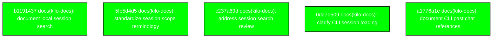

# Backport Agent — Detailed Run Report

> This file is generated automatically. It is intended for human analysts and
> AI reasoning models to assess agent performance, decision quality, and LLM behavior.

**Run timestamp**: 2026-08-09T16:55:17.659Z
**Models used**: fast=`mistral/mistral-code-agent-latest`  powerful=`poolside/laguna-s-2.1`
**Prompt log**: `/Users/rlemeill/Development/tea-ching-kilocode/.backport-agent/run-1786293933930.prompts.jsonl`

---

## Summary (PR body)

## Backport Agent — Sync Report

**Date**: 2026-08-09T16:55:17.659Z
**Upstream ref**: `main`
**Cut date**: `2026-08-06T10:02:00+02:00` 
**Fork ref**: `keypool-live`
**Sync branch**: `sync/upstream-main-2026-08-09-164610`

### Summary

- ✅ Applied: 5
- ⚠️ Needs human review: 0
- ⛔ Blocked (not attempted): 0
- 🔴 Validation suite FAILED during this run (host-verified)
- 🔴🔴 **THIS RUN REQUIRES HUMAN REVIEW despite the counters above reading clean — see 🛑 Host-side gate report below.**

### 🛑 Host-side gate report

- Validation suite(s) FAILED: final — this run requires human review regardless of per-commit statuses above.
- push_sync_branch pushed "sync/upstream-main-2026-08-09-164610" with a FAILED validation suite — run requires human review

### Applied commits

- `b1191437` [low] docs(kilo-docs): document local session search
- `5fb5d4d5` [low] docs(kilo-docs): standardize session scope terminology
- `c237a69d` [low] docs(kilo-docs): address session search review
- `0da7d509` [low] docs(kilo-docs): clarify CLI session loading
- `a1776a1e` [low] docs(kilo-docs): document CLI past chat references

### Agent decision log

- All commits classified as LOW risk and applied directly
- Validation failed due to pty test timeouts; core typecheck and invariants passed

---

## Agent Workflow Diagram

> Generated by the fast model from the run summary. Evaluate the agent's decision path.

---

## AI Sub-Agent Call Log (0 calls)

> Each entry is one sub-agent invocation. Review prompt/response pairs to assess
> reasoning quality, hallucinations, and decision accuracy.

_No AI sub-agent calls were made during this run._

---

## Decision Quality Metrics

> Automated quality signals derived from tool output guards, schema validation,
> hallucination detection, and consensus checks.  Review flagged items manually.

### Audit Event Timeline

| Timestamp | Tool | Event | Details |
|---|---|---|---|
| 16:45:33 | `loadCustomizations` | `manifest_loaded` | sourceKind="file", path=".backport-agent/customizations.yaml", sha256_16="2d3f79908f2e984f" |
| 16:46:08 | `classify_commit_risk` | `risk_classified` | sha="b1191437754b7a301b2e1fc15168df758022260, level="low", changedFileCount=6 |
| 16:46:08 | `classify_commit_risk` | `risk_classified` | sha="5fb5d4d5c012e5bccb7d2d4c388375154975d4a, level="low", changedFileCount=2 |
| 16:46:08 | `classify_commit_risk` | `risk_classified` | sha="c237a69d01ef8ef3a03ec82dcd1e026e3d05569, level="low", changedFileCount=2 |
| 16:46:08 | `classify_commit_risk` | `risk_classified` | sha="0da7d5096548c4e5eefc7d2b7f41fd755590d51, level="low", changedFileCount=1 |
| 16:46:09 | `classify_commit_risk` | `risk_classified` | sha="a1776a1ea5a1b22fb12b9127bb71734e017c9d6, level="low", changedFileCount=2 |
