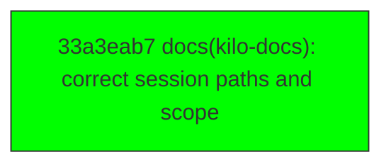

# Backport Agent — Detailed Run Report

> This file is generated automatically. It is intended for human analysts and
> AI reasoning models to assess agent performance, decision quality, and LLM behavior.

**Run timestamp**: 2026-08-10T07:40:47.893Z
**Models used**: fast=`mistral/mistral-code-agent-latest`  powerful=`poolside/laguna-s-2.1`
**Prompt log**: `/Users/rlemeill/Development/tea-ching-kilocode/.backport-agent/run-1786347438979.prompts.jsonl`

---

## Summary (PR body)

## Backport Agent — Sync Report

**Date**: 2026-08-10T07:40:47.893Z
**Upstream ref**: `main`
**Cut date**: `2026-08-06T10:02:00+02:00` 
**Fork ref**: `keypool-live`
**Sync branch**: `sync/upstream-main-2026-08-10-073757`

### Summary

- ✅ Applied: 1
- ⚠️ Needs human review: 0
- ⛔ Blocked (not attempted): 0

### Applied commits

- `33a3eab7` [low] docs(kilo-docs): correct session paths and scope

### Agent decision log

- Commit 33a3eab7510f111cf12d16607d7b0bde9876318b classified as low risk and applied successfully.

---

## Agent Workflow Diagram

> Generated by the fast model from the run summary. Evaluate the agent's decision path.

---

## AI Sub-Agent Call Log (0 calls)

> Each entry is one sub-agent invocation. Review prompt/response pairs to assess
> reasoning quality, hallucinations, and decision accuracy.

_No AI sub-agent calls were made during this run._

---

## Decision Quality Metrics

> Automated quality signals derived from tool output guards, schema validation,
> hallucination detection, and consensus checks.  Review flagged items manually.

### Audit Event Timeline

| Timestamp | Tool | Event | Details |
|---|---|---|---|
| 07:37:18 | `loadCustomizations` | `manifest_loaded` | sourceKind="file", path=".backport-agent/customizations.yaml", sha256_16="2d3f79908f2e984f" |
| 07:37:55 | `classify_commit_risk` | `risk_classified` | sha="33a3eab7510f111cf12d16607d7b0bde9876318, level="low", changedFileCount=3 |
