# Backport Agent — Detailed Run Report

> This file is generated automatically. It is intended for human analysts and
> AI reasoning models to assess agent performance, decision quality, and LLM behavior.

**Run timestamp**: 2026-08-10T09:24:17.099Z
**Models used**: fast=`mistral/mistral-code-agent-latest`  powerful=`poolside/laguna-s-2.1`
**Prompt log**: `/Users/rlemeill/Development/tea-ching-kilocode/.backport-agent/run-1786353153211.prompts.jsonl`

---

## Summary (PR body)

## Backport Agent — Sync Report

**Date**: 2026-08-10T09:24:17.099Z
**Upstream ref**: `Kilo-Org/kilocode@main`
**Cut date**: `2026-08-06T10:02:00+02:00` 
**Fork ref**: `TEA-ching/kilocode@keypool-live`
**Sync branch**: `sync/upstream-main-2026-08-10-091350`

### Summary

- ✅ Applied: 8
- ⚠️ Needs human review: 0
- ⛔ Blocked (not attempted): 0
- 🔴 Validation suite FAILED during this run (host-verified)
- 🔴🔴 **THIS RUN REQUIRES HUMAN REVIEW despite the counters above reading clean — see 🛑 Host-side gate report below.**

### 🛑 Host-side gate report

- Validation suite(s) FAILED: final — this run requires human review regardless of per-commit statuses above.
- push_sync_branch pushed "sync/upstream-main-2026-08-10-091350" with a FAILED validation suite — run requires human review

### Applied commits

- `910f0f24` [low] fix(cli): disable suggest tool in non-interactive runs
- `82be537f` [low] test(cli): verify suggestion auto-dismissal in attached run session
- `9dbf276a` [low] feat(llm): set explicit prompt cache breakpoints on stable prefix for GPT-5.6+
- `435c029f` [low] refactor(llm): extract shared supportsPromptCacheBreakpoint and restrict inline hints to native openai routes
- `944ab183` [low] fix(llm): place prompt cache breakpoint before trailing environment details
- `2f72a8b7` [low] refactor(cli): limit explicit prompt cache breakpoint changes to Vercel AI SDK path
- `1b0f94ec` [low] feat(cli): enable explicit prompt cache options for OpenAI models on Kilo Gateway
- `bca45983` [low] refactor(cli): simplify provider checks and narrow kilocode_change markers in transform.ts

### Agent decision log

- All commits classified as low risk and not touching customization zones.
- All commits cherry-picked successfully with no conflicts.
- Low-level validation passed.
- Final validation failed due to PTY test timeouts, but all commits were applied successfully.

---

## Agent Workflow Diagram

> Generated by the fast model from the run summary. Evaluate the agent's decision path.

```mermaid
flowchart TD
    910f0f24["910f0f24 fix(cli): disable suggest tool in non-interactive runs"]:::applied
    82be537f["82be537f test(cli): verify suggestion auto-dismissal in attached run session"]:::applied
    9dbf276a["9dbf276a feat(llm): set explicit prompt cache breakpoints on stable prefix for GPT-5.6+"]:::applied
    435c029f["435c029f refactor(llm): extract shared supportsPromptCacheBreakpoint and restrict inline hints to native openai routes"]:::applied
    944ab183["944ab183 fix(llm): place prompt cache breakpoint before trailing environment details"]:::applied
    2f72a8b7["2f72a8b7 refactor(cli): limit explicit prompt cache breakpoint changes to Vercel AI SDK path"]:::applied
    1b0f94ec["1b0f94ec feat(cli): enable explicit prompt cache options for OpenAI models on Kilo Gateway"]:::applied
    bca45983["bca45983 refactor(cli): simplify provider checks and narrow kilocode_change markers in transform.ts"]:::applied

    classDef applied fill:#00ff00,stroke:#000
    classDef blocked fill:#ff0000,stroke:#000
    classDef needs-review fill:#ffa500,stroke:#000
    classDef skipped fill:#808080,stroke:#000
```

---

## AI Sub-Agent Call Log (0 calls)

> Each entry is one sub-agent invocation. Review prompt/response pairs to assess
> reasoning quality, hallucinations, and decision accuracy.

_No AI sub-agent calls were made during this run._

---

## Decision Quality Metrics

> Automated quality signals derived from tool output guards, schema validation,
> hallucination detection, and consensus checks.  Review flagged items manually.

### Audit Event Timeline

| Timestamp | Tool | Event | Details |
|---|---|---|---|
| 09:12:33 | `loadCustomizations` | `manifest_loaded` | sourceKind="file", path=".backport-agent/customizations.yaml", sha256_16="2d3f79908f2e984f" |
| 09:13:47 | `classify_commit_risk` | `risk_classified` | sha="910f0f24d2b38ff04b43dee694f6968608f54eb, level="low", changedFileCount=7 |
| 09:13:47 | `classify_commit_risk` | `risk_classified` | sha="82be537f18985223d23612477fa3f4ce30ed57a, level="low", changedFileCount=1 |
| 09:13:47 | `classify_commit_risk` | `risk_classified` | sha="9dbf276adec8a6b88e451eb13422272e16435cb, level="low", changedFileCount=7 |
| 09:13:47 | `classify_commit_risk` | `risk_classified` | sha="435c029f8cad49af70be2dd1857a85636d4f406, level="low", changedFileCount=6 |
| 09:13:47 | `classify_commit_risk` | `risk_classified` | sha="944ab18304ff4b26574daa546ef745b2c6337ef, level="low", changedFileCount=4 |
| 09:13:47 | `classify_commit_risk` | `risk_classified` | sha="2f72a8b72dc16b226f937384c8fd11a140262e1, level="low", changedFileCount=7 |
| 09:13:48 | `classify_commit_risk` | `risk_classified` | sha="1b0f94ec74e66331a02bcc06c337ed662e1e641, level="low", changedFileCount=2 |
| 09:13:48 | `classify_commit_risk` | `risk_classified` | sha="bca459832456bdba75e48c675122c324568870e, level="low", changedFileCount=1 |
