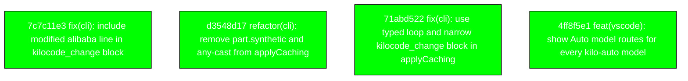

# Backport Agent — Detailed Run Report

> This file is generated automatically. It is intended for human analysts and
> AI reasoning models to assess agent performance, decision quality, and LLM behavior.

**Run timestamp**: 2026-08-10T09:29:28.599Z
**Models used**: fast=`mistral/mistral-code-agent-latest`  powerful=`poolside/laguna-s-2.1`
**Prompt log**: `/Users/rlemeill/Development/tea-ching-kilocode/.backport-agent/run-1786354025288.prompts.jsonl`

---

## Summary (PR body)

## Backport Agent — Sync Report

**Date**: 2026-08-10T09:29:28.599Z
**Upstream ref**: `main`
**Cut date**: `2026-08-06T10:02:00+02:00` 
**Fork ref**: `keypool-live`
**Sync branch**: `sync/upstream-main-2026-08-10-092813`

### Summary

- ✅ Applied: 4
- ⚠️ Needs human review: 0
- ⛔ Blocked (not attempted): 0

### Applied commits

- `7c7c11e3` [low] fix(cli): include modified alibaba line in kilocode_change block
- `d3548d17` [low] refactor(cli): remove part.synthetic and any-cast from applyCaching
- `71abd522` [low] fix(cli): use typed loop and narrow kilocode_change block in applyCaching
- `4ff8f5e1` [low] feat(vscode): show Auto model routes for every kilo-auto model

### Agent decision log

- All commits classified as LOW risk and applied cleanly.

---

## Agent Workflow Diagram

> Generated by the fast model from the run summary. Evaluate the agent's decision path.

---

## AI Sub-Agent Call Log (0 calls)

> Each entry is one sub-agent invocation. Review prompt/response pairs to assess
> reasoning quality, hallucinations, and decision accuracy.

_No AI sub-agent calls were made during this run._

---

## Decision Quality Metrics

> Automated quality signals derived from tool output guards, schema validation,
> hallucination detection, and consensus checks.  Review flagged items manually.

### Audit Event Timeline

| Timestamp | Tool | Event | Details |
|---|---|---|---|
| 09:27:05 | `loadCustomizations` | `manifest_loaded` | sourceKind="file", path=".backport-agent/customizations.yaml", sha256_16="2d3f79908f2e984f" |
| 09:28:11 | `classify_commit_risk` | `risk_classified` | sha="7c7c11e33400a4640ad7b6cb031921964c7fe70, level="low", changedFileCount=1 |
| 09:28:11 | `classify_commit_risk` | `risk_classified` | sha="d3548d179bf9814e16cd4acdeb91411bd046aaa, level="low", changedFileCount=1 |
| 09:28:11 | `classify_commit_risk` | `risk_classified` | sha="71abd522b1fd8988046df726f08f9e804e8f45f, level="low", changedFileCount=1 |
| 09:28:11 | `classify_commit_risk` | `risk_classified` | sha="4ff8f5e1105652b98f49210608e9f28e98a92f8, level="low", changedFileCount=5 |
